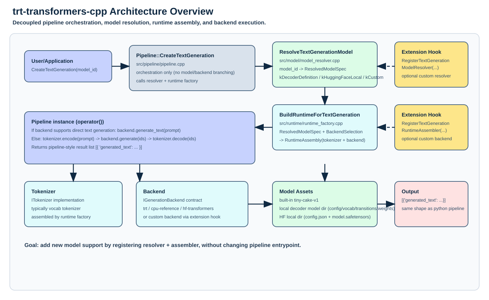
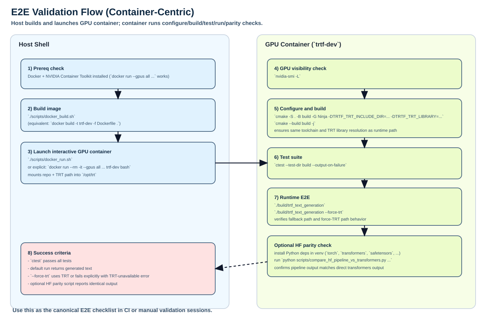

# trt-transformers-cpp

`trt-transformers-cpp` is an API-first C++ project that mirrors core Hugging Face `transformers.pipeline(...)` behavior with TensorRT-first execution.

## Why this exists
- Build a C++ API analogous to `transformers.pipeline(...)`.
- Construct TensorRT graphs directly from C++ APIs (ONNX parser is optional/fallback).
- Support missing ops/plugins incrementally: correct-first, optimize-next.

## Current milestone (M1)
- End-to-end `text-generation` pipeline executable in C++.
- Runtime backend abstraction with three backends.
- `trt` backend: tiny decoder-step graph (attention + MLP) and iterative decode.
- `cpu-reference` backend: deterministic fallback.
- `hf-transformers` backend: raw Hugging Face local model dirs (`config.json` + `model.safetensors`).
- Model-driven execution from built-in tiny model (`models/tiny-cake-v1`) or local model path.
- Unit and integration tests.

## Architecture (with extension seams)


How to read this diagram:
- `Pipeline::CreateTextGeneration(...)` is orchestration only.
- `ResolveTextGenerationModel(...)` turns a user `model_id` into a typed `ResolvedModelSpec`.
- `BuildRuntimeForTextGeneration(...)` builds tokenizer/backend with policy (`prefer_trt`, `force_trt`).
- `RegisterHfModelFamily(...)` is the preferred extension seam for onboarding new HF model families with model-definition loaders.
- Custom model resolution can be injected through `RegisterTextGenerationModelResolver(...)`.
- Custom runtime assembly can be injected through `RegisterTextGenerationRuntimeAssembler(...)`.
- Decode happens through a backend contract (`IGenerationBackend`) so backend internals are isolated from API surface.

## E2E validation flow


This repo supports two E2E paths:
- Native host build/test/run.
- GPU container build/test/run (recommended for TensorRT force-path checks).

## Reproduce Real Qwen3 TRT Result

This section is the authoritative runbook for reproducing the real upstream Qwen3 TRT result in this repo.

Prerequisites:
- Host has Docker + NVIDIA Container Toolkit (`docker run --gpus all ...` works).
- TensorRT host artifacts exist at:
  - `/home/yifeif/repos/trt/build/tensorrt-base-dev/rel-10.15-native-x86_64-ubuntu20.04-cuda11.8-auto/cmake`
- Repo root is `/home/yifeif/repos/trt-transformers-cpp`.

### 1) Build and launch the TRT development container
```bash
cd /home/yifeif/repos/trt-transformers-cpp
./scripts/docker_build.sh
./scripts/docker_run.sh
```

Equivalent direct run command:
```bash
docker run --rm -it \
  --gpus all \
  -e TRT_ROOT=/opt/trt \
  -e LD_LIBRARY_PATH=/opt/trt/Debug/lib:/opt/trt/Release/lib:/opt/trt/lib:/opt/trt/myelin-ext/myelin/lib/Debug:/usr/local/cuda/lib64 \
  -v "$PWD":/workspace/trt-transformers-cpp \
  -v /home/yifeif/repos/trt/build/tensorrt-base-dev/rel-10.15-native-x86_64-ubuntu20.04-cuda11.8-auto/cmake:/opt/trt:ro \
  -w /workspace/trt-transformers-cpp \
  trtf-dev bash
```

### 2) Prepare Python env used by HF tokenizer bridge and eval scripts
Inside container:
```bash
python3 -m venv .venv-hf
source .venv-hf/bin/activate
pip install -U pip
pip install "transformers>=4.57.0" tokenizers safetensors sentencepiece huggingface_hub datasets
# Optional but recommended for HF-reference generation/parity scripts:
pip install torch accelerate
```

### 3) Download real upstream Qwen3 weights locally
Inside container:
```bash
source .venv-hf/bin/activate
python3 - <<'PY'
from huggingface_hub import snapshot_download

snapshot_download(
    repo_id='Qwen/Qwen3-0.6B',
    local_dir='models/hf/Qwen__Qwen3-0.6B',
    local_dir_use_symlinks=False,
    allow_patterns=[
        'config.json',
        'generation_config.json',
        'model.safetensors*',
        'tokenizer.json',
        'tokenizer_config.json',
        'vocab.json',
        'merges.txt',
        'special_tokens_map.json',
        '*.model',
        'README.md',
        'LICENSE',
        '.gitattributes',
    ],
)
PY
```

Notes:
- Built-in alias `QWEN3` prefers `models/hf/Qwen__Qwen3-0.6B` when present.
- If missing, it falls back to bundled demo assets at `models/hf/qwen3`.

### 4) Configure and build TRT binaries (container)
Inside container:
```bash
nvidia-smi -L
cmake -S . -B build-container-phase1 -G Ninja \
  -DTRTF_TRT_INCLUDE_DIR=/opt/trt/include/zapped_headers \
  -DTRTF_TRT_LIBRARY=/opt/trt/Debug/lib/libnvinfer.so \
  -DTRTF_CUDA_INCLUDE_DIR=/usr/local/cuda/include \
  -DTRTF_CUDART_LIBRARY=/usr/local/cuda/lib64/libcudart.so
cmake --build build-container-phase1 -j
ctest --test-dir build-container-phase1 --output-on-failure
```

Important:
- Do not reuse host-generated build dirs inside container.
- Use a container-specific build dir (`build-container-phase1` above).

### 5) Validate real Qwen3 TRT E2E generation
Inside container:
```bash
TRTF_HF_PYTHON=$PWD/.venv-hf/bin/python \
TRTF_MAX_CACHE_LENGTH=1 \
TRTF_MAX_NEW_TOKENS=1 \
./build-container-phase1/trtf_load_model --force-trt QWEN3 "Hello"
```

Expected:
- `backend=trt`
- output starts with `Hello Answer`

Recommended diagnostic path (build + tests + 2 TRT runs + logs):
```bash
./scripts/test_qwen3_trt_e2e.sh "Hello"
```
This script writes logs to `/tmp/trtf_qwen3_trt_e2e.log` by default and includes TRT logger output.
It defaults to `build-container-phase1` and can be redirected with `TRTF_BUILD_DIR=<build-dir>`.

Optional logits debug (for HF/TRT parity checks):
```bash
TRTF_HF_PYTHON=$PWD/.venv-hf/bin/python \
TRTF_MAX_CACHE_LENGTH=1 \
TRTF_MAX_NEW_TOKENS=1 \
TRTF_DEBUG_LOGITS_TOPK=5 \
./build-container-phase1/trtf_load_model --force-trt QWEN3 "Hello"
```

Expected debug line shape:
- `TRTF_DEBUG_LOGITS step=0 <token_id>:<logit> ...`

Optional TensorRT logger output controls:
```bash
TRTF_TRT_LOG_STDERR=1 \
TRTF_TRT_LOG_MIN_SEVERITY=INFO \
./build-container-phase1/trtf_load_model --force-trt QWEN3 "Hello"
```
`TRTF_TRT_LOG_MIN_SEVERITY` can be `INTERNAL_ERROR`, `ERROR`, `WARNING`, `INFO`, or `VERBOSE`.

Longer sanity prompt:
```bash
TRTF_HF_PYTHON=$PWD/.venv-hf/bin/python \
TRTF_MAX_NEW_TOKENS=20 \
./build-container-phase1/trtf_load_model --force-trt QWEN3 "The capital of France is"
```

### 6) MMLU sanity check (TRT backend)
Inside container:
```bash
TRTF_HF_PYTHON=$PWD/.venv-hf/bin/python \
TRTF_MAX_NEW_TOKENS=8 \
$PWD/.venv-hf/bin/python scripts/eval_mmlu.py \
  --backend trtf \
  --model QWEN3 \
  --trtf-binary ./build-container-phase1/trtf_load_model \
  --force-trt \
  --subject all \
  --split test \
  --num-samples 4 \
  --min-accuracy 0.0
```

Notes:
- Current TRT MMLU path launches one `trtf_load_model` process per example, so larger sample sizes are slow.
- For larger runs, increase `--num-samples` (for example `64`) and set your desired threshold.

### 7) Native host fast path (non-container)
```bash
cd /home/yifeif/repos/trt-transformers-cpp
cmake -S . -B build-host -G Ninja
cmake --build build-host -j
ctest --test-dir build-host --output-on-failure
./build-host/trtf_text_generation
./build-host/trtf_text_generation --force-trt
```

If TensorRT/CUDA are not in standard paths:
```bash
cmake -S . -B build-trt -G Ninja \
  -DTRTF_TRT_INCLUDE_DIR=/home/yifeif/repos/trt/build/tensorrt-base-dev/rel-10.15-native-x86_64-ubuntu20.04-cuda11.8-auto/cmake/include/zapped_headers \
  -DTRTF_TRT_LIBRARY=/home/yifeif/repos/trt/build/tensorrt-base-dev/rel-10.15-native-x86_64-ubuntu20.04-cuda11.8-auto/cmake/lib/libnvinfer.so \
  -DTRTF_CUDA_INCLUDE_DIR=/usr/local/cuda/include \
  -DTRTF_CUDART_LIBRARY=/usr/local/cuda/lib64/libcudart.so
cmake --build build-trt -j
ctest --test-dir build-trt --output-on-failure
./build-trt/trtf_text_generation --force-trt
```

### 8) Optional HF-transformers parity check on tiny GPT2
```bash
source .venv-hf/bin/activate
python3 scripts/compare_hf_pipeline_vs_transformers.py \
  --model-dir models/hf/hf-internal-testing__tiny-random-gpt2 \
  --binary ./build-container-phase1/trtf_text_generation \
  --prompt "Hello from trtf" \
  --max-new-tokens 20
```


## CLI behavior reference
- `--force-trt`: require TRT backend and fail if unavailable.
- `--cpu-only`: bypass TRT and use `cpu-reference`.
- Hugging Face local model dirs auto-select backend `hf-transformers`.

Example:
```bash
./<build-dir>/trtf_text_generation trtf/tiny-cake-v1 "the secret to baking a really good cake is"
./<build-dir>/trtf_text_generation --force-trt
./<build-dir>/trtf_text_generation --force-trt QWEN3 "Hello"
./<build-dir>/trtf_load_model --force-trt QWEN3 "Hello"
./<build-dir>/trtf_text_generation models/hf/hf-internal-testing__tiny-random-gpt2 "Hello from trtf"
```

Python interpreter resolution for `hf-transformers` backend and HF tokenizer bridge:
- `TRTF_HF_PYTHON` env var (if set).
- `/opt/hf-venv/bin/python` (if present).
- fallback `python3`.

Decoder-definition cache-length override:
- `TRTF_MAX_CACHE_LENGTH=<positive-int>` can cap/override runtime cache length when loading model definitions.

TRT engine-plan cache controls:
- `TRTF_TRT_ENGINE_CACHE_DIR=<path>` sets the on-disk cache location for serialized TRT engine plans.
- `TRTF_DISABLE_ENGINE_CACHE=1` disables plan cache read/write (forces rebuild/deserialize path each process).

## Model format reference
Built-in model id:
- `trtf/tiny-cake-v1`
- `QWEN3` (prefers real local upstream Qwen3 assets, falls back to bundled demo assets)

Decoder-definition local model directory requires:
- `config.json` (`default_next_token`, `max_cache_length`, optional `weights_file`)
- `vocab.txt` (one token per line)
- `transitions.txt` (`from_token to_token` per line)
- optional checkpoint tensors:
  - `weights.txt` (text tensor blocks)
  - or `.safetensors` referenced by `weights_file` in `config.json`

Checkpoint tensor file format (`weights.txt`):
- Header lines: `hidden_size <int>`, `mlp_size <int>`
- Tensor block start: `tensor <name> <rank> <dim0> ... <dimN>`
- Ops inside tensor block: `fill`, `identity`, `set`, `row_transition`, `all_rows_transition`
- Tensor block terminator: `end`
- Required tensors: `embedding`, `w_q`, `w_k`, `w_v`, `w1`, `b1`, `w2`, `b2`, `w_out`, `b_out`

When checkpoint file is absent, TRT keeps compatibility fallback from `transitions.txt`.

Safetensors checkpoint support in `LoadDecoderModel(...)`:
- direct trtf tensor names in safetensors (`embedding`, `w_q`, `w_k`, `w_v`, `w1`, `b1`, `w2`, `b2`, `w_out`, `b_out`)
- sharded safetensors via `model.safetensors.index.json` (weight-map routing across shard files)
- Qwen bridge mode when `architecture_family=qwen3`:
  - maps full upstream layer stack keys:
    - `model.layers.{i}.input_layernorm.weight`
    - `model.layers.{i}.self_attn.{q_norm,k_norm}.weight`
    - `model.layers.{i}.self_attn.{q,k,v,o}_proj.weight`
    - `model.layers.{i}.post_attention_layernorm.weight`
    - `model.layers.{i}.mlp.{gate,up,down}_proj.weight`
    - `model.norm.weight`, `model.embed_tokens.weight`, `lm_head.weight`
  - runs through the shared TRT multi-layer decoder runtime (RMSNorm + q/k norm + RoPE + attention + SwiGLU)

Raw Hugging Face local model directory requires:
- `config.json`
- `model.safetensors` or `model.safetensors.index.json`
- tokenizer files required by transformers runtime

Qwen-style family onboarding (TRT shared infra path) currently expects:
- an HF root dir with `config.json` + (`model.safetensors` or `model.safetensors.index.json`) and `model_type` starting with `qwen`/`qwq`
- optional normalized decoder-definition subdir at `trtf_decoder/` containing:
  - `config.json`
  - `vocab.txt`
  - `transitions.txt`
  - optional `weights.txt` or `weights_file` pointing at safetensors (for example `../model.safetensors`)
- if `trtf_decoder/` is absent, loader can bridge directly from HF root checkpoint files + `config.json` (placeholder vocab/transitions are generated from config metadata)
- decoder-definition TRT path now prefers HF tokenizer files (`tokenizer.json`) when available

Prepare a local upstream Qwen3 directory for this path:
```bash
python3 scripts/prepare_qwen3_trtf_decoder.py --hf-model-dir /path/to/Qwen3
./build/trtf_load_model --force-trt /path/to/Qwen3
```

Built-in `QWEN3` alias maps to:
- preferred real upstream local dir: `models/hf/Qwen__Qwen3-0.6B` (when present with `config.json` + checkpoint + tokenizer)
- fallback bundled demo dir: `models/hf/qwen3`

## Adding a new model family
Preferred path (no `pipeline.cpp` edits, no family-owned TRT runtime code):
1. Register `HfModelFamilyRegistration` with:
   - `matcher(const HfModelMetadata&)`
   - `model_definition_loader(const HfModelMetadata&) -> DecoderModel`
2. Keep runtime shared: `BuildRuntimeForTextGeneration(...)` uses the existing TRT/CPU backend infrastructure.
3. Keep API unchanged for users: `Pipeline::CreateTextGeneration("your-model-id")`.
4. Add family tests (see `tests/test_hf_family_registry.cpp`).

Advanced fallback path (legacy/custom):
1. `RegisterTextGenerationModelResolver(...)`
2. `RegisterTextGenerationRuntimeAssembler(...)`

## Example API usage
```cpp
#include "trtf/pipeline.h"

int main()
{
    auto pipeline = trtf::Pipeline::CreateTextGeneration("trtf/tiny-cake-v1");
    auto out = pipeline("the secret to baking a really good cake is");
}
```

```cpp
#include "trtf/pipeline.h"

int main()
{
    auto model = trtf::loadModel("QWEN3", /*prefer_trt=*/true, /*force_trt=*/true);
    std::string output = model.generate("Hello");
}
```

Output format mirrors Python pipeline style:
```text
[{'generated_text': 'the secret to baking a really good cake is to use fresh butter and measure carefully follow recipe exactly.'}]
```

## Additional docs
- `docs/GOALS_AND_PLAN.md`
- `docs/TRANSFORMERS_COVERAGE_ANALYSIS.md`
- `docs/TEST_PLAN.md`
- `docs/WORKLOG.md`
- `docs/M0_E2E_RESULT.md`
