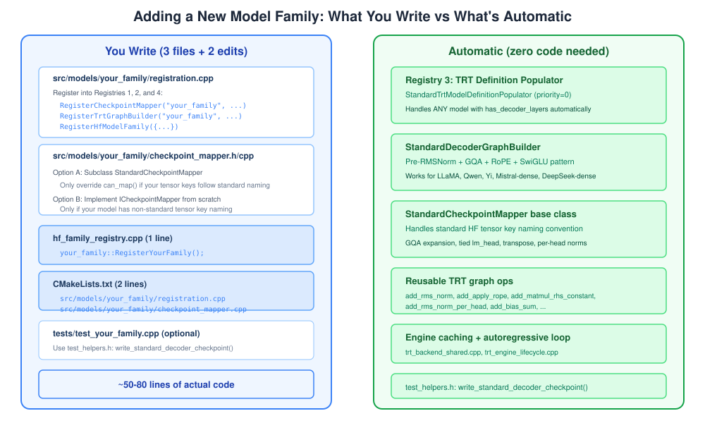

# Adding a New Model Family

This guide walks through adding support for a new HuggingFace model family (e.g., Phi). By the end, your model will be loadable via `trtf_create_pipeline("path/to/your-model", TRTF_FORCE_TRT)` with TRT GPU inference.



## Prerequisites

Before starting, verify your model follows the standard dense decoder pattern:
- **Pre-RMSNorm** before attention
- **Grouped Query Attention** (GQA) or standard multi-head attention
- **Rotary Position Embeddings** (RoPE)
- **SwiGLU MLP** (gate + up projection with SiLU activation)
- **Post-Attention RMSNorm** before MLP

If yes, you only need to write a checkpoint mapper. Everything else is handled automatically.

If your model has a non-standard architecture (MoE, parallel attention, different norm types), you'll need a custom model runtime — see [Advanced: Custom Model Runtime](#advanced-custom-model-runtime) at the bottom.

## Step-by-Step Guide

We'll use a hypothetical "Yi" model family as our example.

### Step 1: Create the directory

```
src/models/yi/
  registration.h
  registration.cpp
  checkpoint_mapper.h
  checkpoint_mapper.cpp
```

### Step 2: Implement the checkpoint mapper

First, check if your model uses the standard HF tensor naming convention:
```
model.embed_tokens.weight
model.layers.N.input_layernorm.weight
model.layers.N.self_attn.q_proj.weight
model.layers.N.self_attn.k_proj.weight
model.layers.N.self_attn.v_proj.weight
model.layers.N.self_attn.o_proj.weight
model.layers.N.post_attention_layernorm.weight
model.layers.N.mlp.gate_proj.weight
model.layers.N.mlp.up_proj.weight
model.layers.N.mlp.down_proj.weight
model.norm.weight
lm_head.weight
```

**If yes** (most models), subclass `StandardCheckpointMapper` and only override `can_map()`:

**`checkpoint_mapper.h`:**
```cpp
#pragma once

#include "model/standard_checkpoint_mapper.h"

namespace trtf {
namespace yi {

class YiCheckpointMapper final : public StandardCheckpointMapper {
public:
    bool can_map(const DecoderArchitectureConfig& architecture) const override;
};

} // namespace yi
} // namespace trtf
```

**`checkpoint_mapper.cpp`:**
```cpp
#include "models/yi/checkpoint_mapper.h"
#include "utils/text_parsers.h"

namespace trtf {
namespace yi {

bool YiCheckpointMapper::can_map(const DecoderArchitectureConfig& architecture) const
{
    const std::string family = to_lower_ascii(architecture.family);
    return starts_with(family, "yi");
}

} // namespace yi
} // namespace trtf
```

That's it. `StandardCheckpointMapper::map_checkpoint()` handles:
- Reading all weight tensors from safetensors
- Transposing weight matrices from `[out, in]` to `[in, out]`
- Expanding K/V projections for GQA (when `num_key_value_heads < num_attention_heads`)
- Repeating per-head norms across all heads
- Handling tied `lm_head` (when `lm_head.weight` is absent, reuses embedding)
- Reading optional `q_norm`/`k_norm` weights

**If no** (non-standard tensor keys), implement `ICheckpointMapper` directly. See `src/models/qwen/checkpoint_mapper.cpp` for the pattern — though Qwen also uses `StandardCheckpointMapper`.

### Step 3: Write the registration

**`registration.h`:**
```cpp
#pragma once

namespace trtf {
namespace yi {

void RegisterYiFamily();

} // namespace yi
} // namespace trtf
```

**`registration.cpp`:**
```cpp
#include "models/yi/registration.h"
#include "models/yi/checkpoint_mapper.h"
#include "trtf/hf_family_registry.h"
#include "model/checkpoint_mapper.h"
#include "runtime/trt/model_runtime_fwd.h"
#include "utils/text_parsers.h"

#include <filesystem>
#include <memory>
#include <string>

namespace trtf {
namespace yi {
namespace {

bool is_yi_model_type(const std::string& model_type)
{
    if (model_type.empty()) return false;
    return starts_with(to_lower_ascii(model_type), "yi");
}

bool has_root_checkpoint(const HfModelMetadata& metadata)
{
    const std::filesystem::path dir(metadata.model_dir);
    return std::filesystem::exists(dir / "model.safetensors")
        || std::filesystem::exists(dir / "model.safetensors.index.json");
}

DecoderModel load_yi_model(const HfModelMetadata& metadata)
{
    DecoderModel model = LoadDecoderModel(metadata.model_dir);
    // Optional: cap cache length for large models
    const int32_t env_max_cache = parse_positive_env_int("TRTF_MAX_CACHE_LENGTH", -1);
    if (env_max_cache <= 0 && model.max_cache_length > 4096)
    {
        model.max_cache_length = 4096;
    }
    return model;
}

} // namespace

void RegisterYiFamily()
{
    // Registry 2: Checkpoint mapper
    RegisterCheckpointMapper("yi", 100, std::make_unique<YiCheckpointMapper>());

    // Registry 3: Model runtime (graph + state + per-step execution)
#if TRTF_HAS_TRT
    RegisterModelRuntime("yi", CreateStandardDecoderRuntime());
#endif

    // Registry 1: HF family matcher + loader
    RegisterHfModelFamily({
        "yi-safetensors",
        100,
        [](const HfModelMetadata& metadata) {
            return is_yi_model_type(metadata.model_type) && has_root_checkpoint(metadata);
        },
        [](const HfModelMetadata& metadata) { return load_yi_model(metadata); },
    });
}

} // namespace yi
} // namespace trtf
```

### Step 4: Re-run CMake

CMake auto-discovers new families via GLOB patterns. No edits to any shared files:

```bash
cmake -S . -B build -G Ninja   # Picks up new src/models/yi/*.cpp + tests/test_yi_family.cpp
cmake --build build -j
```

### Step 5: Write a test

Create `tests/test_yi_family.cpp` (auto-discovered by CMake GLOB `tests/test_*_family.cpp`):

```cpp
// Test: Yi model family registration and checkpoint loading.
// Verifies: HF family detection for model_type "yi", multi-layer safetensors
// bridge, and checkpoint structure validation.

#include "test_helpers.h"
#include "trtf/model_resolver.h"

#include <filesystem>
#include <iostream>

namespace {

void write_hf_yi_root(const std::filesystem::path& dir)
{
    trtf_test::write_file(dir / "config.json",
        "{\n"
        "  \"model_type\": \"yi\",\n"
        "  \"architectures\": [\"YiForCausalLM\"],\n"
        "  \"vocab_size\": 8,\n"
        "  \"hidden_size\": 8,\n"
        "  \"num_hidden_layers\": 2,\n"
        "  \"num_attention_heads\": 2,\n"
        "  \"num_key_value_heads\": 1,\n"
        "  \"rms_norm_eps\": 1e-5,\n"
        "  \"rope_theta\": 10000.0\n"
        "}\n");
    // Yi has no q_norm/k_norm, like LLaMA
    trtf_test::write_standard_decoder_checkpoint(dir, 8, 8, 16, 8, 16, 2, false);
}

} // namespace

int main()
{
    std::filesystem::path yi_dir;
    try
    {
        yi_dir = trtf_test::make_temp_dir_or_throw("/tmp/trtf_yi_family_XXXXXX");
        write_hf_yi_root(yi_dir);

        const trtf::ResolvedModelSpec spec = trtf::ResolveTextGenerationModel(yi_dir.string());
        if (spec.kind != trtf::ResolvedModelKind::kDecoderDefinition)
        {
            std::cerr << "expected yi to resolve as decoder-definition" << std::endl;
            return 1;
        }
        if (!spec.decoder_model.checkpoint.has_decoder_layers
            || spec.decoder_model.checkpoint.decoder_layers.size() != 2)
        {
            std::cerr << "expected 2 decoder layers" << std::endl;
            return 1;
        }

        std::cout << "test_yi_family passed" << std::endl;
    }
    catch (const std::exception& e)
    {
        std::cerr << "test_yi_family failed: " << e.what() << std::endl;
        std::filesystem::remove_all(yi_dir);
        return 1;
    }

    std::filesystem::remove_all(yi_dir);
    return 0;
}
```

### Step 6: Validate

```bash
# Build and run unit tests
cmake -S . -B build -G Ninja && cmake --build build -j
ctest --test-dir build -R test_yi_family --output-on-failure

# E2E logit comparison against HF (in container with GPU)
python3 scripts/diff_logits.py \
  --model-dir path/to/yi-model --binary ./build/trtf \
  --backend-flag --force-trt --atol 1e-3 --battery
```

---

## Checklist Summary

| Step | Files | Lines of code |
|------|-------|--------------|
| Checkpoint mapper | `checkpoint_mapper.h/cpp` | ~15 (if subclassing Standard) |
| Registration | `registration.h/cpp` | ~40 |
| Test | `test_yi_family.cpp` | ~50 |
| Re-run cmake | (zero shared file edits) | 0 |
| **Total** | **5 new files, 0 existing files edited** | **~105** |

---

## Advanced: Custom Model Runtime

If your model doesn't follow the Pre-RMSNorm + GQA + RoPE + SwiGLU pattern, you'll need a custom model runtime. The `IModelRuntime` interface gives families full control over graph construction, state creation, and per-step execution.

Examples of when this is needed:

- **MoE (Mixture of Experts)**: Expert routing layer instead of dense MLP — use `CreateKvCacheRuntime(lambda)` with a custom graph builder
- **MLA (Multi-head Latent Attention)**: Compressed KV cache — implement `IModelRuntime` directly
- **Mamba/SSM**: Fundamentally different state (no KV cache) — implement `IModelRuntime` directly
- **Parallel attention**: Attention and MLP computed in parallel (GPT-J style)
- **Different normalization**: LayerNorm instead of RMSNorm

### Option A: Custom graph, standard KV-cache I/O (MoE, parallel attention)

Use `CreateKvCacheRuntime()` with a lambda that builds your custom engine. You get KV-cache state management for free:

```cpp
RegisterModelRuntime("mixtral", CreateKvCacheRuntime(
    [](const TrtDecoderDefinition& weights, TrtLogger& logger) {
        MixtralGraphBuilder builder;
        return builder.build_decoder_step_engine(weights, logger);
    }));
```

### Option B: Fully custom runtime (Mamba, hybrid)

Implement `IModelRuntime` directly for architectures that don't use KV-cache attention:

```cpp
class MambaRuntime final : public IModelRuntime {
public:
    std::unique_ptr<DecoderStepEngine> build_engine(
        const TrtDecoderDefinition& weights, TrtLogger& logger) override { /* SSM graph */ }
    std::unique_ptr<IStepState> create_state(
        const DecoderStepEngine& engine) override { /* SSM state */ }
    bool run_step(const DecoderStepEngine& engine, IStepState& state,
        int32_t token_id, std::vector<float>& out_logits,
        std::string& error) override { /* SSM step */ }
};
```

Register it:
```cpp
RegisterModelRuntime("mamba", std::make_unique<MambaRuntime>());
```

You can still reuse the ops from `trt_graph_ops.h` (RMSNorm, matmul, RoPE, etc.) — just compose them differently.
