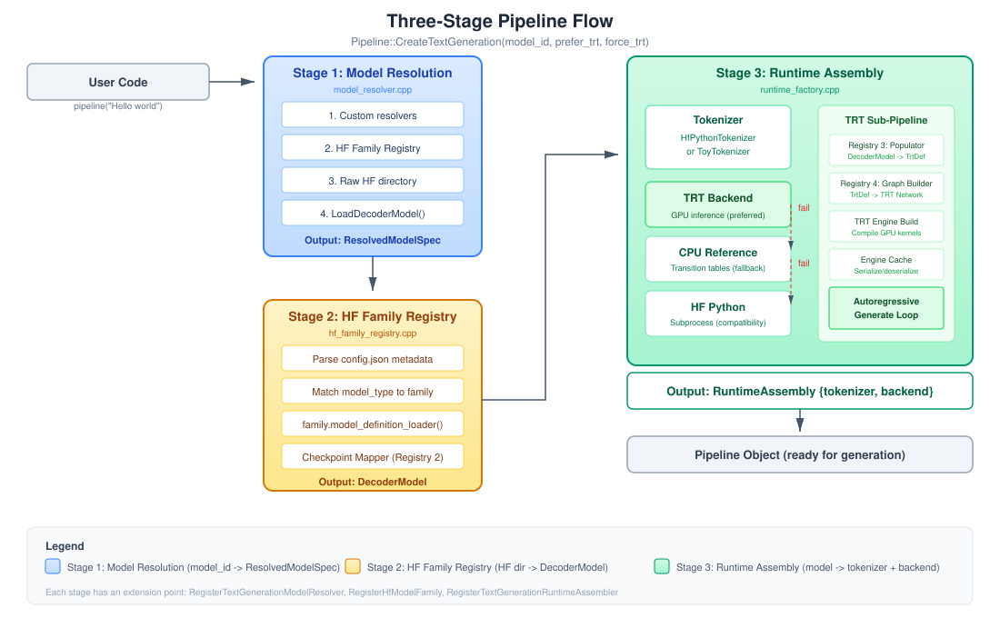
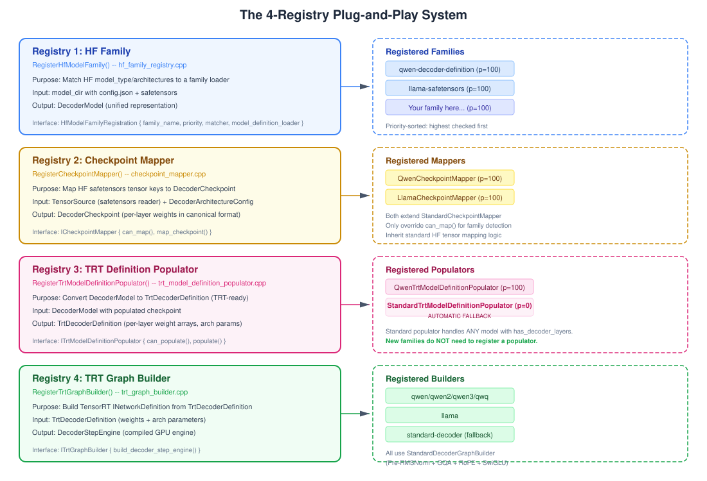
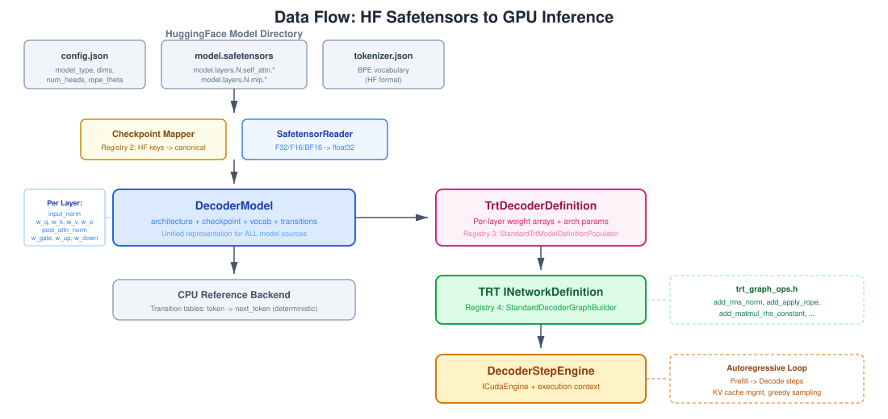

# Architecture Overview

## Three-Stage Pipeline

Every model request flows through three stages, each with an extension point:



### Stage 1: Model Resolution (`model_resolver.cpp`)

Converts a `model_id` string into a `ResolvedModelSpec`. The resolver tries three strategies in order:

| Order | Strategy | When it matches |
|-------|----------|----------------|
| 1 | HF Family Registry | Directory has `config.json` + `model.safetensors` and a registered family matches `model_type` |
| 2 | Raw HF directory | Directory has `config.json` + safetensors but no family matched → `kHuggingFaceLocal` |
| 3 | Decoder definition | `LoadDecoderModel(model_id)` — tries filesystem path |

The output is a `ResolvedModelSpec` with one of two kinds:
- **`kDecoderDefinition`** — Full `DecoderModel` with weights loaded in memory. Ready for TRT backend.
- **`kHuggingFaceLocal`** — Path to HF directory. Will use HF Python subprocess backend.

### Stage 2: HF Family Registry (`hf_family_registry.cpp`)

Only activates when the input is an HF model directory. Registered once via `std::call_once`:

```
RegisterBuiltinHfModelFamilies()
  ├── qwen::RegisterQwenFamily()
  ├── llama::RegisterLlamaFamily()
  ├── mistral::RegisterMistralFamily()
  └── gemma::RegisterGemmaFamily()
```

For each registered family (sorted by priority, highest first):
1. Parse `config.json` to extract `model_type` and `architectures`
2. Call `family.matcher(metadata)` — e.g., checks `starts_with(model_type, "qwen")`
3. On match, call `family.model_definition_loader(metadata)` which:
   - Calls `LoadDecoderModel(model_dir)` (generic loader)
   - Generic loader reads `config.json`, derives architecture, reads safetensors
   - Dispatches to the **Checkpoint Mapper** registry to translate HF tensor keys
   - Returns a `DecoderModel` with checkpoint populated

### C ABI Entry Point (`trtf_c.cpp`)

Users access the library through `extern "C"` factory functions `trtf_create_pipeline()` and `trtf_create_pipeline_ex()` which return an `IPipeline*`. These functions orchestrate stages 1-3 internally. The `IPipeline` interface uses `const char*` (not `std::string`) for ABI safety across compilers/STL versions. `trtf_create_pipeline_ex()` accepts a `TrtfPipelineOptions` struct with flags, `max_new_tokens`, and `max_cache_length`.

### Stage 3: Runtime Assembly (`runtime_factory.cpp`)

Creates the final `{tokenizer, backend}` pair:

**Tokenizer selection:**
- If model has `prefer_hf_tokenizer=true` and `tokenizer.json` exists → `HfPythonTokenizer` (subprocess bridge to HF `tokenizers` library)
- Otherwise → `VocabTokenizer` (vocab.txt-based lookup)

**Backend cascade:**
- If `force_trt`: Try `CreateTrtBackend()` → on failure, throw error
- Otherwise: Try `CreateTrtBackend()` → on failure, fall back to `CreateHfPythonBackend()`

---

## The 3-Registry System



All three registries use priority-sorted dispatch: higher priority wins. Thread-safe via mutex.

### Registry 1: HF Family (`RegisterHfModelFamily`)

**Interface**: `HfModelFamilyRegistration { family_name, priority, matcher, model_definition_loader }`

Matches HF model directories to family-specific loaders. The matcher inspects `model_type` and/or `architectures` from `config.json`. The loader returns a `DecoderModel`.

### Registry 2: Checkpoint Mapper (`RegisterCheckpointMapper`)

**Interface**: `ICheckpointMapper { can_map(), map_checkpoint() }`

Translates HF safetensors tensor keys (e.g., `model.layers.0.self_attn.q_proj.weight`) into the canonical `DecoderCheckpoint` format. Called during `LoadDecoderModel()` when safetensors are detected.

**StandardCheckpointMapper** (base class) handles the common HF naming pattern:
- `model.embed_tokens.weight` → `embedding`
- `model.layers.N.input_layernorm.weight` → `decoder_layers[N].input_norm`
- `model.layers.N.self_attn.q_proj.weight` → `decoder_layers[N].w_q` (transposed)
- `model.layers.N.mlp.gate_proj.weight` → `decoder_layers[N].w_gate` (transposed)
- `model.norm.weight` → `final_norm`
- `lm_head.weight` → `lm_head` (or tied to embedding if absent)

Both `QwenCheckpointMapper` and `LlamaCheckpointMapper` simply subclass `StandardCheckpointMapper` and only override `can_map()` to match their family name.

### Registry 3: TRT Graph Builder (`RegisterTrtGraphBuilder`)

**Interface**: `ITrtGraphBuilder { build_decoder_step_engine() }`

Builds a TensorRT `INetworkDefinition` from `TrtDecoderDefinition` and compiles it to an `ICudaEngine`.

**StandardDecoderGraphBuilder** handles the dominant LLM pattern:
- Pre-RMSNorm → QKV projection → optional per-head QK norm → RoPE → GQA attention → output projection → residual → Post-RMSNorm → SwiGLU MLP → residual

Lookup order: exact family name (e.g., `"llama"`) → `"standard-decoder"` fallback.

---

## The Two Backends

All implement `IGenerationBackend`:

```cpp
class IGenerationBackend {
    virtual bool is_available() const = 0;
    virtual const char* name() const = 0;
    virtual std::vector<int32_t> generate(const std::vector<int32_t>& input_ids,
                                           const GenerationConfig& config) = 0;
};
```

### TRT Backend (`trt_backend.cpp` + `trt_backend_shared.cpp`)
- **Name**: `"trt"`
- **Available when**: `TRTF_HAS_TRT=1` and GPU is present
- **How it works**: Builds a TensorRT engine from the model weights, then runs an autoregressive generation loop on GPU with KV-cache management, CUDA memory allocation, and greedy argmax sampling.
- **Engine caching**: When `TRTF_TRT_ENGINE_CACHE_DIR` is set, serialized engine plans are cached to disk. Subsequent runs load from cache instead of rebuilding.

### HF Python Backend (`hf_python_backend.cpp`)
- **Name**: `"hf-transformers"`
- **Available when**: `TRTF_HF_PYTHON` env var points to a Python with `transformers` installed
- **How it works**: Spawns a Python subprocess, passes the prompt, and reads the generated text. Maximum compatibility with any HF model, but slowest path.

---

## Data Flow



The complete data transformation pipeline:

```
HF Model Directory (config.json + model.safetensors + tokenizer.json)
  │
  ├──[config.json]──→ DecoderArchitectureConfig (family, dims, num_heads, rope_theta, ...)
  │
  ├──[safetensors]──→ SafetensorReader (F32/F16/BF16 → float32)
  │                    ├──→ Checkpoint Mapper (Registry 2)
  │                    └──→ DecoderCheckpoint (per-layer: input_norm, w_q/k/v/o, post_attn_norm, w_gate/up/down)
  │
  └──[tokenizer.json]──→ HfPythonTokenizer (subprocess bridge)
                          │
                          ▼
                    DecoderModel (unified representation)
                          │
                          ▼
                    TRT Pipeline
                           │
                           ├─→ TrtDecoderDefinition (inlined conversion)
                           ├─→ INetworkDefinition (Registry 3: TRT Graph Builder)
                           ├─→ ICudaEngine (TRT compilation)
                           └─→ Autoregressive generation loop
```

---

## Key Design Decisions

### Why no ONNX?
ONNX export introduces an intermediate representation that limits control over the TensorRT graph. By building `INetworkDefinition` directly via the TensorRT C++ API, we get:
- Exact control over layer fusion and memory layout
- No ONNX parser dependency
- Reusable op primitives (`trt_graph_ops.h`) shared across all families
- Easier debugging of the graph structure

### Why a unified DecoderModel?
Every model source (HF safetensors, built-in weights.txt, custom format) is converted to the same `DecoderModel` struct. This means:
- All backends work with the same representation
- Checkpoint loading is decoupled from TRT graph building
- Adding a new source format only requires a new checkpoint mapper

### Why priority-sorted registries?
Family-specific implementations override shared defaults. For example:
- A custom checkpoint mapper at priority 100 beats a standard mapper at lower priority
- This allows families to customize specific stages while inheriting shared infrastructure for others
- External code can register at any priority to override built-in behavior

### Why lazy initialization?
`RegisterBuiltinHfModelFamilies()` is called via `std::call_once` only when the HF family registry is actually needed. This means:
- The order of static initialization doesn't matter
- Thread-safe without explicit ordering
