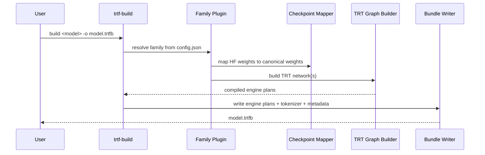
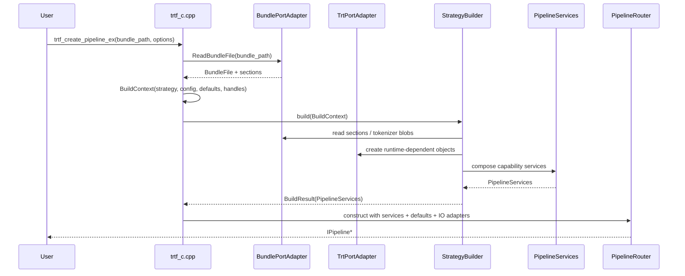
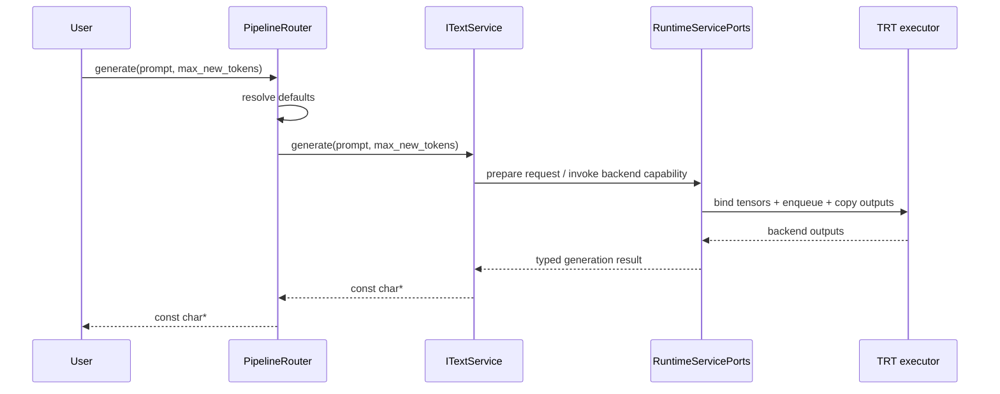
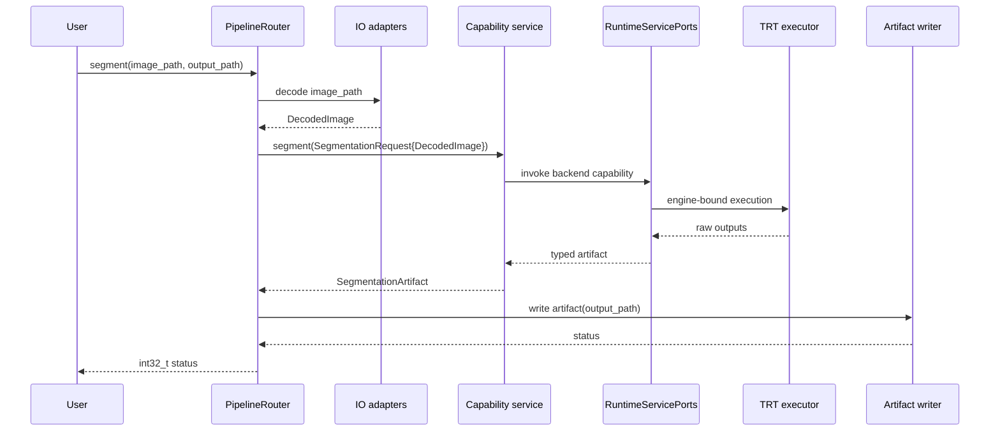

# Dynamic Design

This page documents the live build-time and run-time flows. The runtime path is the builder-composed runtime that returns a `PipelineRouter` over `PipelineServices`.

## 1. Bundle Build Flow

## 2. Runtime Creation Flow

## 3. Text Generation Request Flow

## 4. Media Request Flow

Segmentation, detection, speech, transcription, and vision-language calls follow the same pattern: file paths stop at the router boundary.

## 5. Why This Flow Is Testable

Each stage can be tested independently.

- Builders: validate bundle/config behavior without running full inference.
- Router: validate defaults, decode/load behavior, and artifact writes with fake loaders and writers.
- Services: validate request handling with fake ports.
- Executors: validate bind/copy/enqueue/sync behavior with focused harnesses.
- Pure seams: validate planner and postprocess logic with direct unit tests.

That separation is what keeps the runtime scalable and coverage-friendly.
