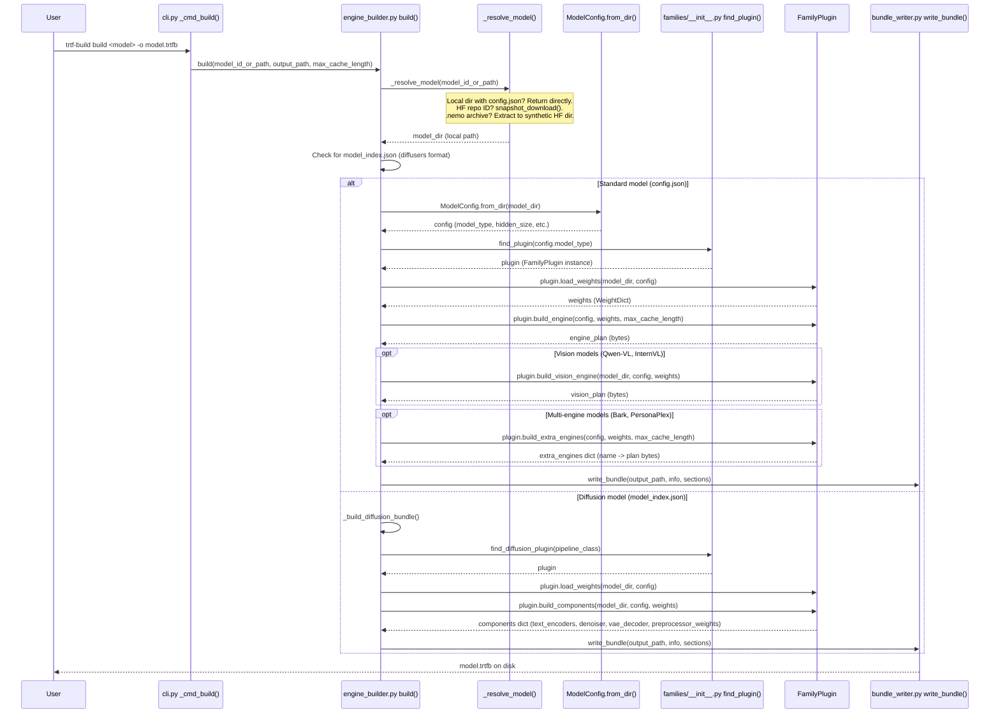
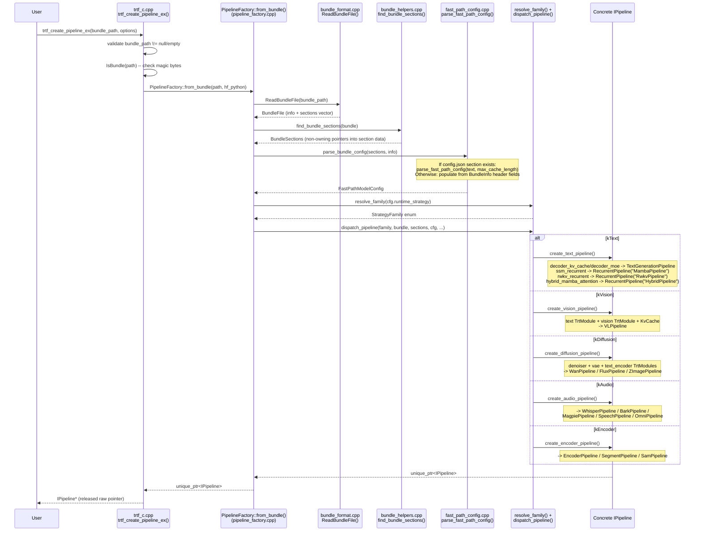
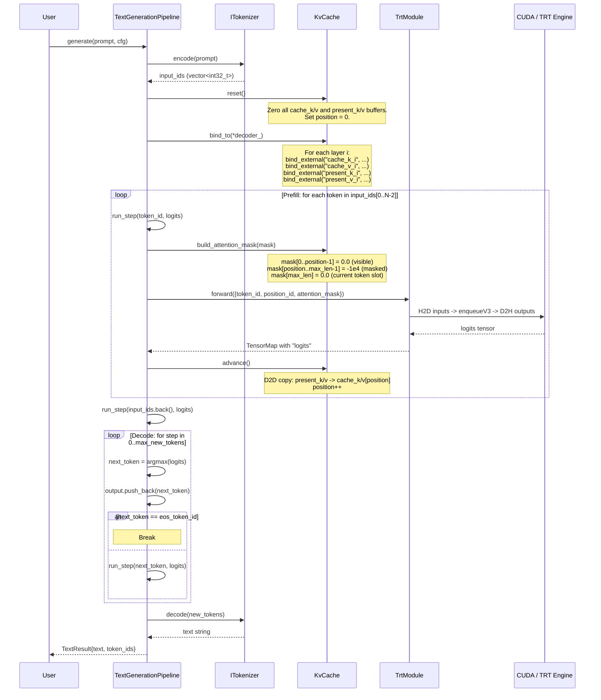
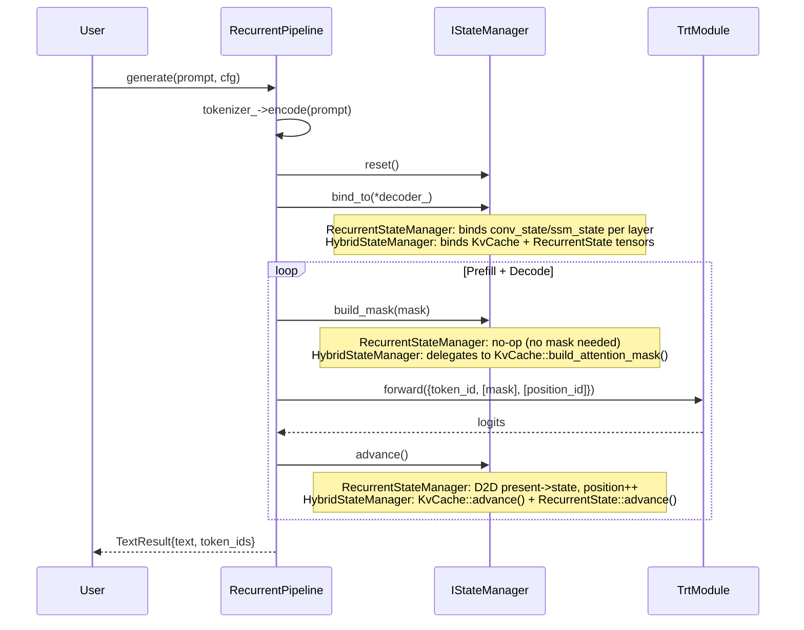
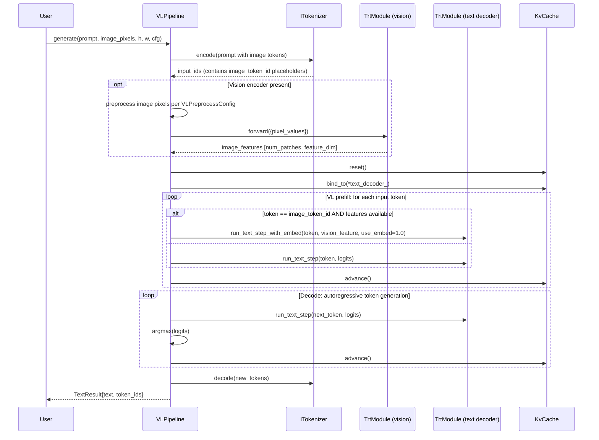
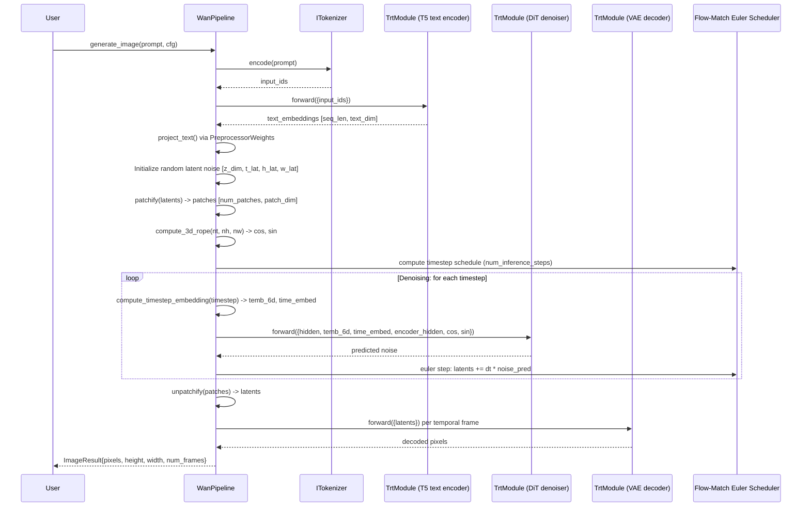
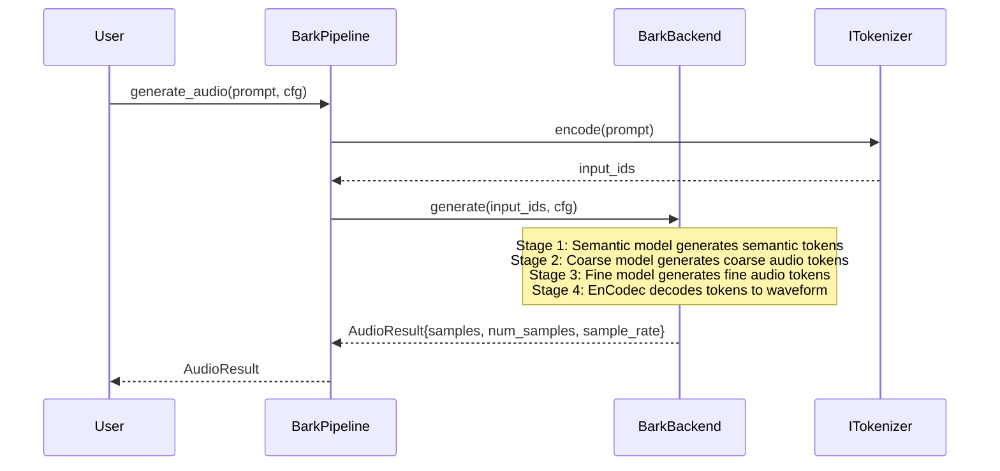
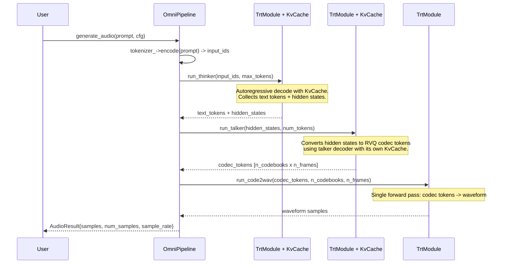

# Dynamic Design

| Field | Value |
|-------|-------|
| Document ID | DD-001 |
| ISO 26262-6 clause | 7 (Dynamic aspects of the software architectural design) |
| Applicable to | trt-transformers-cpp (Python build + C++ runtime) |
| Revision | 2.0 |
| Date | 2026-03-12 |
| Status | Living document -- reflects code as of this revision date |
| Author | Safety Architecture Team (yifeif@nvidia.com) |
| Reviewer | Independent Review Required (TBD — assign before merge) |
| Review Status | Pending independent review |

---

This page documents the actual runtime flows as implemented in source code today.
Every participant, function name, and file path references real code.
There is no `PipelineRouter`, `PipelineServices`, `BuildContext`, or `StrategyBuilder` in the codebase.

---

## 1. Bundle Build Flow (Python)

Entry point: `trtf_build/trtf_build/engine_builder.py` function `build()`.

**Key files:**
- `trtf_build/trtf_build/cli.py` -- CLI dispatch
- `trtf_build/trtf_build/engine_builder.py` -- `build()`, `build_bundle()`, `_build_diffusion_bundle()`
- `trtf_build/trtf_build/config.py` -- `ModelConfig.from_dir()`
- `trtf_build/trtf_build/families/__init__.py` -- `find_plugin()`, `find_diffusion_plugin()`
- `trtf_build/trtf_build/families/base.py` -- `FamilyPlugin` protocol
- `trtf_build/trtf_build/bundle_writer.py` -- `write_bundle()`

---

## 2. Runtime Pipeline Creation Flow (C++)

Entry point: `trtf_create_pipeline_ex()` in `src/cabi/api/trtf_c.cpp`.
All assembly logic lives in `PipelineFactory::from_bundle()` in `src/runtime/pipeline_factory.cpp`.

**Key files:**
- `src/cabi/api/trtf_c.cpp` -- C ABI entry point (108 LOC)
- `src/runtime/pipeline_factory.cpp` -- `PipelineFactory::from_bundle()`, all `create_*_pipeline()` functions (~700 LOC)
- `include/trtf/runtime/pipeline_factory.h` -- `PipelineFactory` class declaration
- `src/bundle/bundle_format.cpp` -- `ReadBundleFile()`, `HasBundleMagic()`
- `src/cabi/bundle/bundle_helpers.cpp` -- `find_bundle_sections()`, `extract_tokenizer_from_bundle()`
- `src/cabi/config/fast_path_config.cpp` -- `parse_fast_path_config()`

---

## 3. Text Generation Request Flow

Entry point: `TextGenerationPipeline::generate()` in `src/runtime/pipelines/text_generation_pipeline.cpp`.

**Key files:**
- `src/runtime/pipelines/text_generation_pipeline.cpp` -- `generate()`, `generate_from_ids()`, `run_step()`
- `src/runtime/pipelines/text_generation_pipeline.h` -- class declaration
- `src/runtime/trt/core/kv_cache.cpp` -- `bind_to()`, `advance()`, `build_attention_mask()`, `reset()`
- `src/runtime/trt/core/trt_module.cpp` -- `forward()`, `forward_async()`, `bind_external()`

---

## 4. Recurrent (Mamba/RWKV/Hybrid) Generation Flow

Same generate loop structure as text generation, but using `IStateManager` abstraction.

**Key files:**
- `src/runtime/pipelines/recurrent_pipeline.h` -- `RecurrentPipeline`, `IStateManager`, `RecurrentStateManager`, `HybridStateManager`
- `src/runtime/pipelines/recurrent_pipeline.cpp` -- `generate()`, `run_step()`
- `include/trtf/runtime/recurrent_state.h` -- `RecurrentState` class

---

## 5. Vision-Language Generation Flow

Entry point: `VLPipeline::generate()` in `src/runtime/pipelines/vl_pipeline.cpp`.

**Key files:**
- `src/runtime/pipelines/vl_pipeline.h` -- `VLPipeline`, `VLConfig`
- `src/runtime/pipelines/vl_pipeline.cpp` -- `generate()`, `generate_vl_from_ids()`, `run_vision_encoder()`
- `src/runtime/trt/multimodal/image_preprocessor.h` -- `VLPreprocessConfig`, preprocessing strategies

---

## 6. Diffusion Generation Flow (WanPipeline)

Entry point: `WanPipeline::generate_image()` in `src/runtime/pipelines/wan_pipeline.cpp`.

**Key files:**
- `src/runtime/pipelines/diffusion_pipeline.h` -- `WanPipeline`, `FluxPipeline`, `ZImagePipeline`
- `src/runtime/pipelines/wan_pipeline.cpp` -- `generate_image()`, denoising loop, VAE decode
- `src/runtime/pipelines/flux_pipeline.cpp` -- FLUX-specific RoPE, timestep embedding, dual tokenizer
- `src/runtime/pipelines/z_image_pipeline.cpp` -- Z-Image patchify, caption projection
- `src/runtime/trt/core/flow_match_euler_scheduler.cpp` -- scheduler implementation

---

## 7. Audio Generation Flow (Bark)

Entry point: `BarkPipeline::generate_audio()` in `src/runtime/pipelines/audio_pipeline.cpp`.

**Key files:**
- `src/runtime/pipelines/audio_pipeline.h` -- `BarkPipeline`, `WhisperPipeline`, `MagpiePipeline`, `SpeechPipeline`, `OmniPipeline`
- `src/runtime/pipelines/audio_pipeline.cpp` -- pipeline implementations
- `src/runtime/pipelines/audio_backend_factory.h` -- `make_whisper_pipeline_from_bundle()`, etc.
- `src/runtime/trt/audio/bark_backend.h` -- `BarkBackend`

---

## 8. Omni Multimodal Flow (TrtModule-based)

Entry point: `OmniPipeline::generate_audio()` in `src/runtime/pipelines/audio_pipeline.cpp`.

**Key files:**
- `src/runtime/pipelines/audio_pipeline.h` -- `OmniPipeline`, `OmniConfig`
- `src/runtime/pipelines/audio_pipeline.cpp` -- `run_thinker()`, `run_talker()`, `run_code2wav()`

---

## 9. Error Propagation

All flows use the same error pattern:

1. `trtf_create_pipeline_ex()` catches all exceptions via `try/catch(...)`.
2. On failure, `set_last_error(msg)` stores the message in a thread-local string.
3. The function returns `nullptr`.
4. The caller retrieves the error via `trtf_last_error()`.

Pipeline method errors (e.g., `generate()` on an unsupported pipeline type) throw `std::runtime_error` from the default `IPipeline` virtual method implementations in `include/trtf/pipeline.h`.

---

## 10. Thread Safety

- `g_last_error` in `trtf_c.cpp` is `thread_local` -- safe for concurrent pipeline creation on different threads.
- Individual `IPipeline` instances are NOT thread-safe. Each pipeline owns an exclusive CUDA stream and device state (KvCache, RecurrentState, TrtModule execution context). Concurrent `generate()` calls on the same pipeline instance produce undefined behavior.
- Different pipeline instances on different CUDA streams can run concurrently.

---

## 11. Testability

Each stage in these flows is independently testable:

| Stage | Test approach | Test location |
|-------|--------------|---------------|
| `ModelConfig.from_dir()` | Synthetic config.json | `tests/builder/test_config.py` |
| `find_plugin()` + `load_weights()` | Synthetic safetensors | `tests/builder/test_family_plugins.py` |
| `write_bundle()` / `ReadBundleFile()` | Round-trip in memory | `tests/builder/test_bundle_writer.py`, `tests/cpp/test_bundle_format.cpp` |
| `parse_fast_path_config()` | Config JSON strings | `tests/cpp/test_fast_path_config.cpp` |
| `find_bundle_sections()` | Synthetic bundles | `tests/cpp/test_bundle_helpers.cpp` |
| KvCache state machine | GPU buffer ops | `tests/cpp/test_device_kv_cache.cpp`, `tests/builder/test_cache_state_machine.py` |
| TrtModule forward | Real TRT engine | `tests/cpp/test_cuda_buffer.cpp` (buffer ops), E2E tests |
| Full pipeline | E2E harness | `tests/test_e2e.py` |
