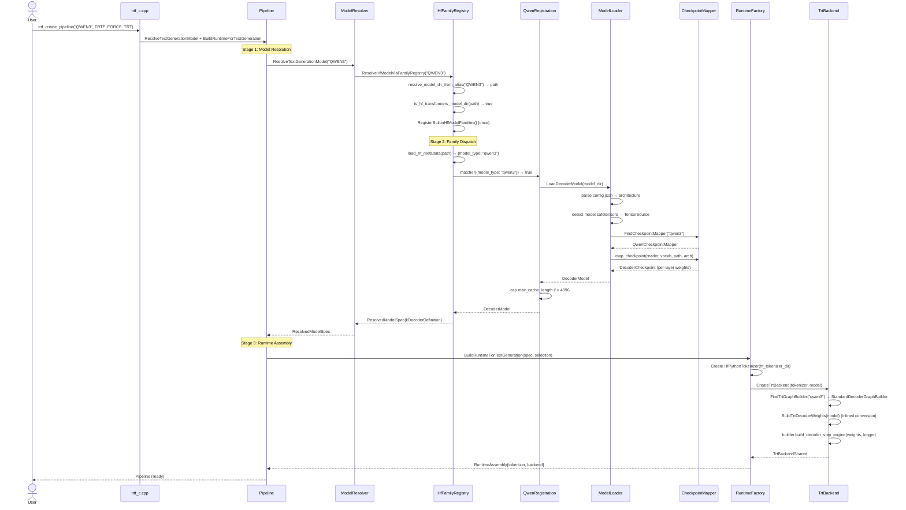
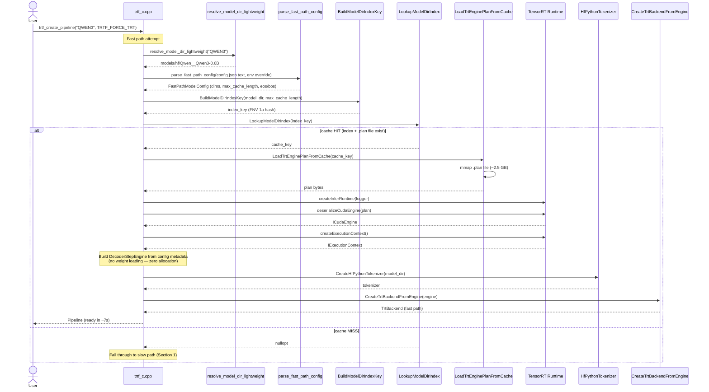
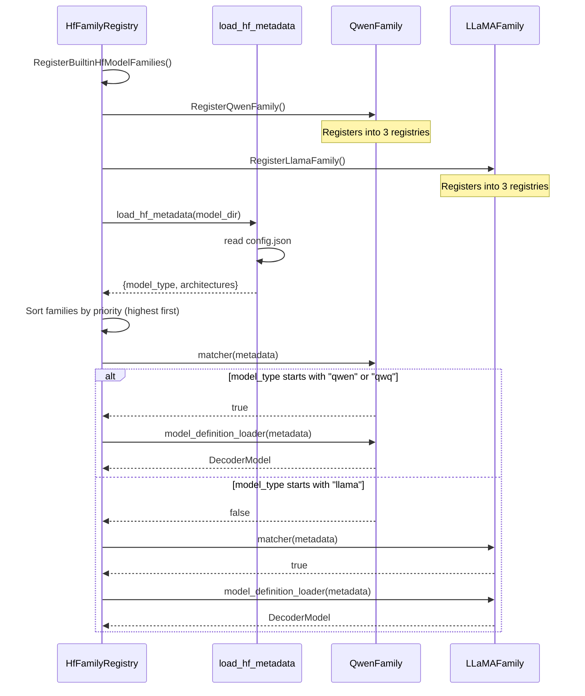
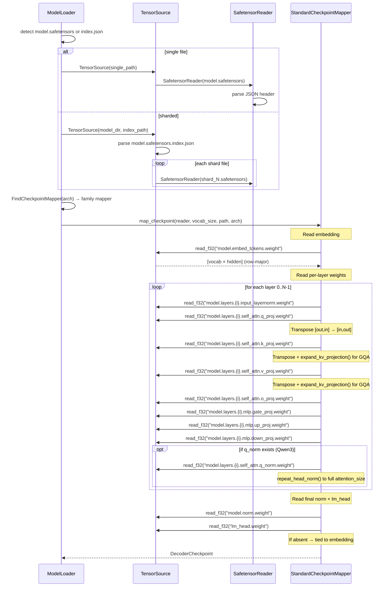
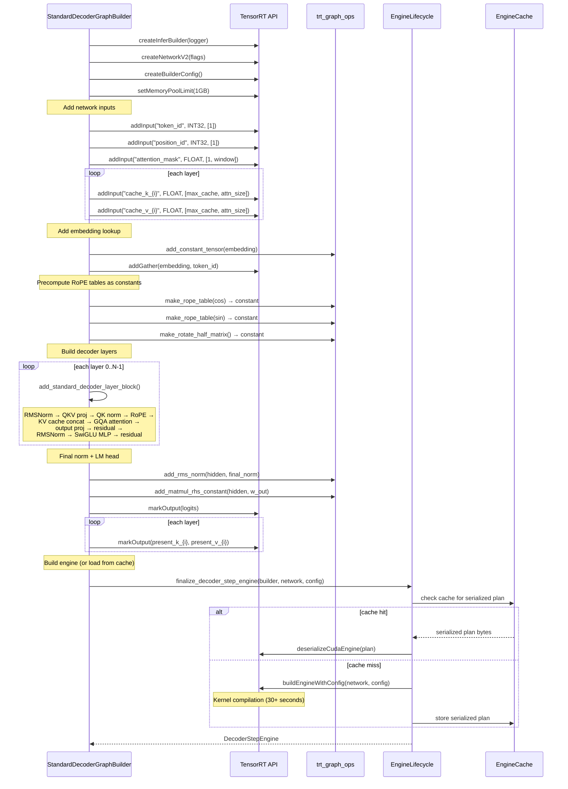
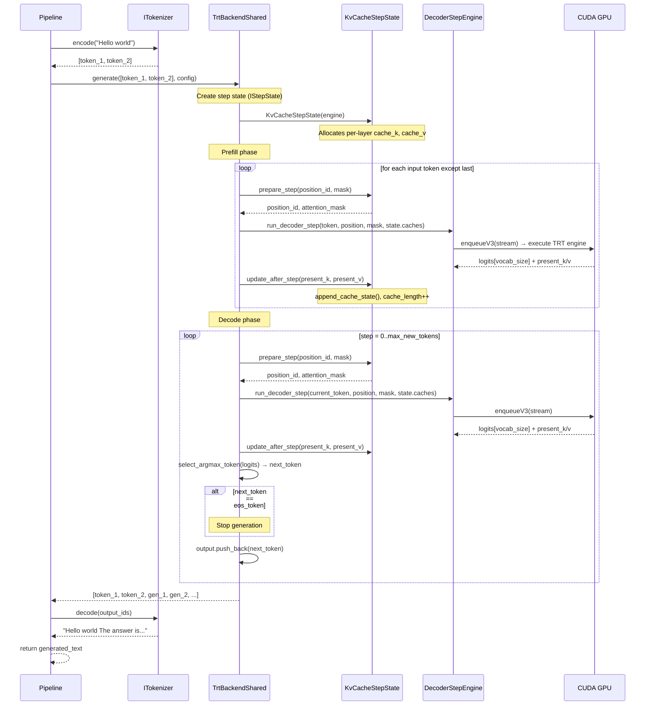
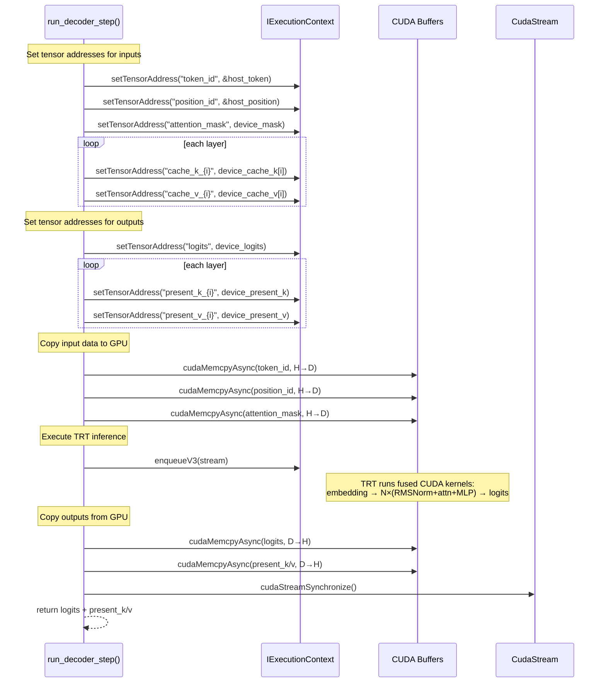
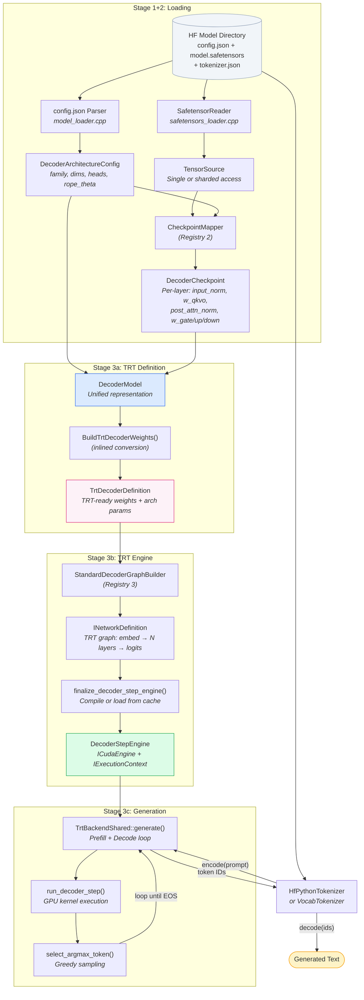

# Dynamic Design: Sequence Diagrams and Data Flow

This page shows the runtime behavior of the system through sequence diagrams and data flow descriptions.

## Table of Contents

1. [Pipeline Creation (Full Sequence)](#1-pipeline-creation-full-sequence)
2. [Pipeline Creation — Fast Path (Cached Engine)](#2-pipeline-creation--fast-path-cached-engine)
3. [HF Family Resolution Detail](#3-hf-family-resolution-detail)
4. [Checkpoint Loading and Mapping](#4-checkpoint-loading-and-mapping)
5. [TRT Engine Build](#5-trt-engine-build)
6. [Autoregressive Generation](#6-autoregressive-generation)
7. [Single Decode Step (TRT)](#7-single-decode-step-trt)
8. [Data Transformation Pipeline](#8-data-transformation-pipeline)

---

## 1. Pipeline Creation (Full Sequence)

End-to-end sequence from `trtf_create_pipeline("QWEN3", TRTF_FORCE_TRT)` to a ready-to-use IPipeline object. The C ABI factory in `trtf_c.cpp` delegates to the same internal stages.

### What happens at each stage

**Stage 1** resolves the model ID. For `"QWEN3"`, alias resolution maps it to a local directory. The resolver tries custom resolvers first (none registered), then the HF family registry.

**Stage 2** parses `config.json` to get `model_type`, matches it against registered families (Qwen matches), and the family loader calls `LoadDecoderModel()` which reads safetensors through the checkpoint mapper registry.

**Stage 3** creates the tokenizer (HfPythonTokenizer if `tokenizer.json` exists) and backend (TRT preferred, with HF-Python fallback). The TRT backend finds the graph builder, converts model weights to TRT format, builds the TensorRT engine, and wraps it in `TrtBackendShared`.

---

## 2. Pipeline Creation -- Fast Path (Cached Engine)

When a TRT engine has been previously built and cached to disk, the fast path bypasses all weight loading, checkpoint mapping, and TRT graph building. This reduces cached startup from ~260s to ~7s.

The fast path is attempted **before** the slow path. On cache miss, it returns `nullptr` and the slow path runs normally. On the first successful slow-path build, the engine cache index is saved so subsequent runs take the fast path.

### What makes the fast path fast

| Slow path step | Time | Fast path equivalent |
|---------------|------|---------------------|
| Load safetensors (600M+ FP32 weights) | ~120s | **Skipped entirely** |
| Checkpoint mapping (transpose, GQA expand) | ~40s | **Skipped entirely** |
| TRT engine build (or cache load) | ~100s | mmap .plan file (~400ms) |
| Engine deserialization | ~5s | Same (~5s) |
| Tokenizer init | ~3s | Same (~3s) |

### Model-dir index key

`BuildModelDirIndexKey()` hashes:
- Canonical model directory path
- `config.json` file content (captures all architecture changes)
- `model.safetensors` file size (catches weight file changes without reading data)
- `model.safetensors.index.json` content (for sharded models)
- `max_cache_length` (different cache lengths need different engines)

This ensures any change to the model files invalidates the cache automatically.

### Cache invalidation

`LookupModelDirIndex()` verifies the `.plan` file still exists before returning a cache hit. If the plan was deleted (e.g., TRT version upgrade), it returns `nullopt` and the slow path rebuilds.

---

## 3. HF Family Resolution Detail

Detailed view of how the family registry matches and dispatches.

---

## 4. Checkpoint Loading and Mapping

How HF safetensors tensor keys are translated into the canonical `DecoderCheckpoint`.

### Key transformations during mapping

| Transformation | When | Why |
|---------------|------|-----|
| **Transpose** | All weight matrices | HF stores `[out, in]`, TRT matmul needs `[in, out]` for right-side constant |
| **GQA KV expansion** | `num_kv_heads < num_attention_heads` | `expand_kv_projection()` repeats KV heads to match Q heads, so the TRT graph builder doesn't need special GQA logic |
| **Per-head norm repeat** | When `q_norm`/`k_norm` present | `repeat_head_norm()` expands `[head_dim]` to `[num_heads × head_dim]` for per-head RMSNorm |
| **Tied lm_head** | When `lm_head.weight` absent | Reuses embedding matrix (transposed) as LM head projection |

---

## 5. TRT Engine Build

How `StandardDecoderGraphBuilder` constructs the TensorRT network graph.

---

## 6. Autoregressive Generation

How `TrtBackendShared::generate()` runs the prefill + decode loop.

### Key implementation details

- **State management is abstracted via `IStepState`**. `KvCacheStepState` implements it for standard attention models. Mamba/SSM models can provide `RecurrentStepState`, hybrid models can combine both.
- **KV cache is a fixed-size circular buffer** per layer: `[max_cache_length, attention_size]`. `append_cache_state()` writes new K/V at `position % max_cache_length`.
- **Attention mask** is built each step: `0.0` for visible positions, `-1e9` for masked. Grows by 1 each step.
- **Greedy sampling** via `select_argmax_token()` — scans logits array for maximum value.
- **Greedy sampling** via `select_argmax_token()` -- scans logits array for maximum value.

---

## 7. Single Decode Step (TRT)

Detailed view of what happens inside `run_decoder_step()`.

---

## 8. Data Transformation Pipeline

End-to-end data transformation from HF files to generated text.

### Data formats at each stage

| Stage | Data Format | Key Properties |
|-------|-------------|---------------|
| HF files | Safetensors binary (F32/F16/BF16) + JSON config | HF tensor naming, `[out, in]` weight layout |
| After CheckpointMapper | `DecoderCheckpoint` with `vector<float>` per tensor | Transposed to `[in, out]`, GQA KV expanded, canonical field names |
| After BuildTrtDecoderWeights | `TrtDecoderDefinition` with per-layer `TrtDecoderLayerDefinition` | Same data as checkpoint but organized for TRT graph builder consumption, with validated sizes |
| TRT Network | `INetworkDefinition` with `ITensor*` nodes | Weights baked as constant tensors, ops fused by TRT compiler |
| Compiled Engine | `ICudaEngine` serialized plan | Optimized CUDA kernels, can be cached to disk |
| Runtime | Host `int32_t` token IDs + device `float` KV caches | Prefill processes input tokens, decode generates one token per step |
