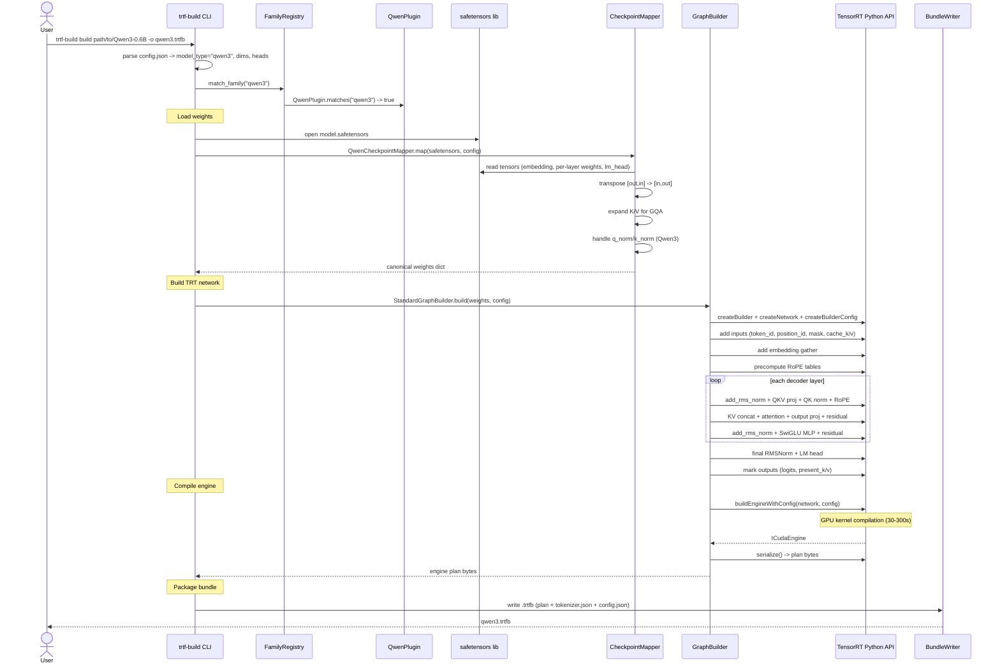
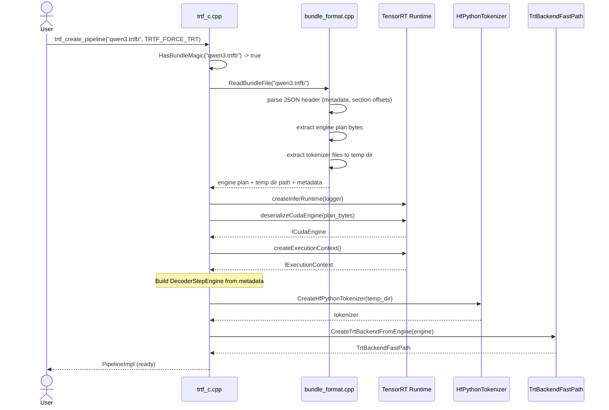
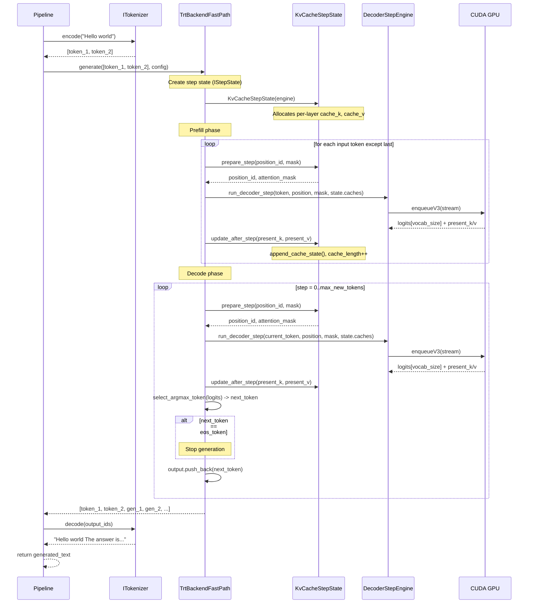
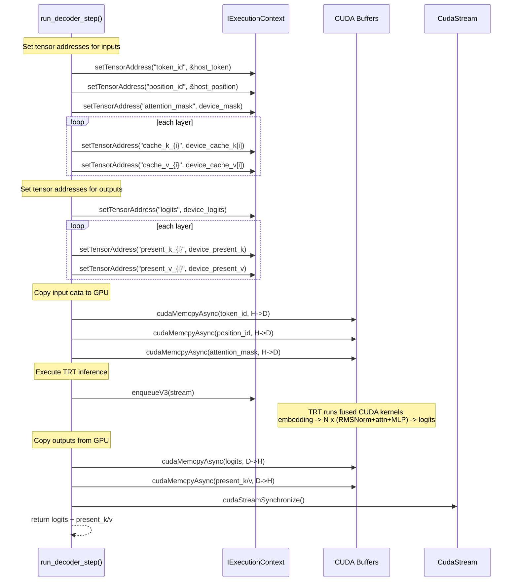
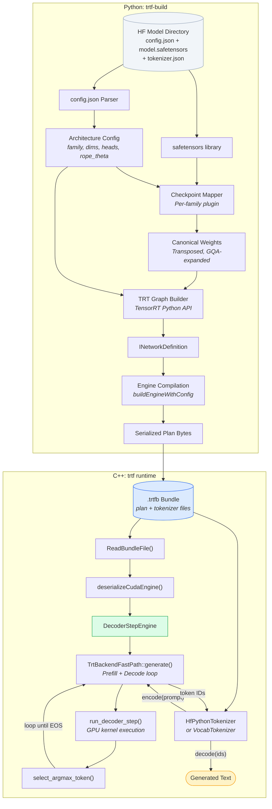

# Dynamic Design: Sequence Diagrams and Data Flow

This page shows the runtime behavior of the system through sequence diagrams and data flow descriptions. The system is split: Python builds bundles, C++ runs them.

## Table of Contents

1. [Bundle Build (Python)](#1-bundle-build-python)
2. [Bundle Load and Pipeline Creation (C++)](#2-bundle-load-and-pipeline-creation-c)
3. [Autoregressive Generation (C++)](#3-autoregressive-generation-c)
4. [Single Decode Step (TRT)](#4-single-decode-step-trt)
5. [Data Transformation Pipeline](#5-data-transformation-pipeline)

---

## 1. Bundle Build (Python)

End-to-end sequence for `trtf-build build path/to/Qwen3-0.6B -o qwen3.trtfb`.

---

## 2. Bundle Load and Pipeline Creation (C++)

Sequence for `trtf_create_pipeline("qwen3.trtfb", TRTF_FORCE_TRT)`.

---

## 3. Autoregressive Generation (C++)

How `TrtBackendFastPath::generate()` runs the prefill + decode loop.

### Key implementation details

- **State management is abstracted via `IStepState`**. `KvCacheStepState` implements it for standard attention models.
- **KV cache is a fixed-size circular buffer** per layer: `[max_cache_length, attention_size]`. `append_cache_state()` writes new K/V at `position % max_cache_length`.
- **Attention mask** is built each step: `0.0` for visible positions, `-1e9` for masked. Grows by 1 each step.
- **Greedy sampling** via `select_argmax_token()` -- scans logits array for maximum value.

---

## 4. Single Decode Step (TRT)

Detailed view of what happens inside `run_decoder_step()`.

---

## 5. Data Transformation Pipeline

End-to-end data transformation from HF files to generated text, showing the Python/C++ boundary.

### Data formats at each stage

| Stage | Location | Data Format |
|-------|----------|-------------|
| HF files | Input | Safetensors binary (F32/F16/BF16) + JSON config |
| After checkpoint mapper | Python | NumPy arrays, transposed to `[in, out]`, GQA KV expanded |
| TRT Network | Python | `INetworkDefinition` with weights as constant tensors |
| Compiled engine | `.trtfb` bundle | Serialized plan bytes (optimized CUDA kernels) |
| Deserialized engine | C++ runtime | `ICudaEngine` + `IExecutionContext` |
| Runtime | C++ | Host `int32_t` token IDs + device `float` KV caches |
