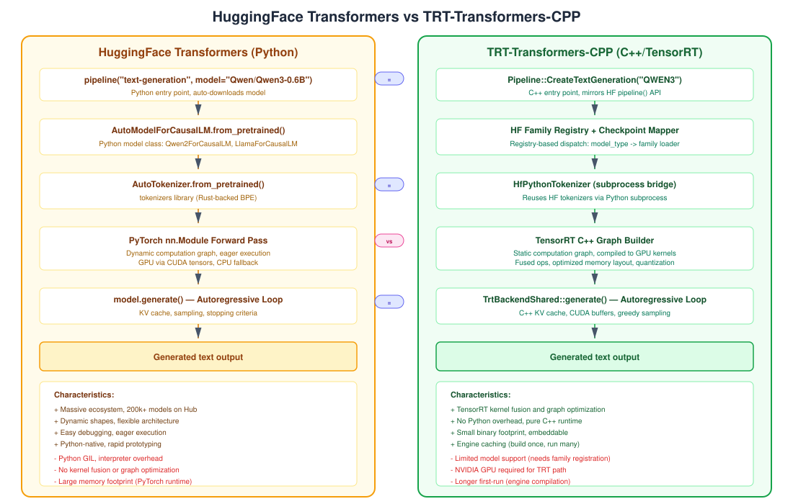

# HuggingFace Transformers vs TRT-Transformers-CPP

This page provides a detailed comparison between HuggingFace's Python `transformers` library and this C++/TensorRT library. Understanding these similarities and differences helps when porting models or debugging parity issues.



## API Comparison

| Concept | HuggingFace Transformers | TRT-Transformers-CPP |
|---------|-------------------------|---------------------|
| Entry point | `pipeline("text-generation", model=...)` | `trtf_create_pipeline(model_id, flags)` |
| Generation | `pipeline("Hello")` | `pipeline->generate("Hello")` |
| Model loading | `AutoModelForCausalLM.from_pretrained()` | `LoadDecoderModel(model_dir)` via family registry |
| Tokenizer | `AutoTokenizer.from_pretrained()` | `HfPythonTokenizer` (subprocess) or `VocabTokenizer` |
| Config | `AutoConfig.from_pretrained()` | `config.json` parsing in `model_loader.cpp` |
| Backend selection | `device_map="auto"` / `.to("cuda")` | `prefer_trt=true` / `force_trt=true` |

## Architectural Parallels

### Model Discovery

**HuggingFace**: Uses `AutoModelForCausalLM` which reads `config.json`'s `architectures` field to dispatch to a specific Python model class (e.g., `Qwen2ForCausalLM`).

**TRT-Transformers-CPP**: Uses the HF Family Registry which reads `config.json`'s `model_type` to dispatch to a registered family loader. Same metadata, different dispatch mechanism.

```python
# HF: Dynamic class dispatch via Python __init_subclass__
model = AutoModelForCausalLM.from_pretrained("Qwen/Qwen3-0.6B")
# Internally: architectures=["Qwen2ForCausalLM"] → Qwen2ForCausalLM class
```

```cpp
// TRT: Registry-based dispatch via function pointers
auto spec = ResolveTextGenerationModel("Qwen/Qwen3-0.6B");
// Internally: model_type="qwen2" → qwen::RegisterQwenFamily matcher
```

### Weight Loading

**HuggingFace**: `from_pretrained()` downloads safetensors, uses `safetensors` library to load tensors directly into PyTorch `nn.Parameter` objects using the exact HF tensor key names.

**TRT-Transformers-CPP**: `SafetensorReader` parses the safetensors binary format, then the **Checkpoint Mapper** translates HF key names to canonical `DecoderCheckpoint` fields with explicit transposition.

Key difference: **HF stores weights as `[out_features, in_features]`** (PyTorch convention). TRT-Transformers-CPP transposes them to `[in_features, out_features]` during checkpoint mapping for efficient right-side matmul in TRT.

### The Transformer Block

Both implement the same mathematical operations. The differences are in execution strategy:

| Operation | HuggingFace | TRT-Transformers-CPP |
|-----------|-------------|---------------------|
| RMSNorm | `Qwen2RMSNorm(nn.Module)` — Python class, eager PyTorch op | `add_rms_norm()` — TRT graph op, fused kernel |
| QKV Projection | `nn.Linear` (separate Q, K, V modules) | `add_matmul_rhs_constant()` × 3 — constant folded |
| RoPE | `apply_rotary_pos_emb()` — dynamic Python function | `add_apply_rope()` — precomputed cos/sin tables as TRT constants |
| Attention | `torch.matmul` + masking + softmax | TRT `addMatrixMultiply` + `addSoftMax` — fused |
| SwiGLU | `self.act_fn(gate) * up` in Python | `addActivation(SIGMOID)` + `addElementWise(PROD)` — fused |
| Residual | Python `+` operator | `addElementWise(kSUM)` |

### GQA (Grouped Query Attention)

**HuggingFace**: Keeps K/V at their natural smaller size (`num_key_value_heads`), then `repeat_kv()` expands them to match Q's head count at attention time.

**TRT-Transformers-CPP**: Expands K/V projections at **checkpoint loading time** via `expand_kv_projection()` in `StandardCheckpointMapper`. This means KV weights are stored at full Q-head size, so the TRT graph builder doesn't need special GQA logic — it always sees matching head counts.

### KV Cache

**HuggingFace**: `DynamicCache` class. K/V tensors grow dynamically as the sequence extends. Python list of per-layer `(key, value)` tuples.

**TRT-Transformers-CPP**: Fixed-size `CudaBuffer` per layer. Circular buffer approach with `max_cache_length` slots. Concatenation is done inside the TRT network graph (cache input → concat with new K/V → output as present K/V). Host-side `append_cache_state()` updates the buffer between steps.

## Tokenization

**HuggingFace**: `tokenizers` library (Rust-backed, called from Python). BPE, WordPiece, SentencePiece, etc.

**TRT-Transformers-CPP**: Two paths:
1. **HfPythonTokenizer**: Spawns a Python subprocess that imports `transformers` and calls the same HF tokenizer. Exact parity guaranteed.
2. **VocabTokenizer**: Simple word-to-id lookup from vocabulary list.

The subprocess approach ensures tokenization parity. The `TRTF_HF_PYTHON` environment variable must point to a Python with `transformers` installed.

## Numerical Parity

For the same model weights and input, TRT and HF should produce nearly identical logits. Sources of small differences:

| Source | Magnitude | Reason |
|--------|-----------|--------|
| FP32 accumulation order | ~1e-6 | TRT may reorder operations for GPU efficiency |
| TF32 (disabled by default) | ~1e-3 | We explicitly `clearFlag(BuilderFlag::kTF32)` |
| RoPE table precision | ~1e-7 | Precomputed vs on-the-fly computation |
| Softmax implementation | ~1e-6 | Different reduction algorithms |

Validation tools:
```bash
# E2E logit comparison
python3 scripts/diff_logits.py --model-dir <hf-dir> --binary ./build/trtf \
  --backend-flag --force-trt --atol 1e-3 --battery

# Per-layer hidden state comparison
python3 scripts/diff_layers.py --model-dir <hf-dir>
```

## What HF Has That We Don't (Yet)

| Feature | HF | TRT-Transformers |
|---------|-----|-----------------|
| Auto model download | Hub integration, `from_pretrained("Qwen/Qwen3-0.6B")` downloads automatically | Must pre-download weights to local directory |
| Sampling strategies | top-k, top-p, beam search, temperature, repetition penalty | Greedy argmax only (currently) |
| Dynamic batch size | Arbitrary batch sizes | Batch size = 1 |
| Quantization | GPTQ, AWQ, bitsandbytes | FP32 only (TRT quantization planned) |
| Attention variants | Flash Attention 2, SDPA, PagedAttention | Standard scaled dot-product in TRT |
| Model formats | safetensors, PyTorch bin, GGUF | safetensors only |
| Architecture breadth | 200+ model architectures | Dense decoders with standard structure |

## What We Have That HF Doesn't

| Feature | Description |
|---------|-------------|
| TensorRT kernel fusion | Operations are fused into optimized CUDA kernels at compile time |
| Engine caching | Compiled engines serialized to disk, instant reload |
| Zero Python runtime | Core inference path is pure C++ (tokenizer bridge is optional) |
| Embeddable | Statically linked library, no interpreter needed |
| Deterministic CPU fallback | Transition-table backend for testing without GPU |

## File-Level Correspondence

| HF Python File | TRT-Transformers-CPP File | Notes |
|----------------|--------------------------|-------|
| `modeling_qwen2.py` | `src/models/qwen/registration.cpp` | Model class ↔ family registration |
| `modeling_qwen2.py::Qwen2Attention` | `standard_decoder_graph_builder.cpp::add_standard_decoder_layer_block()` | Attention implementation |
| `modeling_qwen2.py::Qwen2MLP` | Same function, SwiGLU section | MLP implementation |
| `configuration_qwen2.py` | `model_loader.cpp::load_config()` | Config parsing |
| `modeling_utils.py::from_pretrained()` | `model_loader.cpp::LoadDecoderModel()` | Weight loading |
| `generation/utils.py::generate()` | `trt_backend_shared.cpp::generate()` | Autoregressive loop |
| `cache_utils.py::DynamicCache` | `trt_decode_runtime.cpp::append_cache_state()` | KV cache management |
