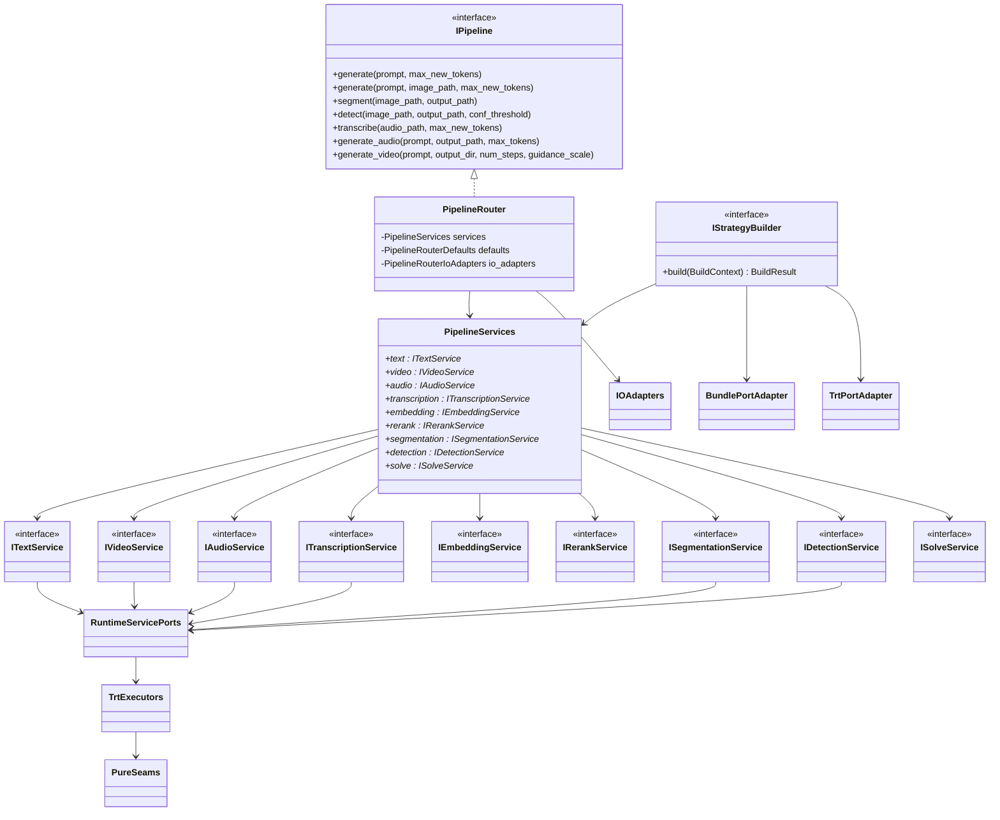

# Static Design

This page describes the live runtime structure. The public API remains `IPipeline`, but the runtime is implemented as a service-composed graph centered on strategy builders, `PipelineServices`, and `PipelineRouter`.

## Runtime Class Relationships

## Runtime Units

| Unit ID | Unit | Owns | Primary files |
|---------|------|------|---------------|
| `UD-RT-01` | C ABI edge | bundle-path validation, bundle loading, build-context assembly, top-level error translation, family dispatch | `src/cabi/api/trtf_c.cpp` |
| `UD-RT-02` | Runtime contracts | request/result DTOs, service interfaces, build status/result contracts | `include/trtf/runtime/contracts/*` |
| `UD-RT-03` | Strategy builders | per-family validation and service composition | `src/runtime/builders/*` |
| `UD-RT-04` | Pipeline router | stable `IPipeline` facade, defaults, path-to-DTO conversion, artifact persistence routing | `include/trtf/runtime/pipeline/router.h`, `src/runtime/pipeline/router.cpp` |
| `UD-RT-05` | IO adapters | image/audio decode and artifact write boundaries | `src/runtime/adapters/io/*` |
| `UD-RT-06` | Service layer | text, vision, audio, transcription, embedding, rerank, solve orchestration | `src/runtime/services/*` |
| `UD-RT-07` | Service ports | fakeable capability adapters between services and concrete backends | `src/runtime/services/common/*` |
| `UD-RT-08` | TRT executors | TensorRT/CUDA execution with engine-bound state | `src/runtime/trt/*` |
| `UD-RT-09` | Pure seams | planners, validators, stop policies, tensor-shape logic, postprocessors | seam headers under `src/runtime/trt/**` |

## Unit Responsibilities

### `UD-RT-01` C ABI Edge

`trtf_c.cpp` owns the only runtime creation path. It should stay small in responsibility:

- validate input
- read the bundle
- build `BuildContext`
- choose the strategy family
- call the right builder
- wrap the result in `PipelineRouter`

It should not implement modality-specific request logic.

### `UD-RT-03` Strategy Builders

Builders translate a bundle into a runnable service graph. They decide which services exist, which ports are needed, and what defaults are applied.

### `UD-RT-04` Pipeline Router

`PipelineRouter` exists to keep `IPipeline` stable while the internal runtime stays modular. It should delegate, not own strategy behavior.

### `UD-RT-06` Service Layer

Services implement capability semantics in terms of typed requests and results. They should depend on fakeable ports instead of concrete backends.

### `UD-RT-08` TRT Executors

Executors are the only units that should directly own engine-bound CUDA/TensorRT behavior. When these files grow, more seams should be extracted so planners and postprocessors stay outside executor code.

## Static Design Rules

1. Builders may depend on adapters and ports; services may depend on ports; executors may depend on TensorRT/CUDA.
2. Services must not depend on path-based APIs or artifact filenames.
3. Router and IO adapters are the compatibility boundary.
4. Pure seams should be reusable across tests and executor code.
5. Runtime growth should add builders, services, and seam modules rather than expanding `trtf_c.cpp` or `PipelineRouter` logic.
