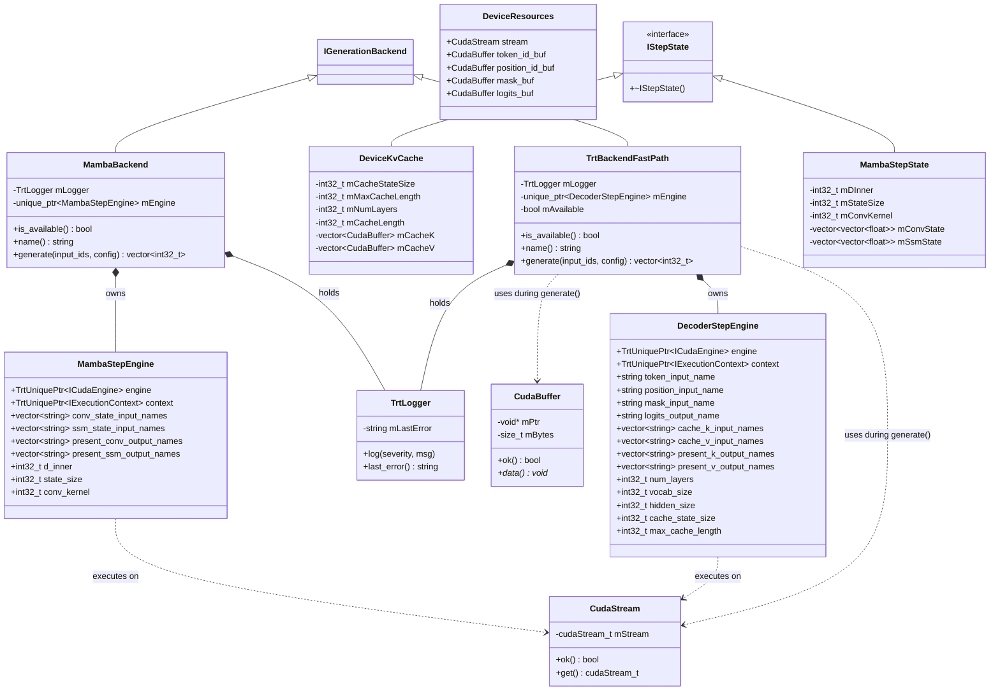
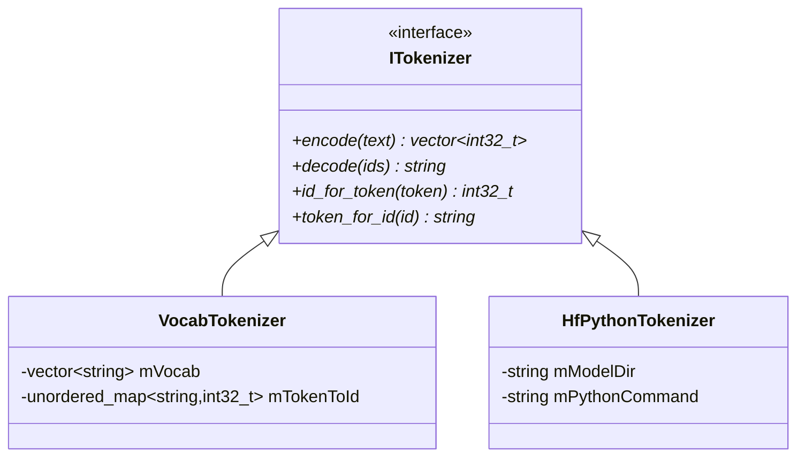

# Static Design: Class-Level UML and Logical Descriptions

This page decomposes the architecture into software units, showing class-level UML diagrams and describing the logical role and implementation of each class. The system is split: Python handles engine building, C++ handles runtime inference.

## Table of Contents

1. [Unit 1: Public API Layer (C++)](#unit-1-public-api-layer-c)
2. [Unit 2: Bundle Format (C++)](#unit-2-bundle-format-c)
3. [Unit 3: TRT Backend Infrastructure (C++)](#unit-3-trt-backend-infrastructure-c)
4. [Unit 4: Tokenization (C++)](#unit-4-tokenization-c)
5. [Unit 5: Python Build Package](#unit-5-python-build-package)
6. [Unit 6: Diffusion Backend (C++)](#unit-6-diffusion-backend-c)

---

## Unit 1: Public API Layer (C++)

The public API is the **C ABI entry point** for library consumers. It accepts `.trtfb` bundle paths.

### Class Diagram


### Logical Description

| Class | Role | Implementation |
|-------|------|---------------|
| **IPipeline / PipelineImpl** | C ABI entry point. Loads bundle, creates tokenizer + backend, provides generation API. | `trtf_create_pipeline()` / `trtf_create_pipeline_ex()` in `src/cabi/trtf_c.cpp`. Detects `.trtfb` bundle, loads engine plan, creates tokenizer from extracted files, wraps in `TrtBackendFastPath`. |
| **ITokenizer** | Abstract interface for text-to-token-ids and back. | Two implementations: `VocabTokenizer` (vocab.txt lookup) and `HfPythonTokenizer` (subprocess bridge). |
| **IGenerationBackend** | Abstract interface for token-level autoregressive generation. | Two implementations: `TrtBackendFastPath` (GPU inference from bundle, KV-cache decoder and MoE), `MambaBackend` (GPU inference from bundle, SSM recurrent state). |
| **GenerationConfig** | Value struct for generation parameters. | `max_new_tokens`, `do_sample`, `temperature`. Passed from PipelineImpl to backend. |

---

## Unit 2: Bundle Format (C++)

Handles reading `.trtfb` bundle files.

### Logical Description

| Class/Function | Role | Implementation |
|---------------|------|---------------|
| **ReadBundleFile()** | Parses `.trtfb` binary format: JSON header + section data. | Returns engine plan bytes, extracted tokenizer files, and metadata. File: `src/bundle/bundle_format.cpp`. |
| **HasBundleMagic()** | Checks if a file starts with the `.trtfb` magic bytes. | Used by the C ABI factory to detect bundles. |
| **InspectBundle()** | Returns human-readable metadata from a bundle. | Reads JSON header without deserializing engine plan. File: `src/bundle/bundle_format.cpp`. |

---

## Unit 3: TRT Backend Infrastructure (C++)

The TRT backend comprises RAII resource wrappers, the deserialized engine, decode runtime utilities, and the autoregressive generation loop.

### Class Diagram



### Logical Description

| Class | Role | Implementation |
|-------|------|---------------|
| **TrtBackendFastPath** | `IGenerationBackend` for bundle-loaded engines. Owns the deserialized engine and runs the autoregressive loop. | `generate()` creates `DeviceKvCache` and `DeviceResources`, runs prefill then decode loop (greedy argmax until EOS or max tokens). File: `src/runtime/trt/trt_backend_shared.cpp`. |
| **IStepState** | Abstract interface for per-step state. | Opaque base (`virtual ~IStepState() = default`). Two implementations: `DeviceKvCache` (attention) and `MambaStepState` (SSM). File: `src/runtime/trt/step_state.h`. |
| **DeviceKvCache** | Device-resident KV-cache for standard attention decoders. Keeps KV cache on GPU; only transfers small inputs H2D per step. | Manages per-layer GPU `cache_k`/`cache_v` buffers, tracks `cache_length`, builds attention masks. D2D cache update is internal. File: `src/runtime/trt/device_kv_cache.cpp`. |
| **DeviceResources** | Pre-allocated per-step I/O buffers for TRT execution. | Holds CUDA stream, token/position/mask/logits device buffers. Allocated once and reused across steps. File: `src/runtime/trt/device_kv_cache.h`. |
| **MambaBackend** | `IGenerationBackend` for Mamba/SSM bundle-loaded engines. | `generate()` creates `MambaStepState`, runs single-step recurrent loop (no prefill phase). File: `src/runtime/trt/mamba_backend.cpp`. |
| **MambaStepEngine** | Mamba TRT engine + execution context + tensor binding metadata. | Holds conv_state/ssm_state tensor names, SSM dimensions. File: `src/runtime/trt/mamba_decode_runtime.h`. |
| **MambaStepState** | Recurrent state for Mamba/SSM models. | Manages per-layer conv_state and ssm_state vectors (constant size, no growth). File: `src/runtime/trt/mamba_step_state.cpp`. |
| **DecoderStepEngine** | Deserialized TRT engine + execution context + tensor binding metadata. | Populated from bundle metadata during loading. File: `src/runtime/trt/trt_engine_lifecycle.h`. |
| **TrtLogger** | TRT `ILogger` implementation. | Forwards to stderr when `TRTF_TRT_LOG_STDERR=1`. File: `src/runtime/trt/trt_common.cpp`. |
| **CudaStream** | RAII wrapper for `cudaStream_t`. | File: `src/runtime/trt/trt_common.cpp`. |
| **CudaBuffer** | RAII wrapper for GPU memory. | File: `src/runtime/trt/trt_common.cpp`. |
| **CreateTrtBackendFromEngine()** | Creates TrtBackendFastPath from a deserialized engine. | Used when loading from `.trtfb` bundle. File: `src/runtime/trt/trt_backend_shared.cpp`. |

### VL Image Preprocessing

VL (vision-language) image preprocessing is handled by `image_preprocessor.h/cpp`:

| Struct/Function | Role | Implementation |
|----------------|------|---------------|
| **VLPreprocessConfig** | Configuration for VL image preprocessing. | Contains `fixed_image_size`, `patch_size`, `merge_size`, `image_mean`/`image_std`, `preprocessor_type`, `interpolation`, prompt template, and token fields. File: `src/runtime/trt/image_preprocessor.h`. |
| **PreprocessedImage** | Result of image preprocessing. | Contains `pixel_values` (float vector), `channels`, `height`, `width`, `ok` flag. Layout depends on preprocessor_type. |
| **load_and_preprocess_image()** | Loads and preprocesses a single image. | Dispatches to strategy based on `preprocessor_type`: `qwen_merge_group` (merge-group patch permutation), `simple_chw` (standard resize), `center_crop_chw` (center-crop then resize), `aspect_preserve_chw` (aspect-preserving resize + zero-pad). Unknown types warn and fall back to `qwen_merge_group`. |
| **parse_vl_preprocess_config()** | Parses VL config from JSON strings. | Reads from `config.json` (preprocessor_type, interpolation, image_token_id, etc.) and `preprocessor_config.json` (patch_size, merge_size, image_mean/std, resample int). Explicit `interpolation` overrides `resample`. |
| **format_vl_prompt()** | Formats a VL prompt with image pad tokens. | Replaces `{image_pads}` and `{prompt}` in `vl_prompt_template`. |

---

## Unit 4: Tokenization (C++)

Two tokenizer implementations, both implementing `ITokenizer`.

### Class Diagram



### Logical Description

| Class | Role | Implementation |
|-------|------|---------------|
| **VocabTokenizer** | Simple word-to-ID lookup from vocabulary list. | File: `src/tokenizer/vocab_tokenizer.cpp`. |
| **HfPythonTokenizer** | Bridges to HF `tokenizers` library via Python subprocess. Exact parity with HF. | File: `src/tokenizer/hf_python_tokenizer.cpp`. |

---

## Unit 5: Python Build Package

The `trtf_build/` package handles all engine building. This is where new model families are added.

### Component Overview

| Component | Role |
|-----------|------|
| **FamilyRegistry** | Matches `model_type` from config.json to a registered family plugin. |
| **FamilyPlugin** | Per-family registration: matcher function, checkpoint mapper, optional custom graph builder. |
| **StandardCheckpointMapper** | Base class for the standard HF tensor naming convention. Handles transpose, GQA expansion, tied lm_head. |
| **StandardGraphBuilder** | Parameterized decoder builder supporting `norm_type` (rmsnorm/layernorm), `mlp_type` (swiglu/gelu_fc), `position_type` (rope/learned), and `activation` (silu/gelu_new/gelu/relu). |
| **graph_ops** | Shared reusable TRT graph ops: RMSNorm, matmul, RoPE, attention, SwiGLU. |
| **BundleWriter** | Writes `.trtfb` bundles: engine plan + tokenizer files + metadata. |
| **DiffusionRunner** | Pure-Python TRT diffusion pipeline: T5 encoding, denoising loop with CFG, frame-by-frame VAE decode. |
| **FlowMatchEulerScheduler** | Flow matching Euler discrete scheduler (numpy). Implements `z_t = (1-t)*x + t*noise`, configurable shift. |
| **StandardDiTBuilder** | Shared DiT engine builder: self-attention with AdaLN, cross-attention, FFN, 3D RoPE. |
| **CausalVAE3DBuilder** | Shared Causal 3D VAE decoder builder: per-frame with temporal caches, causal convolutions. |
| **T5EncoderBuilder** | Shared T5 encoder builder: UMT5/mT5/T5 with relative position bias, gated GELU FFN. |

### Family Plugins

Each family is a single Python file in `trtf_build/trtf_build/families/`:

| Family | Model Types | Architecture | Custom Behavior |
|--------|-------------|--------------|-----------------|
| Qwen | qwen, qwen2, qwen3, qwq | Standard decoder | Handles q_norm/k_norm for Qwen3 |
| LLaMA | llama | Standard decoder | Standard mapper |
| Mistral | mistral | Standard decoder | Standard mapper |
| Gemma | gemma, gemma2 | Standard decoder | +1.0 to RMSNorm gamma, scale embedding |
| Phi | phi3, phi (not phimoe) | Standard decoder | Fused QKV/gate_up splitting |
| Phi-MoE | phimoe | MoE decoder | SparseMixer routing, expert MLPs |
| Granite | granite | Standard decoder | Multiplier absorption |
| InternLM | internlm, internlm2 | Standard decoder | Fused wqkv, custom key names |
| StarCoder2 | starcoder2 | Extended decoder | LayerNorm + GELU FC + RoPE |
| GPT-2 | gpt2 | Extended decoder | Learned positions, fused QKV, Conv1D |
| OPT | opt | Extended decoder | Learned positions, ReLU, position offset |
| Falcon | falcon | Extended decoder | LayerNorm + GELU FC + RoPE + GQA |
| StableLM | stablelm | Extended decoder | LayerNorm + SwiGLU + RoPE |
| Mamba | mamba | SSM | Selective scan, custom graph, no KV cache |
| Qwen-VL | qwen*vl | Vision-language | Vision encoder + text decoder with embed_input |
| Wan T2V | wan | Diffusion (T2V) | T5 + DiT + Causal 3D VAE; flow-match Euler scheduler |

Adding a new family requires creating a single plugin `.py` file with a `plugin` attribute. See [Adding a Model Family](Adding-a-Model-Family.md).

---

## Unit 6: Diffusion Backend (C++)

The diffusion backend handles text-to-video generation with a multi-engine pipeline. Unlike autoregressive decoders, diffusion uses a fixed-step denoising loop producing video frames.

### Class Diagram

```mermaid
classDiagram
    class IDiffusionBackend {
        <<interface>>
        +generate_video(prompt, config)* VideoResult
    }

    class DiffusionBackendBase {
        #TrtLogger mLogger
        #DiffusionConfig mConfig
        #DiffusionEngine mT5Engine
        #DiffusionEngine mDiTEngine
        #DiffusionEngine mVAEEngine
        #PreprocessorWeights mPPWeights
        +run_t5_encoder(input_ids, mask) vector~float~
        +run_denoiser(hidden, timestep_emb, text_emb, rope) vector~float~
        +decode_vae_subprocess(latents, model_dir) vector~uint8_t~
        #cpu_matmul_bias(A, B, bias, M, N, K) vector~float~
        #cpu_silu_inplace(data)
        #cpu_gelu_tanh_inplace(data)
    }

    class WanDiffusionBackend {
        -vector~CudaBuffer~ mVAECaches
        +generate_video(prompt, config) VideoResult
        -compute_timestep_embedding(timestep) vector~float~
        -project_text(text_emb) vector~float~
        -patchify(latents) vector~float~
        -unpatchify(patches) vector~float~
        -compute_3d_rope(num_frames, h, w) pair~vector,vector~
        -decode_vae_native(latents) vector~vector~uint8_t~~
        -init_vae_buffers()
    }

    class DiffusionConfig {
        +string scheduler_type
        +int num_inference_steps
        +float guidance_scale
        +int video_num_frames
        +int video_height
        +int video_width
        +int dit_hidden_size
        +int dit_num_heads
        +int latent_channels
    }

    class PreprocessorWeights {
        +vector~float~ patch_embed_weight
        +vector~float~ patch_embed_bias
        +vector~float~ timestep_mlp_w1
        +vector~float~ timestep_mlp_b1
        +vector~float~ timestep_mlp_w2
        +vector~float~ timestep_mlp_b2
        +vector~float~ text_proj_weight
        +vector~float~ text_proj_bias
    }

    class DiffusionEngine {
        +TrtUniquePtr~ICudaEngine~ engine
        +TrtUniquePtr~IExecutionContext~ context
    }

    class VideoResult {
        +vector~vector~uint8_t~~ frames
        +int width
        +int height
        +bool ok
    }

    IDiffusionBackend <|-- DiffusionBackendBase
    DiffusionBackendBase <|-- WanDiffusionBackend
    DiffusionBackendBase *-- DiffusionConfig : holds
    DiffusionBackendBase *-- PreprocessorWeights : holds
    DiffusionBackendBase *-- DiffusionEngine : owns (x3: T5, DiT, VAE)
    IDiffusionBackend ..> VideoResult : returns
```

### Logical Description

| Class | Role | Implementation |
|-------|------|---------------|
| **IDiffusionBackend** | Abstract interface for diffusion pipelines. | `generate_video()` takes a prompt and returns video frames. File: `src/runtime/trt/diffusion_backend.h`. |
| **DiffusionBackendBase** | Shared base class for diffusion backends. | CPU math helpers, preprocessor weight parsing, T5/DiT engine execution, VAE subprocess fallback. File: `src/runtime/trt/diffusion_backend_base.cpp`. |
| **WanDiffusionBackend** | Wan2.1-specific diffusion backend. | Flow-match Euler scheduler, 3D RoPE (temporal + spatial split), patchify/unpatchify, native causal VAE decode with cache management. File: `src/runtime/trt/wan_diffusion_backend.cpp`. |
| **DiffusionConfig** | Pipeline configuration. | Scheduler type, inference steps, guidance scale, video dimensions, model dimensions. File: `src/runtime/trt/diffusion_backend.h`. |
| **PreprocessorWeights** | DiT preprocessor weights loaded from bundle section. | Patch embedding, timestep MLP, text projection weights. Parsed from binary+JSON index. File: `src/runtime/trt/diffusion_backend.h`. |
| **DiffusionEngine** | TRT engine wrapper for diffusion components. | Wraps engine + execution context for T5, DiT, and VAE engines. File: `src/runtime/trt/diffusion_backend.h`. |
| **VideoResult** | Output of diffusion generation. | Contains decoded frames as byte vectors, dimensions, success flag. File: `src/runtime/trt/diffusion_backend.h`. |
