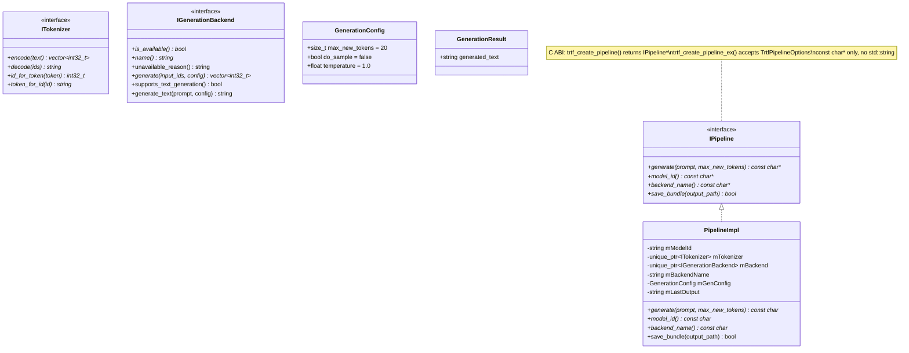
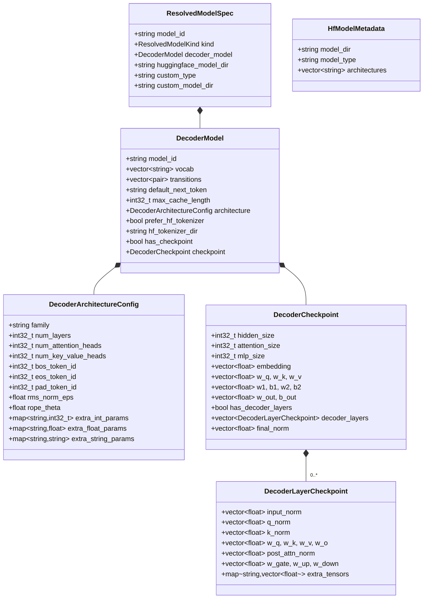
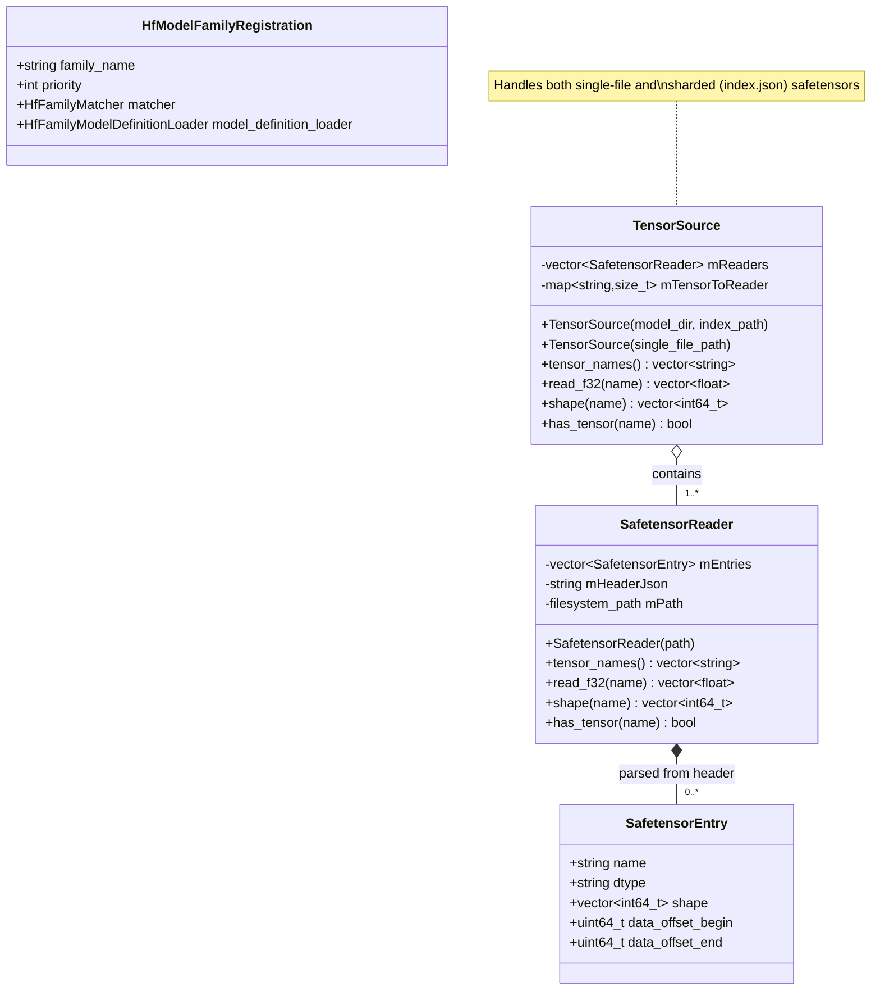
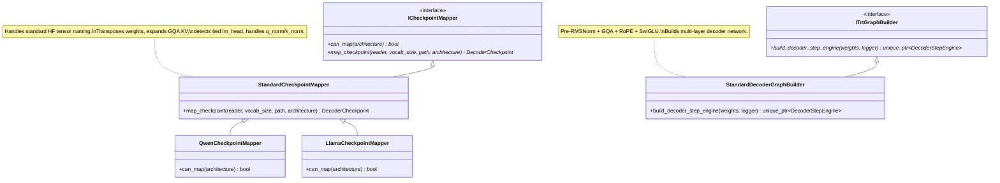
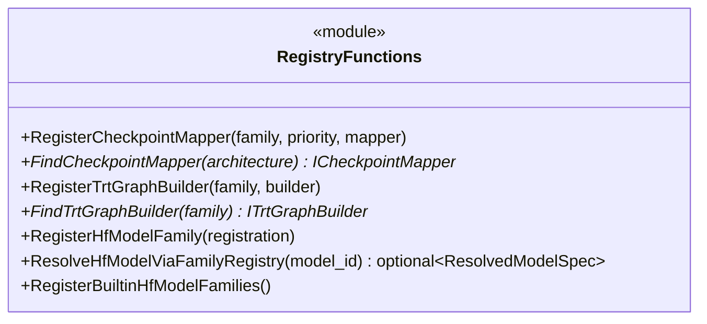
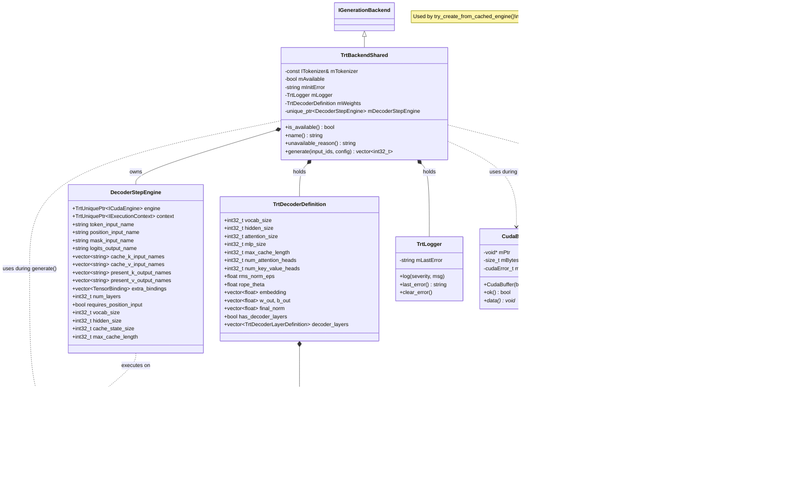
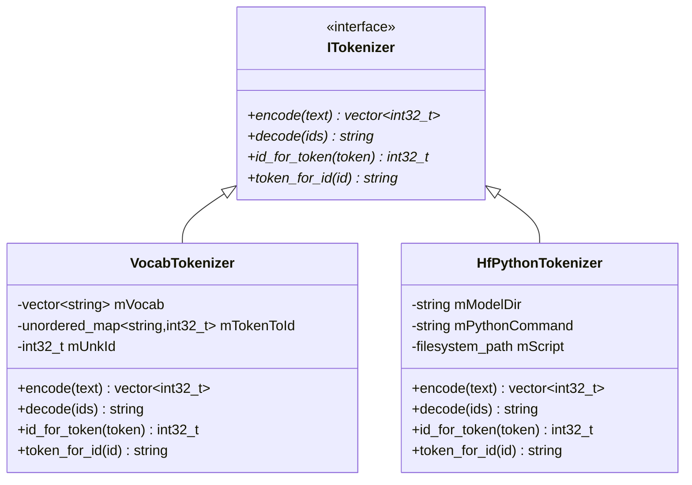
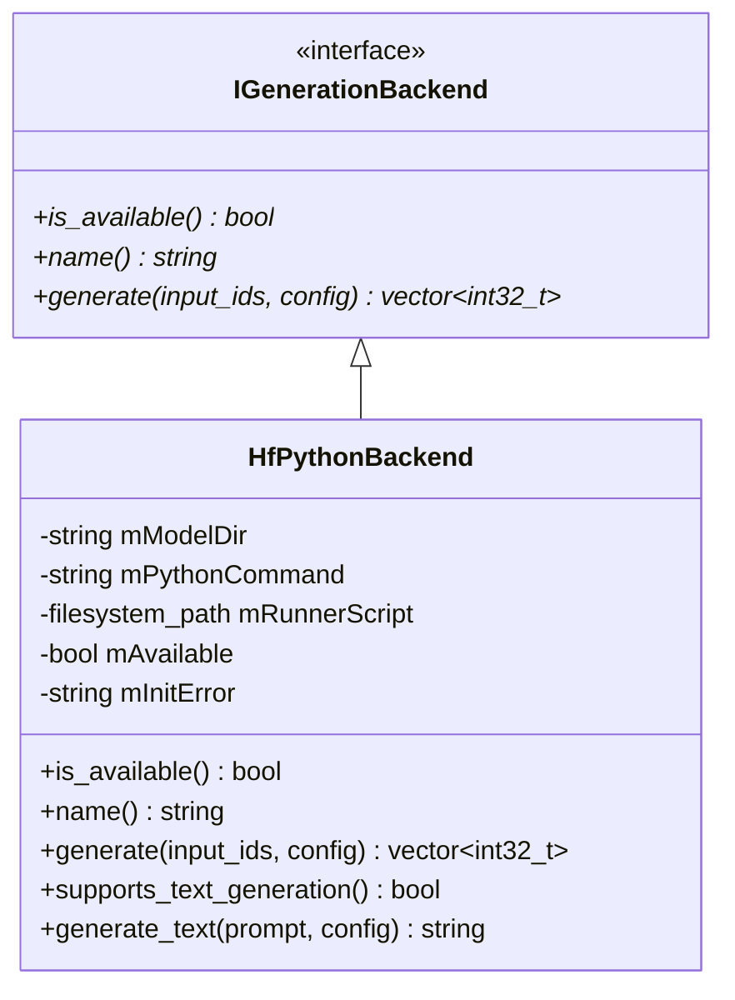

# Static Design: Class-Level UML and Logical Descriptions

This page decomposes the architecture into software units, showing class-level UML diagrams and describing the logical role and implementation of each class.

## Table of Contents

1. [Unit 1: Public API Layer](#unit-1-public-api-layer)
2. [Unit 2: Model Data Structures](#unit-2-model-data-structures)
3. [Unit 3: Model Resolution and Loading](#unit-3-model-resolution-and-loading)
4. [Unit 4: Registry System](#unit-4-registry-system)
5. [Unit 5: TRT Backend Infrastructure](#unit-5-trt-backend-infrastructure)
6. [Unit 6: Tokenization](#unit-6-tokenization)
7. [Unit 7: Alternative Backends](#unit-7-alternative-backends)

---

## Unit 1: Public API Layer

The public API is the **C ABI entry point** (`trtf_create_pipeline` / `trtf_create_pipeline_ex` → `IPipeline*`) for library consumers.

### Class Diagram

### Logical Description

| Class | Role | Implementation |
|-------|------|---------------|
| **IPipeline / PipelineImpl** | C ABI entry point. Resolves model, assembles runtime, provides generation API. | `trtf_create_pipeline()` / `trtf_create_pipeline_ex()` in `src/cabi/trtf_c.cpp` creates `PipelineImpl` which calls `ResolveTextGenerationModel()` (Stage 1) then `BuildRuntimeForTextGeneration()` (Stage 3). `generate()` encodes prompt via tokenizer, calls backend's `generate()`, decodes output. |
| **ITokenizer** | Abstract interface for text-to-token-ids and back. | Pure virtual. Two concrete implementations: `VocabTokenizer` (vocab.txt lookup) and `HfPythonTokenizer` (subprocess bridge). See [Unit 6](#unit-6-tokenization). |
| **IGenerationBackend** | Abstract interface for token-level autoregressive generation. | Pure virtual `generate()` takes input token IDs and returns input + generated IDs. `is_available()` for runtime capability check. Optional `generate_text()` for text-level backends (HF Python). Two implementations: `TrtBackendShared`, `HfPythonBackend`. |
| **GenerationConfig** | Value struct for generation parameters. | Currently supports `max_new_tokens`, `do_sample`, `temperature`. Passed through from PipelineImpl to backend. |

---

## Unit 2: Model Data Structures

These structs form the internal data model. All model sources (HF safetensors, built-in, custom) converge to `DecoderModel`.

### Class Diagram

### Logical Description

| Struct | Role | Key Details |
|--------|------|-------------|
| **DecoderModel** | Unified representation of any loaded model. Consumed by all backends. | Contains architecture metadata (parsed from `config.json`) and optional checkpoint weight tensors. `has_checkpoint=true` when safetensors loaded. `prefer_hf_tokenizer` set when `tokenizer.json` detected. File: `include/trtf/model.h`. |
| **DecoderArchitectureConfig** | Architecture metadata from `config.json`. | `family` drives registry dispatch (e.g., `"qwen3"`, `"llama"`). `num_key_value_heads < num_attention_heads` indicates GQA. `rope_theta` configures RoPE base frequency. Parsed in `model_loader.cpp`. |
| **DecoderCheckpoint** | All weight tensors in canonical format. | Multi-layer fields (`decoder_layers`, `final_norm`) for HF models. `attention_size` may differ from `hidden_size` after GQA KV expansion. |
| **DecoderLayerCheckpoint** | Per-layer weights for one transformer decoder layer. | `q_norm`/`k_norm` are empty for models without per-head norms (LLaMA, Mistral). Non-empty for Qwen3. All projection matrices stored as `[in_features, out_features]` (transposed from HF's `[out, in]` during checkpoint mapping). |
| **ResolvedModelSpec** | Output of Stage 1 (model resolution). | `kind` determines which Stage 3 path runs: `kDecoderDefinition` (TRT backend) or `kHuggingFaceLocal` (HF Python subprocess). |
| **HfModelMetadata** | Parsed metadata from an HF `config.json`. | Used by family matchers. `model_type` is the primary dispatch key (e.g., `"qwen3"`, `"llama"`). `architectures` is secondary (e.g., `["Qwen2ForCausalLM"]`). |

---

## Unit 3: Model Resolution and Loading

These components turn a `model_id` string into a fully-loaded `DecoderModel`.

### Class Diagram

### Logical Description

| Class/Struct | Role | Implementation |
|-------------|------|---------------|
| **SafetensorReader** | Parses a single `.safetensors` file. | Reads the 8-byte header length, parses JSON header to extract tensor names/shapes/offsets, then reads raw data on demand. Supports F32, F16, BF16 dtypes with conversion to float32. File: `src/model/safetensors_loader.cpp`. |
| **TensorSource** | Unified access to single or sharded safetensors. | For single files: wraps one `SafetensorReader`. For sharded models: reads `model.safetensors.index.json`, creates one `SafetensorReader` per shard file, and routes `read_f32(name)` to the correct shard. File: `src/model/safetensors_loader.cpp`. |
| **HfModelFamilyRegistration** | Registration entry for an HF model family. | `matcher` is a `std::function<bool(HfModelMetadata)>` — typically checks `model_type` prefix. `model_definition_loader` is a `std::function<DecoderModel(HfModelMetadata)>` — typically calls `LoadDecoderModel()` after checkpoint mapper is registered. |
| **LoadDecoderModel()** | Free function: generic model loader. | Reads `config.json`, derives architecture, detects vocab source (vocab.txt or placeholder), detects checkpoint format (weights.txt, single safetensors, sharded safetensors), dispatches to `FindCheckpointMapper()` for HF tensor key translation. File: `src/model/model_loader.cpp`. |

---

## Unit 4: Registry System

Three registries provide the plug-and-play extension mechanism. All use priority-sorted dispatch with mutex-protected registration.

### Class Diagram

### Logical Description

| Class | Role | Implementation |
|-------|------|---------------|
| **ICheckpointMapper** | Registry 2 interface. Translates HF safetensors tensor keys to canonical `DecoderCheckpoint`. | `can_map()` checks if this mapper handles the given `architecture.family`. `map_checkpoint()` reads tensors from `TensorSource` and populates `DecoderCheckpoint`. Priority-sorted registry in `checkpoint_mapper.cpp`. |
| **StandardCheckpointMapper** | Base class for the standard HF tensor naming convention. | Handles `model.embed_tokens.weight`, `model.layers.N.self_attn.{q,k,v,o}_proj.weight`, `model.layers.N.mlp.{gate,up,down}_proj.weight`, `model.norm.weight`, `lm_head.weight`. Transposes all weight matrices (`[out,in]` → `[in,out]`). Expands K/V for GQA via `expand_kv_projection()`. Repeats per-head norms via `repeat_head_norm()`. Detects tied `lm_head`. File: `src/model/standard_checkpoint_mapper.cpp` (260 LOC). |
| **QwenCheckpointMapper** | Qwen family mapper. | Inherits all logic from `StandardCheckpointMapper`. Only overrides `can_map()` to match `starts_with(family, "qwen")` or `"qwq"`. 15 LOC. File: `src/models/qwen/checkpoint_mapper.cpp`. |
| **LlamaCheckpointMapper** | LLaMA family mapper. | Same pattern: inherits `StandardCheckpointMapper`, overrides `can_map()` for `"llama"`. 15 LOC. File: `src/models/llama/checkpoint_mapper.cpp`. |
| **ITrtGraphBuilder** | Registry 3 interface. Builds TRT `INetworkDefinition` from `TrtDecoderDefinition`. | `build_decoder_step_engine()` returns a compiled `DecoderStepEngine`. Name-based registry in `trt_graph_builder.cpp`. Lookup: exact family name → `"standard-decoder"` fallback. |
| **StandardDecoderGraphBuilder** | Builds the dominant LLM decoder pattern in TRT. | Creates `INetworkDefinition` with embedding gather, N decoder layers (each: RMSNorm → QKV → optional QK norm → RoPE → GQA attention → residual → RMSNorm → SwiGLU MLP → residual), final RMSNorm, LM head projection. Uses reusable ops from `trt_graph_ops.h`. File: `src/runtime/trt/standard_decoder_graph_builder.cpp`. |

### Registry Free Functions

---

## Unit 5: TRT Backend Infrastructure

The TRT backend comprises RAII resource wrappers, the compiled engine, decode runtime utilities, and the autoregressive generation loop.

### Class Diagram

### Logical Description

| Class | Role | Implementation |
|-------|------|---------------|
| **TrtBackendShared** | `IGenerationBackend` implementation for TRT. Owns the compiled engine and runs the autoregressive loop. | Constructor calls `BuildTrtDecoderWeights()` (inlined conversion) then the provided engine factory (Registry 3 dispatch) to produce a `DecoderStepEngine`. `generate()` creates a `KvCacheStepState` (via `IStepState` interface), runs prefill then decode loop (greedy argmax until EOS or max tokens). File: `src/runtime/trt/trt_backend_shared.cpp`. |
| **IStepState** | Abstract interface for per-step state management during autoregressive generation. | Defines `prepare_step()` (compute position/mask), `cache_k/v_by_layer()` (access current state), `update_after_step()` (incorporate new outputs). Enables Mamba/SSM models to provide recurrent state instead of KV cache. File: `src/runtime/trt/step_state.h`. |
| **KvCacheStepState** | KV-cache state implementation for standard attention-based decoders. | Manages per-layer `cache_k`/`cache_v` vectors, tracks `cache_length`, builds attention masks, appends new state via `append_cache_state()`. Extracted from the previous inline cache management in `generate()`. File: `src/runtime/trt/kv_cache_step_state.cpp`. |
| **DecoderStepEngine** | Compiled TRT engine + execution context + tensor binding metadata. | Created by `finalize_decoder_step_engine()` which builds `ICudaEngine` from `INetworkDefinition` (or loads from cache). Stores all tensor names for inputs (token_id, position_id, attention_mask, per-layer cache_k/v) and outputs (logits, per-layer present_k/v). Also supports `extra_bindings` for non-KV-cache models. File: `src/runtime/trt/trt_engine_lifecycle.h`. |
| **TrtDecoderDefinition** | TRT-ready model weights + architecture parameters. | Produced by `BuildTrtDecoderWeights()` (inlined in `trt_model_definition.cpp`). Contains all data needed by the graph builder: embedding, per-layer weights, final norm, LM head, dims, special token IDs, RoPE/RMSNorm params. File: `src/model/trt_model_definition.h`. |
| **TrtLogger** | TRT `ILogger` implementation. | Forwards TRT log messages to stderr when `TRTF_TRT_LOG_STDERR=1`. Captures last error for diagnostic reporting. Filters by `TRTF_TRT_LOG_MIN_SEVERITY`. File: `src/runtime/trt/trt_common.cpp`. |
| **CudaStream** | RAII wrapper for `cudaStream_t`. | Constructor calls `cudaStreamCreate()`, destructor calls `cudaStreamDestroy()`. Non-copyable. `ok()` checks `cudaSuccess`. File: `src/runtime/trt/trt_common.cpp`. |
| **CudaBuffer** | RAII wrapper for GPU memory allocation. | Constructor calls `cudaMalloc()`, destructor calls `cudaFree()`. Non-copyable. `ok()` checks `cudaSuccess`. File: `src/runtime/trt/trt_common.cpp`. |
| **FastPathModelConfig** | Lightweight config struct for the zero-weight fast path. | Parsed from `config.json` text by `parse_fast_path_config()` without loading any safetensors data. Contains dimensions, cache length (with 4096 cap), and special token IDs needed to populate `DecoderStepEngine` metadata. File: `src/cabi/fast_path_config.h/cpp`. |
| **CreateTrtBackendFromEngine()** | Creates a TRT backend from a pre-built `DecoderStepEngine` (fast path). | Wraps the engine in a `TrtBackendShared` without calling any graph builder or weight populator. Used when the engine was deserialized from a cached `.plan` file. File: `src/runtime/trt/trt_backend_shared.cpp`. |

### TRT Graph Ops (Reusable Building Blocks)

These free functions in `trt_graph_ops.h/cpp` build individual TRT network layers. Used by `StandardDecoderGraphBuilder` and available for custom builders:

| Function | Builds | Input → Output |
|----------|--------|---------------|
| `add_constant_tensor()` | Constant weight tensor | dims + float data → `ITensor*` |
| `add_matmul_rhs_constant()` | Matrix multiply with constant weights | `[1, M]` × `[M, N]` → `[1, N]` |
| `add_bias_sum()` | Elementwise add bias | `[1, N]` + `[N]` → `[1, N]` |
| `add_rms_norm()` | RMS normalization with gamma | `[1, H]` → `[1, H]` |
| `add_rms_norm_per_head()` | Per-head RMS norm (Qwen3 QK norms) | `[1, A]` → `[1, A]` where A = num_heads × head_dim |
| `add_apply_rope()` | Rotary position embedding | Q/K `[1, A]` + position → `[1, A]` |
| `make_rope_table()` | Precompute cos/sin tables | (max_pos, hidden, heads, theta) → `vector<float>` |
| `make_rotate_half_matrix()` | Build rotation matrix for RoPE | (hidden, heads) → `vector<float>` |

---

## Unit 6: Tokenization

Two tokenizer implementations, both implementing `ITokenizer`.

### Class Diagram

### Logical Description

| Class | Role | Implementation |
|-------|------|---------------|
| **VocabTokenizer** | Simple word-to-ID lookup from vocabulary list. | Loads vocabulary from `vector<string>`. `encode()` splits text on spaces/punctuation, lowercases, looks up each token. Unknown tokens map to `<unk>` ID. `decode()` joins tokens with spaces. File: `src/tokenizer/vocab_tokenizer.cpp`. |
| **HfPythonTokenizer** | Bridges to HuggingFace `tokenizers` library via Python subprocess. | Each `encode()`/`decode()` call spawns a Python process running `scripts/hf_tokenizer.py`. Sanitizes output to strip library warnings. Guarantees exact parity with HF tokenization. Requires `TRTF_HF_PYTHON` env var. File: `src/tokenizer/hf_python_tokenizer.cpp`. |

---

## Unit 7: HF Python Backend

Non-TRT backend for fallback and compatibility.

### Class Diagram

### Logical Description

| Class | Role | Implementation |
|-------|------|---------------|
| **HfPythonBackend** | Delegates generation to HuggingFace Python subprocess. | `generate_text()` writes prompt to temp file, spawns `scripts/hf_generate.py` with model dir and config args, reads generated text from stdout. Maximum compatibility with any HF model. `is_available()` checks that Python and model dir exist. File: `src/runtime/hf_python_backend.cpp`. |
