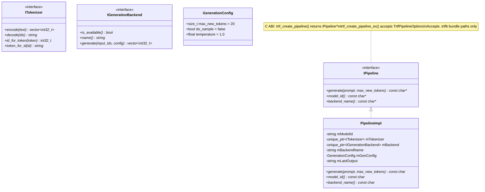
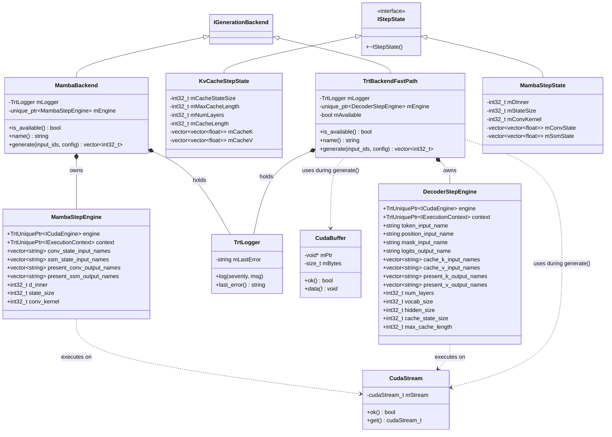
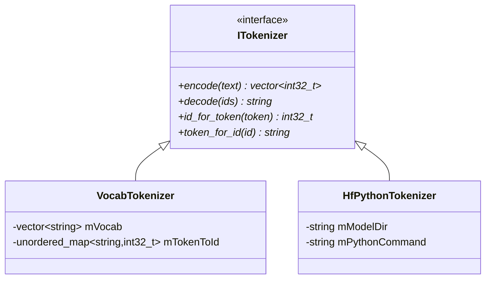

# Static Design: Class-Level UML and Logical Descriptions

This page decomposes the architecture into software units, showing class-level UML diagrams and describing the logical role and implementation of each class. The system is split: Python handles engine building, C++ handles runtime inference.

## Table of Contents

1. [Unit 1: Public API Layer (C++)](#unit-1-public-api-layer-c)
2. [Unit 2: Bundle Format (C++)](#unit-2-bundle-format-c)
3. [Unit 3: TRT Backend Infrastructure (C++)](#unit-3-trt-backend-infrastructure-c)
4. [Unit 4: Tokenization (C++)](#unit-4-tokenization-c)
5. [Unit 5: Python Build Package](#unit-5-python-build-package)

---

## Unit 1: Public API Layer (C++)

The public API is the **C ABI entry point** for library consumers. It accepts `.trtfb` bundle paths.

### Class Diagram

### Logical Description

| Class | Role | Implementation |
|-------|------|---------------|
| **IPipeline / PipelineImpl** | C ABI entry point. Loads bundle, creates tokenizer + backend, provides generation API. | `trtf_create_pipeline()` / `trtf_create_pipeline_ex()` in `src/cabi/trtf_c.cpp`. Detects `.trtfb` bundle, loads engine plan, creates tokenizer from extracted files, wraps in `TrtBackendFastPath`. |
| **ITokenizer** | Abstract interface for text-to-token-ids and back. | Two implementations: `VocabTokenizer` (vocab.txt lookup) and `HfPythonTokenizer` (subprocess bridge). |
| **IGenerationBackend** | Abstract interface for token-level autoregressive generation. | Two implementations: `TrtBackendFastPath` (GPU inference from bundle, KV-cache decoder and MoE), `MambaBackend` (GPU inference from bundle, SSM recurrent state). |
| **GenerationConfig** | Value struct for generation parameters. | `max_new_tokens`, `do_sample`, `temperature`. Passed from PipelineImpl to backend. |

---

## Unit 2: Bundle Format (C++)

Handles reading `.trtfb` bundle files.

### Logical Description

| Class/Function | Role | Implementation |
|---------------|------|---------------|
| **ReadBundleFile()** | Parses `.trtfb` binary format: JSON header + section data. | Returns engine plan bytes, extracted tokenizer files, and metadata. File: `src/bundle/bundle_format.cpp`. |
| **HasBundleMagic()** | Checks if a file starts with the `.trtfb` magic bytes. | Used by the C ABI factory to detect bundles. |
| **InspectBundle()** | Returns human-readable metadata from a bundle. | Reads JSON header without deserializing engine plan. File: `src/bundle/bundle_format.cpp`. |

---

## Unit 3: TRT Backend Infrastructure (C++)

The TRT backend comprises RAII resource wrappers, the deserialized engine, decode runtime utilities, and the autoregressive generation loop.

### Class Diagram

### Logical Description

| Class | Role | Implementation |
|-------|------|---------------|
| **TrtBackendFastPath** | `IGenerationBackend` for bundle-loaded engines. Owns the deserialized engine and runs the autoregressive loop. | `generate()` creates `KvCacheStepState`, runs prefill then decode loop (greedy argmax until EOS or max tokens). File: `src/runtime/trt/trt_backend_shared.cpp`. |
| **IStepState** | Abstract interface for per-step state. | Opaque base (`virtual ~IStepState() = default`). Two implementations: `KvCacheStepState` (attention) and `MambaStepState` (SSM). File: `src/runtime/trt/step_state.h`. |
| **KvCacheStepState** | KV-cache state for standard attention decoders. | Manages per-layer `cache_k`/`cache_v` vectors, tracks `cache_length`, builds attention masks, appends new state. File: `src/runtime/trt/kv_cache_step_state.cpp`. |
| **MambaBackend** | `IGenerationBackend` for Mamba/SSM bundle-loaded engines. | `generate()` creates `MambaStepState`, runs single-step recurrent loop (no prefill phase). File: `src/runtime/trt/mamba_backend.cpp`. |
| **MambaStepEngine** | Mamba TRT engine + execution context + tensor binding metadata. | Holds conv_state/ssm_state tensor names, SSM dimensions. File: `src/runtime/trt/mamba_decode_runtime.h`. |
| **MambaStepState** | Recurrent state for Mamba/SSM models. | Manages per-layer conv_state and ssm_state vectors (constant size, no growth). File: `src/runtime/trt/mamba_step_state.cpp`. |
| **DecoderStepEngine** | Deserialized TRT engine + execution context + tensor binding metadata. | Populated from bundle metadata during loading. File: `src/runtime/trt/trt_engine_lifecycle.h`. |
| **TrtLogger** | TRT `ILogger` implementation. | Forwards to stderr when `TRTF_TRT_LOG_STDERR=1`. File: `src/runtime/trt/trt_common.cpp`. |
| **CudaStream** | RAII wrapper for `cudaStream_t`. | File: `src/runtime/trt/trt_common.cpp`. |
| **CudaBuffer** | RAII wrapper for GPU memory. | File: `src/runtime/trt/trt_common.cpp`. |
| **CreateTrtBackendFromEngine()** | Creates TrtBackendFastPath from a deserialized engine. | Used when loading from `.trtfb` bundle. File: `src/runtime/trt/trt_backend_shared.cpp`. |

---

## Unit 4: Tokenization (C++)

Two tokenizer implementations, both implementing `ITokenizer`.

### Class Diagram

### Logical Description

| Class | Role | Implementation |
|-------|------|---------------|
| **VocabTokenizer** | Simple word-to-ID lookup from vocabulary list. | File: `src/tokenizer/vocab_tokenizer.cpp`. |
| **HfPythonTokenizer** | Bridges to HF `tokenizers` library via Python subprocess. Exact parity with HF. | File: `src/tokenizer/hf_python_tokenizer.cpp`. |

---

## Unit 5: Python Build Package

The `trtf_build/` package handles all engine building. This is where new model families are added.

### Component Overview

| Component | Role |
|-----------|------|
| **FamilyRegistry** | Matches `model_type` from config.json to a registered family plugin. |
| **FamilyPlugin** | Per-family registration: matcher function, checkpoint mapper, optional custom graph builder. |
| **StandardCheckpointMapper** | Base class for the standard HF tensor naming convention. Handles transpose, GQA expansion, tied lm_head. |
| **StandardGraphBuilder** | Parameterized decoder builder supporting `norm_type` (rmsnorm/layernorm), `mlp_type` (swiglu/gelu_fc), `position_type` (rope/learned), and `activation` (silu/gelu_new/gelu/relu). |
| **graph_ops** | Shared reusable TRT graph ops: RMSNorm, matmul, RoPE, attention, SwiGLU. |
| **BundleWriter** | Writes `.trtfb` bundles: engine plan + tokenizer files + metadata. |

### Family Plugins

Each family is a single Python file in `trtf_build/trtf_build/families/`:

| Family | Model Types | Architecture | Custom Behavior |
|--------|-------------|--------------|-----------------|
| Qwen | qwen, qwen2, qwen3, qwq | Standard decoder | Handles q_norm/k_norm for Qwen3 |
| LLaMA | llama | Standard decoder | Standard mapper |
| Mistral | mistral | Standard decoder | Standard mapper |
| Gemma | gemma, gemma2 | Standard decoder | +1.0 to RMSNorm gamma, scale embedding |
| Phi | phi3, phi (not phimoe) | Standard decoder | Fused QKV/gate_up splitting |
| Phi-MoE | phimoe | MoE decoder | SparseMixer routing, expert MLPs |
| Granite | granite | Standard decoder | Multiplier absorption |
| InternLM | internlm, internlm2 | Standard decoder | Fused wqkv, custom key names |
| StarCoder2 | starcoder2 | Extended decoder | LayerNorm + GELU FC + RoPE |
| GPT-2 | gpt2 | Extended decoder | Learned positions, fused QKV, Conv1D |
| OPT | opt | Extended decoder | Learned positions, ReLU, position offset |
| Falcon | falcon | Extended decoder | LayerNorm + GELU FC + RoPE + GQA |
| StableLM | stablelm | Extended decoder | LayerNorm + SwiGLU + RoPE |
| Mamba | mamba | SSM | Selective scan, custom graph, no KV cache |
| Qwen-VL | qwen*vl | Vision-language | Text decoder only |

Adding a new family requires creating a single plugin `.py` file with a `plugin` attribute. See [Adding a Model Family](Adding-a-Model-Family.md).
