# Static Design

| Field | Value |
|---|---|
| **Document ID** | TRTF-SD-001 |
| **Title** | Software Unit Design Specification |
| **Standard** | ISO 26262-6:2018 clause 8 |
| **Scope** | C++ runtime and Python build package |
| **Status** | Living document, auto-verified against source tree |
| **Author** | Safety Architecture Team (yifeif@nvidia.com) |
| **Reviewer** | Independent Review Required (TBD — assign before merge) |
| **Review Status** | Pending independent review |

---

## 1. Purpose

This document specifies the static structure of the trt-transformers-cpp
system: every class, interface, and dependency described here maps to a real
source file. No aspirational content is included.

The system has two stages:

1. **Python build** (`trtf_build/`) -- converts HuggingFace models into
   self-describing `.trtfb` bundles containing serialized TensorRT engine
   plans, tokenizer data, and JSON config.
2. **C++ runtime** -- loads `.trtfb` bundles, deserializes TRT engines, and
   runs inference through the `IPipeline` interface.

---

## 2. C++ Runtime Class Diagram

```mermaid
classDiagram
    direction TB

    class IPipeline {
        <<interface>>
        +generate(prompt, cfg) TextResult
        +generate(prompt, pixels, h, w, cfg) TextResult
        +encode_text(prompt) TextEmbedding
        +generate_image(prompt, cfg) ImageResult
        +generate_audio(prompt, cfg) AudioResult
        +transcribe(audio, n, max, rate) TextResult
        +speak(audio, n, cfg, rate) AudioResult
        +embed(text) EmbeddingResult
        +rerank(query, doc) float
        +segment(pixels, h, w) SegmentResult
        +encode(text) EmbeddingResult
        +solve(branch, blen, trunk, tlen) EmbeddingResult
        +detect(pixels, h, w, conf) string
        +model_id()* const char*
        +pipeline_type()* const char*
    }

    class PipelineFactory {
        +from_bundle(path, hf_python)$ unique_ptr~IPipeline~
    }

    class TrtModule {
        +forward(inputs) TensorMap
        +forward_device(inputs) DeviceTensorMap
        +forward_async(inputs)
        +sync()
        +input_info() vector~TensorInfo~
        +output_info() vector~TensorInfo~
        +has_input(name) bool
        +has_output(name) bool
        +device_ptr(name) void*
        +bind_external(name, ptr)
        +keep_alive(resource)
    }

    class KvCache {
        +position() int32
        +max_length() int32
        +build_attention_mask(mask)
        +bind_to(module)
        +advance()
        +reset()
    }

    class RecurrentState {
        +bind_to(module)
        +advance()
        +reset()
        +num_layers() int32
    }

    class IStateManager {
        <<interface>>
        +reset()
        +bind_to(module)
        +advance()
        +build_mask(mask)
        +position() int32
        +has_mask() bool
    }

    class RecurrentStateManager {
        -RecurrentState state
    }

    class HybridStateManager {
        -KvCache kv
        -RecurrentState ssm
    }

    class ITokenizer {
        <<interface>>
        +encode(text) vector~int32~
        +decode(ids) string
        +id_for_token(token) int32
        +token_for_id(id) string
    }

    class IScheduler {
        <<interface>>
        +set_timesteps(num_steps)
        +timesteps() vector~float~
        +sigmas() vector~float~
        +step(latents, velocity, n, idx)
    }

    class TextGenerationPipeline {
        -TrtModule decoder
        -KvCache cache
        -ITokenizer tokenizer
    }

    class RecurrentPipeline {
        -TrtModule decoder
        -IStateManager state
        -ITokenizer tokenizer
    }

    class VLPipeline {
        -TrtModule text_decoder
        -TrtModule vision_encoder
        -KvCache cache
        -ITokenizer tokenizer
    }

    class EncoderPipeline {
        -TrtModule encoder
        -ITokenizer tokenizer
    }

    class SegmentPipeline {
        -TrtModule model
    }

    class SamPipeline {
        -TrtModule image_encoder
        -TrtModule mask_decoder
    }

    class WhisperPipeline {
        -WhisperBackend backend
        -ITokenizer tokenizer
    }

    class BarkPipeline {
        -BarkBackend backend
        -ITokenizer tokenizer
    }

    class MagpiePipeline {
        -MagpieTTSBackend backend
        -ITokenizer tokenizer
    }

    class SpeechPipeline {
        -SpeechToSpeechBackend backend
    }

    class OmniPipeline {
        -TrtModule thinker
        -KvCache thinker_cache
        -TrtModule talker
        -KvCache talker_cache
        -TrtModule code2wav
        -ITokenizer tokenizer
    }

    class FluxPipeline {
        -TrtModule text_encoders[]
        -TrtModule denoiser
        -TrtModule vae
        -ITokenizer tokenizer
        -ITokenizer clip_tokenizer
    }

    class WanPipeline {
        -TrtModule text_encoder
        -TrtModule denoiser
        -TrtModule vae
        -ITokenizer tokenizer
    }

    class ZImagePipeline {
        -TrtModule text_encoder
        -TrtModule denoiser
        -TrtModule vae
        -ITokenizer tokenizer
    }

    IPipeline <|.. TextGenerationPipeline
    IPipeline <|.. RecurrentPipeline
    IPipeline <|.. VLPipeline
    IPipeline <|.. EncoderPipeline
    IPipeline <|.. SegmentPipeline
    IPipeline <|.. SamPipeline
    IPipeline <|.. WhisperPipeline
    IPipeline <|.. BarkPipeline
    IPipeline <|.. MagpiePipeline
    IPipeline <|.. SpeechPipeline
    IPipeline <|.. OmniPipeline
    IPipeline <|.. FluxPipeline
    IPipeline <|.. WanPipeline
    IPipeline <|.. ZImagePipeline

    IStateManager <|.. RecurrentStateManager
    IStateManager <|.. HybridStateManager

    RecurrentStateManager --> RecurrentState
    HybridStateManager --> KvCache
    HybridStateManager --> RecurrentState

    TextGenerationPipeline --> TrtModule
    TextGenerationPipeline --> KvCache
    TextGenerationPipeline --> ITokenizer

    RecurrentPipeline --> TrtModule
    RecurrentPipeline --> IStateManager

    VLPipeline --> TrtModule
    VLPipeline --> KvCache
    VLPipeline --> ITokenizer

    EncoderPipeline --> TrtModule
    EncoderPipeline --> ITokenizer

    OmniPipeline --> TrtModule
    OmniPipeline --> KvCache
    OmniPipeline --> ITokenizer

    FluxPipeline --> TrtModule
    FluxPipeline --> ITokenizer

    WanPipeline --> TrtModule
    WanPipeline --> ITokenizer

    ZImagePipeline --> TrtModule
    ZImagePipeline --> ITokenizer

    PipelineFactory ..> IPipeline : creates
    KvCache --> TrtModule : bind_to
    RecurrentState --> TrtModule : bind_to

    IScheduler <|.. FlowMatchEulerScheduler
```

---

## 3. C++ Runtime Unit Designs

### UD-CABI-01: C ABI Entry Point

| Field | Value |
|---|---|
| **Files** | `src/cabi/api/trtf_c.cpp` |
| **Public header** | `include/trtf/pipeline.h` (C ABI section at bottom) |
| **Purpose** | Exposes `trtf_create_pipeline()`, `trtf_create_pipeline_ex()`, `trtf_last_error()`, `trtf_version()`, `trtf_has_trt()` as C-linkage functions. Bridges external callers (CLI, FFI) to the C++ `PipelineFactory`. |
| **Behavior** | Delegates to `PipelineFactory::from_bundle()`. Catches all exceptions and stores the error message for retrieval via `trtf_last_error()`. Returns raw `IPipeline*` (caller owns). |

### UD-CFG-01: Bundle Config Parsing

| Field | Value |
|---|---|
| **Files** | `src/cabi/config/fast_path_config.h`, `src/cabi/config/fast_path_config.cpp` |
| **Purpose** | Parses the JSON config section from a `.trtfb` bundle into `FastPathModelConfig`. |
| **Key fields** | `runtime_strategy`, `vocab_size`, `hidden_size`, `num_layers`, `num_heads`, `num_kv_heads`, `head_dim`, `max_cache_length`, `id_bos`, `id_eos`, Mamba SSM fields (`d_inner`, `state_size`, `conv_kernel`), Hybrid fields (`layer_types`, `mamba_*`), Whisper fields (`num_mel_bins`, `mel_*`), VL fields (`has_vision_engine`, `image_token_id`, `vl_prompt_template`), segmentation fields, SAM fields, diffusion fields, RWKV fields, Bark fields, and audio fields. |
| **Invariant** | All fields have safe defaults. Unknown JSON keys are silently ignored. |

### UD-BDL-01: Bundle Format

| Field | Value |
|---|---|
| **Files** | `src/bundle/bundle_format.h`, `src/bundle/bundle_format.cpp` |
| **Public header** | `include/trtf/bundle.h` |
| **Purpose** | Reads `.trtfb` bundle files. Format: 8-byte magic (`TRTFB\x00\x01\x00`), 8-byte LE JSON header length, JSON metadata, then binary sections at offsets. |
| **Functions** | `ReadBundleFile()` (full load), `ReadBundleHeader()` (metadata only), `HasBundleMagic()` (validation). |
| **Public API** | `BundleInfo InspectBundle()`, `bool IsBundle()` -- thin wrappers for external callers. |

### UD-BDL-02: Bundle Helpers

| Field | Value |
|---|---|
| **Files** | `src/cabi/bundle/bundle_helpers.h`, `src/cabi/bundle/bundle_helpers.cpp` |
| **Purpose** | Shared plumbing for pipeline factory: extracts tokenizer data from bundle sections, deserializes TRT engine plans, creates CUDA streams. Produces `BundleSections` struct consumed by all factory functions. |

### UD-FAC-01: Pipeline Factory

| Field | Value |
|---|---|
| **Files** | `include/trtf/runtime/pipeline_factory.h`, `src/runtime/pipeline_factory.cpp` |
| **Purpose** | Sole creation path for all pipelines. Static `from_bundle()` method reads a `.trtfb`, parses config, and dispatches on `runtime_strategy`. |
| **Dispatch** | `resolve_family()` maps runtime strategy strings to `StrategyFamily` enum (`kText`, `kEncoder`, `kVision`, `kAudio`, `kDiffusion`). Each family has a dedicated factory branch that constructs the appropriate pipeline with its required components. |
| **Strategy mapping** | `decoder_kv_cache`/`decoder_moe` -> `TextGenerationPipeline`; `ssm_recurrent`/`rwkv_recurrent`/`hybrid_mamba_attention` -> `RecurrentPipeline`; `encoder_only`/`embedding`/`reranking`/`neural_operator` -> `EncoderPipeline`; `vision_language` -> `VLPipeline`; `segmentation` -> `SegmentPipeline`; `prompted_segmentation` -> `SamPipeline`; `object_detection` -> detection pipeline; `speech_to_text` -> `WhisperPipeline`; `text_to_audio` -> `BarkPipeline` or `MagpiePipeline`; `speech_to_speech` -> `SpeechPipeline`; `omni_multimodal` -> `OmniPipeline`; `diffusion` -> `WanPipeline`, `FluxPipeline`, or `ZImagePipeline`. |

### UD-MOD-01: TRT Module

| Field | Value |
|---|---|
| **Files** | `include/trtf/runtime/trt_module.h`, `src/runtime/trt/core/trt_module.cpp` |
| **Purpose** | `model.forward()` abstraction for TensorRT engines. Wraps `ICudaEngine` + `IExecutionContext`. Manages all I/O binding, H2D/D2H transfers, and execution. |
| **Key API** | `forward()` (CPU tensors, synchronous), `forward_device()` (GPU tensors, no copies), `forward_async()`/`sync()` (async), `bind_external()` (KvCache binding), `device_ptr()` (direct buffer access). |
| **Ownership** | Non-copyable, movable. `keep_alive()` stores `shared_ptr<void>` to ensure TRT engine and CUDA stream outlive the execution context. |
| **Related** | `include/trtf/runtime/tensor.h` (CPU Tensor, TensorMap, DType), `include/trtf/runtime/device_tensor.h` (GPU DeviceTensor). |

### UD-KVC-01: KV Cache

| Field | Value |
|---|---|
| **Files** | `include/trtf/runtime/kv_cache.h`, `src/runtime/trt/core/kv_cache.cpp`, `src/runtime/trt/core/device_kv_cache.h`, `src/runtime/trt/core/device_kv_cache.cpp` |
| **Purpose** | Autoregressive KV cache state manager. Allocates per-layer K/V device tensors, builds causal attention masks, and binds directly to TrtModule. |
| **Key API** | `bind_to()` binds `cache_k_{i}`, `cache_v_{i}` (inputs) and `present_k_{i}`, `present_v_{i}` (outputs). `advance()` appends present into cache and increments position. `build_attention_mask()` produces `[max_length]` float mask. |
| **Legacy** | `device_kv_cache.h/cpp` contains the older `DeviceKvCache` and `run_decoder_step_device()` used by legacy backends. |

### UD-REC-01: Recurrent State

| Field | Value |
|---|---|
| **Files** | `include/trtf/runtime/recurrent_state.h`, `src/runtime/trt/core/recurrent_state.cpp` |
| **Purpose** | Config-driven SSM/RWKV state manager. Replaces old `MambaStepState` and `RwkvStepState` with a single class parametrized by `TensorSpec` array. |
| **Key API** | `bind_to()` binds state tensors (`{name}_{i}`) and present tensors (`{output_prefix}_{i}`). `advance()` copies present->state (D2D async). `reset()` zeros all state. |
| **Usage** | Mamba: `specs = {{"conv_state", ...}, {"ssm_state", ...}}`. RWKV: `specs = {{"attn_state", ...}, ...}`. |

### UD-TOK-01: Tokenizers

| Field | Value |
|---|---|
| **Files** | `include/trtf/tokenizer.h`, `include/trtf/runtime/tokenizer_interface.h`, `src/tokenizer/vocab_tokenizer.cpp`, `src/tokenizer/hf_python_tokenizer.cpp`, `src/tokenizer/ipa_tokenizer.cpp` |
| **Purpose** | `ITokenizer` interface with three concrete implementations. `include/trtf/tokenizer.h` defines the full interface (`encode`, `decode`, `id_for_token`, `token_for_id`) plus factory functions. `include/trtf/runtime/tokenizer_interface.h` defines a minimal `encode`/`decode`-only interface. |
| **Implementations** | `VocabTokenizer` -- vocab.txt lookup. `HfPythonTokenizer` -- bridges to HuggingFace via Python subprocess. `IpaTokenizer` -- IPA phoneme tokenizer for speech models. |

### UD-PIP-TEXT-01: Text Generation Pipeline

| Field | Value |
|---|---|
| **Files** | `src/runtime/pipelines/text_generation_pipeline.h`, `src/runtime/pipelines/text_generation_pipeline.cpp` |
| **Purpose** | Serves all decoder-only LLMs (Qwen, LLaMA, Mistral, GPT-2, etc.) and MoE decoders (Mixtral, Phi-MoE). Composes TrtModule + KvCache + ITokenizer. Runs prefill->decode loop with greedy argmax. |
| **Key API** | `generate()` (text in, `TextResult` out), `generate_ids()` (token IDs in/out for testing). |

### UD-PIP-REC-01: Recurrent Pipeline

| Field | Value |
|---|---|
| **Files** | `src/runtime/pipelines/recurrent_pipeline.h`, `src/runtime/pipelines/recurrent_pipeline.cpp` |
| **Purpose** | Serves Mamba, RWKV, and Hybrid (Nemotron-H) models. Uses `IStateManager` to abstract between pure recurrent (`RecurrentStateManager`) and hybrid attention+recurrent (`HybridStateManager`). |
| **Key API** | Same `generate()` / `generate_ids()` interface as TextGenerationPipeline. |
| **State managers** | `RecurrentStateManager` wraps `RecurrentState` (no mask, position tracked internally). `HybridStateManager` wraps both `KvCache` and `RecurrentState` (has mask, position from KvCache). |

### UD-PIP-VL-01: VL Pipeline

| Field | Value |
|---|---|
| **Files** | `src/runtime/pipelines/vl_pipeline.h`, `src/runtime/pipelines/vl_pipeline.cpp` |
| **Purpose** | Vision-language generation (Qwen2.5-VL, Qwen3-VL, InternVL3, Phi4). Composes text decoder TrtModule + optional vision encoder TrtModule + KvCache + ITokenizer + image preprocessor. |
| **Key API** | `generate(prompt, cfg)` for text-only, `generate(prompt, pixels, h, w, cfg)` for image+text. Vision encoder runs on preprocessed pixels, features are injected at image token positions during prefill. |

### UD-PIP-ENC-01: Encoder Pipeline

| Field | Value |
|---|---|
| **Files** | `src/runtime/pipelines/encoder_pipeline.h`, `src/runtime/pipelines/encoder_pipeline.cpp` |
| **Purpose** | Single-pass encoder models: BERT (`encode()`), embedding models (`embed()`), reranking models (`rerank()`). Also contains `SegmentPipeline` (SegFormer) and `SamPipeline` (two-stage SAM). |
| **Key API** | Mode-driven: `mode_` string selects which IPipeline method is active ("encoder_only", "embedding", "reranking"). |

### UD-PIP-AUD-01: Audio Pipelines

| Field | Value |
|---|---|
| **Files** | `src/runtime/pipelines/audio_pipeline.h`, `src/runtime/pipelines/audio_pipeline.cpp`, `src/runtime/pipelines/audio_backend_factory.h`, `src/runtime/pipelines/audio_backend_factory.cpp` |
| **Purpose** | Five audio pipeline classes. `WhisperPipeline` (`transcribe()`), `BarkPipeline` (`generate_audio()`), `MagpiePipeline` (`generate_audio()`), `SpeechPipeline` (`speak()`), and `OmniPipeline` (`generate_audio()` -- three-stage: thinker->talker->code2wav). |
| **Backend delegation** | Whisper, Bark, Magpie, and Speech delegate to old-style backends in `src/runtime/trt/audio/`. OmniPipeline uses TrtModule + KvCache directly. Factory functions in `audio_backend_factory.h` create backends from bundle sections. |

### UD-PIP-DIFF-01: Diffusion Pipelines

| Field | Value |
|---|---|
| **Files** | `src/runtime/pipelines/diffusion_pipeline.h`, `src/runtime/pipelines/wan_pipeline.cpp`, `src/runtime/pipelines/flux_pipeline.cpp`, `src/runtime/pipelines/z_image_pipeline.cpp` |
| **Purpose** | Three diffusion pipelines, all using TrtModule directly. `WanPipeline` (T5 + denoiser + 3D VAE for text-to-video), `FluxPipeline` (T5 + CLIP + denoiser + VAE for text-to-image), `ZImagePipeline` (Qwen3 text encoder + denoiser + VAE for text-to-image). |
| **Key API** | `generate_image(prompt, cfg)` returns `ImageResult`. All use `FlowMatchEulerScheduler` for noise scheduling. |
| **Supporting types** | `src/runtime/trt/diffusion/diffusion_types.h` (`DiffusionConfig`, `PreprocessorWeights`, `VideoResult`), `src/runtime/trt/diffusion/diffusion_math.h` (math helpers). |

### UD-TRT-CORE-01: TRT Common

| Field | Value |
|---|---|
| **Files** | `src/runtime/trt/core/trt_common.h`, `src/runtime/trt/core/trt_common.cpp` |
| **Purpose** | TRT logger implementation, CUDA helper utilities (CudaBuffer with RAII, CudaStream with RAII and move semantics), error checking macros. |

### UD-TRT-DEC-01: Decode Runtime

| Field | Value |
|---|---|
| **Files** | `src/runtime/trt/core/trt_decode_runtime.h`, `src/runtime/trt/core/trt_decode_runtime.cpp` |
| **Purpose** | `select_argmax_token()`, `build_attention_mask()`, and engine lifecycle management (`DecoderStepEngine`, tensor validation). Used by legacy backend code. |

### UD-IMG-01: Image Preprocessor

| Field | Value |
|---|---|
| **Files** | `src/runtime/trt/multimodal/image_preprocessor.h`, `src/runtime/trt/multimodal/image_preprocessor.cpp` |
| **Purpose** | VL image preprocessing with 4 strategies (configurable per model). Handles resize, normalize, pad, and CHW reorder. `VLPreprocessConfig` drives the preprocessing behavior. |

### UD-SCHED-01: Noise Scheduler

| Field | Value |
|---|---|
| **Files** | `include/trtf/runtime/scheduler.h`, `src/runtime/trt/core/flow_match_euler_scheduler.cpp` |
| **Purpose** | `IScheduler` interface for diffusion noise scheduling. `FlowMatchEulerScheduler` implements the Flow Matching Euler Discrete schedule used by FLUX, Wan, and Z-Image. |

### UD-AUD-WHISPER-01: Whisper Backend

| Field | Value |
|---|---|
| **Files** | `src/runtime/trt/audio/whisper_backend.h`, `src/runtime/trt/audio/whisper_backend.cpp`, `src/runtime/trt/audio/whisper_cross_kv_apply.h`, `src/runtime/trt/audio/whisper_cross_kv_plan.h`, `src/runtime/trt/audio/whisper_decode_policy.h`, `src/runtime/trt/audio/whisper_host_plan.h` |
| **Purpose** | Whisper speech-to-text backend. Manages encoder-decoder architecture with cross-attention KV cache, mel spectrogram input, and autoregressive token decoding. Host plan orchestrates the two-stage (encode + decode) inference. Decode policy governs stopping criteria and token selection. |

### UD-AUD-BARK-01: Bark Backend

| Field | Value |
|---|---|
| **Files** | `src/runtime/trt/audio/bark_backend.h`, `src/runtime/trt/audio/bark_backend.cpp`, `src/runtime/trt/audio/bark_generation_plan.h` |
| **Purpose** | Bark text-to-audio backend. Multi-stage codebook generation (semantic, coarse, fine) producing audio waveforms from text. Generation plan configures the three-stage autoregressive pipeline. |

### UD-AUD-MAGPIE-01: Magpie TTS Backend

| Field | Value |
|---|---|
| **Files** | `src/runtime/trt/audio/magpie_tts_backend.h`, `src/runtime/trt/audio/magpie_tts_backend.cpp`, `src/runtime/trt/audio/magpie_codec_plan.h`, `src/runtime/trt/audio/magpie_decode_policy.h`, `src/runtime/trt/audio/magpie_decoder_plan.h`, `src/runtime/trt/audio/magpie_text_completion_policy.h`, `src/runtime/trt/audio/magpie_kernels.cu`, `src/runtime/trt/audio/magpie_kernels.h` |
| **Purpose** | Magpie neural TTS backend. Codec plan configures audio codec parameters, decode policy governs autoregressive stopping, decoder plan orchestrates the multi-step generation, and text completion policy handles prompt completion. Custom CUDA kernels accelerate audio processing. |

### UD-AUD-SPEECH-01: Speech-to-Speech Backend

| Field | Value |
|---|---|
| **Files** | `src/runtime/trt/audio/speech_backend.h`, `src/runtime/trt/audio/speech_backend.cpp`, `src/runtime/trt/audio/speech_delay_cache.h`, `src/runtime/trt/audio/speech_depth_plan.h`, `src/runtime/trt/audio/speech_generation_policy.h`, `src/runtime/trt/audio/speech_mimi_decode_plan.h`, `src/runtime/trt/audio/speech_runtime_plan.h`, `src/runtime/trt/audio/speech_temporal_embed_plan.h`, `src/runtime/trt/audio/speech_waveform_postprocess.h` |
| **Purpose** | PersonaPlex speech-to-speech backend. Delay cache manages temporal audio buffering, depth plan configures multi-depth codec decoding, MIMI decode plan handles neural audio codec, temporal embed plan manages time embeddings, and waveform postprocess produces final audio output. |

### UD-AUD-OMNI-01: Omni Backend

| Field | Value |
|---|---|
| **Files** | `src/runtime/trt/audio/omni_backend.h`, `src/runtime/trt/audio/omni_backend.cpp`, `src/runtime/trt/audio/omni_audio_plan.h` |
| **Purpose** | Omni multimodal backend (legacy). Audio plan configures the thinker-talker-code2wav three-stage pipeline for multimodal audio generation. |

### UD-AUD-COMMON-01: Audio Common Utilities

| Field | Value |
|---|---|
| **Files** | `src/runtime/trt/audio/audio_bundle_validation.h`, `src/runtime/trt/audio/audio_bundle_validation.cpp`, `src/runtime/trt/audio/audio_configs.h`, `src/runtime/trt/audio/mel_spectrogram.h`, `src/runtime/trt/audio/mel_spectrogram.cpp` |
| **Purpose** | Shared audio infrastructure. Bundle validation ensures required sections exist for each audio pipeline type. Audio configs define shared configuration types. Mel spectrogram computes filterbank features from raw audio for Whisper input. |

### UD-REC-MAMBA-01: Legacy Mamba Backend

| Field | Value |
|---|---|
| **Files** | `src/runtime/trt/recurrent/mamba_backend.h`, `src/runtime/trt/recurrent/mamba_backend.cpp`, `src/runtime/trt/recurrent/mamba_decode_runtime.h`, `src/runtime/trt/recurrent/mamba_decode_runtime.cpp`, `src/runtime/trt/recurrent/mamba_step_state.h`, `src/runtime/trt/recurrent/mamba_step_state.cpp` |
| **Purpose** | Legacy Mamba SSM backend. `MambaBackend` runs the autoregressive loop, `MambaStepEngine` manages per-step TRT execution, and `MambaStepState` tracks conv and SSM recurrent state across steps. Superseded by `RecurrentPipeline` + `RecurrentState` for new code. |

### UD-REC-RWKV-01: Legacy RWKV Backend

| Field | Value |
|---|---|
| **Files** | `src/runtime/trt/recurrent/rwkv_backend.h`, `src/runtime/trt/recurrent/rwkv_backend.cpp`, `src/runtime/trt/recurrent/rwkv_decode_runtime.h`, `src/runtime/trt/recurrent/rwkv_decode_runtime.cpp`, `src/runtime/trt/recurrent/rwkv_step_state.h`, `src/runtime/trt/recurrent/rwkv_step_state.cpp` |
| **Purpose** | Legacy RWKV backend. `RwkvBackend` runs the autoregressive loop, `RwkvStepEngine` manages per-step execution, and `RwkvStepState` tracks attention and FFN recurrent state. Superseded by `RecurrentPipeline` + `RecurrentState`. |

### UD-REC-HYBRID-01: Legacy Hybrid Backend

| Field | Value |
|---|---|
| **Files** | `src/runtime/trt/recurrent/hybrid_backend.h`, `src/runtime/trt/recurrent/hybrid_backend.cpp` |
| **Purpose** | Legacy Hybrid (Mamba + Attention) backend for Nemotron-H. Combines KV cache attention layers with SSM recurrent layers in a single autoregressive loop. Superseded by `RecurrentPipeline` + `HybridStateManager`. |

### UD-REC-COMMON-01: Recurrent Common Contracts

| Field | Value |
|---|---|
| **Files** | `src/runtime/trt/recurrent/recurrent_step_contracts.h`, `src/runtime/trt/recurrent/recurrent_tensor_bindings.h` |
| **Purpose** | Shared contracts for recurrent backends. Step contracts define the interface for per-step execution. Tensor bindings provide helpers for binding recurrent state tensors to TRT modules. |

### UD-VL-VISION-01: Vision Engine

| Field | Value |
|---|---|
| **Files** | `src/runtime/trt/multimodal/vision_engine.h`, `src/runtime/trt/multimodal/vision_engine.cpp`, `src/runtime/trt/multimodal/vision_execution_plan.h` |
| **Purpose** | Vision encoder TRT engine lifecycle. Manages deserialization, execution, and output extraction for vision encoders in VL pipelines. Execution plan configures input/output tensor shapes and processing parameters. |

### UD-VL-DECODE-01: VL Decode Backend

| Field | Value |
|---|---|
| **Files** | `src/runtime/trt/multimodal/vl_backend.h`, `src/runtime/trt/multimodal/vl_backend.cpp`, `src/runtime/trt/multimodal/vl_decode_policy.h` |
| **Purpose** | Legacy VL backend and decode policy. VL backend orchestrates vision-then-text inference. Decode policy governs vision feature injection into text decoder at image token positions and autoregressive generation stopping. |

### UD-SEG-01: Segmentation Backend

| Field | Value |
|---|---|
| **Files** | `src/runtime/trt/perception/segmentation_backend.h`, `src/runtime/trt/perception/segmentation_backend.cpp`, `src/runtime/trt/perception/segmentation_postprocess_seam.h`, `src/runtime/trt/perception/segmentation_preprocess_seam.h` |
| **Purpose** | SegFormer semantic segmentation backend. Preprocess seam handles image resize/normalize, postprocess seam handles argmax class selection and colorization. |

### UD-SAM-01: SAM Backend

| Field | Value |
|---|---|
| **Files** | `src/runtime/trt/perception/sam_backend.h`, `src/runtime/trt/perception/sam_backend.cpp`, `src/runtime/trt/perception/sam_image_preprocess_seam.h`, `src/runtime/trt/perception/sam_output_selection.h`, `src/runtime/trt/perception/sam_postprocess_seam.h`, `src/runtime/trt/perception/sam_prompt_seam.h` |
| **Purpose** | SAM (Segment Anything Model) two-stage backend. Image encoder produces embeddings, mask decoder takes point/box prompts to produce segmentation masks. Seams handle image preprocessing, prompt encoding, output mask selection, and postprocessing. |

### UD-DET-01: Detection Backend

| Field | Value |
|---|---|
| **Files** | `src/runtime/trt/perception/detection_backend.h`, `src/runtime/trt/perception/detection_backend.cpp` |
| **Purpose** | Object detection backend. Runs single-pass detection inference and applies NMS/postprocessing. |

### UD-NOP-01: Neural Operator Backend

| Field | Value |
|---|---|
| **Files** | `src/runtime/trt/perception/neural_operator_backend.h`, `src/runtime/trt/perception/neural_operator_backend.cpp` |
| **Purpose** | Neural operator (FNO) backend for scientific computing models. Single-pass inference for PDEs and other operator-based tasks. |

### UD-DIFF-HELPER-01: Diffusion Helpers

| Field | Value |
|---|---|
| **Files** | `src/runtime/trt/diffusion/diffusion_denoising_step_seam.h`, `src/runtime/trt/diffusion/diffusion_generation_plan.h`, `src/runtime/trt/diffusion/diffusion_math.h`, `src/runtime/trt/diffusion/diffusion_preprocessor_weights_helpers.h`, `src/runtime/trt/diffusion/diffusion_scheduler_helpers.h`, `src/runtime/trt/diffusion/diffusion_types.h`, `src/runtime/trt/diffusion/wan_generation_conditioning.h`, `src/runtime/trt/diffusion/diffusion_preprocessor.cpp` |
| **Purpose** | Shared diffusion infrastructure. Denoising step seam isolates per-step denoising logic. Generation plan configures the full denoising schedule. Math helpers provide numerical utilities. Preprocessor weights helpers manage VAE/text encoder weight extraction. Scheduler helpers bridge to `IScheduler`. Types define `DiffusionConfig`, `PreprocessorWeights`, `VideoResult`. Wan conditioning handles T2V-specific guidance. |

### UD-CORE-HELPER-01: Core Runtime Helpers

| Field | Value |
|---|---|
| **Files** | `src/runtime/trt/core/decoded_image.h`, `src/runtime/trt/core/device_kv_cache_update_plan.h`, `src/runtime/trt/core/device_tensor.cpp`, `src/runtime/trt/core/flow_match_euler_scheduler.cpp`, `src/runtime/trt/core/generation_backend.h`, `src/runtime/trt/core/step_state.h`, `src/runtime/trt/core/stb_impl.cpp`, `src/runtime/trt/core/trt_graph_builder.cpp` |
| **Purpose** | Core runtime helpers not covered by other UD entries. `decoded_image.h` holds decoded pixel data. `device_kv_cache_update_plan.h` describes cache update operations. `device_tensor.cpp` implements GPU tensor memory management. `flow_match_euler_scheduler.cpp` implements the `FlowMatchEulerScheduler` (see UD-SCHED-01). `generation_backend.h` defines the `IGenerationBackend` interface. `step_state.h` defines the `IStepState` interface. `stb_impl.cpp` provides STB image library implementation. `trt_graph_builder.cpp` provides TRT network construction utilities. |

### UD-ENC-EMBED-01: Embedding Backend

| Field | Value |
|---|---|
| **Files** | `src/runtime/trt/encoder/embedding_backend.h`, `src/runtime/trt/encoder/embedding_backend.cpp` |
| **Purpose** | Embedding extraction backend for encoder models (Eagle-embed). Produces dense vector embeddings from input text via single-pass encoder inference with mean pooling. |

### UD-ENC-RERANK-01: Reranking Backend

| Field | Value |
|---|---|
| **Files** | `src/runtime/trt/encoder/reranking_backend.h`, `src/runtime/trt/encoder/reranking_backend.cpp` |
| **Purpose** | Reranking backend for cross-encoder models (Eagle-rerank). Scores query-document pairs via single-pass encoder inference and returns relevance scores. |

### UD-UTIL-MEDIA-01: Media I/O Utilities

| Field | Value |
|---|---|
| **Files** | `src/utils/image_reader.cpp`, `src/utils/wav_reader.h`, `src/utils/wav_reader.cpp` |
| **Purpose** | Media file I/O. WAV reader/writer handles PCM audio file read/write for audio pipelines (Whisper input, Bark/PersonaPlex output). Image reader loads image files from disk for VL and segmentation pipelines. |

---

## 4. C++ Runtime Supporting Subsystems

### Audio Backends (`src/runtime/trt/audio/`)

| UD ID | File | Backend | Used by |
|---|---|---|---|
| `UD-AUD-WHISPER-01` | `whisper_backend.h/cpp`, `whisper_cross_kv_apply.h`, `whisper_cross_kv_plan.h`, `whisper_decode_policy.h`, `whisper_host_plan.h` | `WhisperBackend` | `WhisperPipeline` |
| `UD-AUD-BARK-01` | `bark_backend.h/cpp`, `bark_generation_plan.h` | `BarkBackend` | `BarkPipeline` |
| `UD-AUD-MAGPIE-01` | `magpie_tts_backend.h/cpp`, `magpie_codec_plan.h`, `magpie_decode_policy.h`, `magpie_decoder_plan.h`, `magpie_text_completion_policy.h`, `magpie_kernels.cu/h` | `MagpieTTSBackend` | `MagpiePipeline` |
| `UD-AUD-SPEECH-01` | `speech_backend.h/cpp`, `speech_delay_cache.h`, `speech_depth_plan.h`, `speech_generation_policy.h`, `speech_mimi_decode_plan.h`, `speech_runtime_plan.h`, `speech_temporal_embed_plan.h`, `speech_waveform_postprocess.h` | `SpeechToSpeechBackend` | `SpeechPipeline` |
| `UD-AUD-OMNI-01` | `omni_backend.h/cpp`, `omni_audio_plan.h` | `OmniBackend` (legacy) | -- |
| `UD-AUD-COMMON-01` | `mel_spectrogram.h/cpp`, `audio_bundle_validation.h/cpp`, `audio_configs.h` | Shared audio utilities | All audio pipelines |

### Recurrent Backends (`src/runtime/trt/recurrent/`)

| UD ID | File | Purpose |
|---|---|---|
| `UD-REC-MAMBA-01` | `mamba_backend.h/cpp`, `mamba_decode_runtime.h/cpp`, `mamba_step_state.h/cpp` | Legacy Mamba autoregressive loop, step engine, conv+SSM state |
| `UD-REC-RWKV-01` | `rwkv_backend.h/cpp`, `rwkv_decode_runtime.h/cpp`, `rwkv_step_state.h/cpp` | Legacy RWKV autoregressive loop, step engine, recurrent state |
| `UD-REC-HYBRID-01` | `hybrid_backend.h/cpp` | Legacy Hybrid (Mamba + Attention) |
| `UD-REC-COMMON-01` | `recurrent_step_contracts.h`, `recurrent_tensor_bindings.h` | Shared contracts and tensor binding helpers |

### Multimodal (`src/runtime/trt/multimodal/`)

| UD ID | File | Purpose |
|---|---|---|
| `UD-VL-VISION-01` | `vision_engine.h/cpp`, `vision_execution_plan.h` | Vision engine lifecycle and execution plan config |
| `UD-VL-DECODE-01` | `vl_backend.h/cpp`, `vl_decode_policy.h` | Legacy VL backend and decode step policy |
| `UD-IMG-01` | `image_preprocessor.h/cpp` | Image preprocessing (4 strategies) |

### Perception (`src/runtime/trt/perception/`)

| UD ID | File | Purpose |
|---|---|---|
| `UD-SEG-01` | `segmentation_backend.h/cpp`, `segmentation_postprocess_seam.h`, `segmentation_preprocess_seam.h` | SegFormer backend with pre/post-processing seams |
| `UD-SAM-01` | `sam_backend.h/cpp`, `sam_image_preprocess_seam.h`, `sam_output_selection.h`, `sam_postprocess_seam.h`, `sam_prompt_seam.h` | SAM two-stage backend with seams |
| `UD-DET-01` | `detection_backend.h/cpp` | Object detection backend |
| `UD-NOP-01` | `neural_operator_backend.h/cpp` | Neural operator (FNO) backend |

### Encoder (`src/runtime/trt/encoder/`)

| UD ID | File | Purpose |
|---|---|---|
| `UD-PIP-ENC-01` | `encoder_backend.h/cpp` | Encoder-only backend (BERT) |
| `UD-ENC-EMBED-01` | `embedding_backend.h/cpp` | Embedding backend (Eagle-embed) |
| `UD-ENC-RERANK-01` | `reranking_backend.h/cpp` | Reranking backend (Eagle-rerank) |

---

## 5. Python Builder Unit Designs

### UD-BLD-CFG-01: Model Config

| Field | Value |
|---|---|
| **Files** | `trtf_build/trtf_build/config.py` |
| **Purpose** | Parses HuggingFace `config.json` into `ModelConfig` dataclass. Handles nested configs (VL `text_config`), architecture-specific field mapping, and safe defaults. |

### UD-BLD-FAM-01: Family Plugin System

| Field | Value |
|---|---|
| **Files** | `trtf_build/trtf_build/families/base.py`, `trtf_build/trtf_build/families/__init__.py` |
| **Purpose** | `FamilyPlugin` protocol in `base.py` defines the contract: `match()`, `load_weights()`, `runtime_strategy()`, `embed_input()`. `__init__.py` uses `pkgutil.iter_modules()` to auto-discover all `.py` files with a module-level `plugin` attribute. 53 family plugins currently exist. |
| **Plugins** | `bark`, `bert`, `bloom`, `canary`, `codegen`, `deepseek_ocr`, `deepseek_v2`, `distilbert`, `eagle_vlm`, `falcon`, `flux`, `gemma`, `glm`, `gpt2`, `gpt_neo`, `gpt_neox`, `gpt_oss`, `granite`, `internlm`, `internvl`, `llama`, `magpie_tts`, `mamba`, `mistral`, `mixtral`, `mpnet`, `nemotron`, `nemotron_h`, `olmo`, `opt`, `personaplex`, `phi`, `phi4_multimodal`, `phi_moe`, `pixart`, `qwen`, `qwen3_5`, `qwen3_omni`, `qwen_moe`, `qwen_vl`, `roberta`, `rwkv`, `sam`, `segformer`, `stablelm`, `starcoder2`, `wan_t2v`, `whisper`, `xglm`, `z_image` |

### UD-BLD-CKP-01: Checkpoint Mapper

| Field | Value |
|---|---|
| **Files** | `trtf_build/trtf_build/checkpoint_mapper.py` |
| **Purpose** | Loads HuggingFace safetensors, maps weight keys to engine builder's expected names, performs GQA head expansion, handles tied embeddings, and applies biases. |

### UD-BLD-GRP-01: Graph Ops

| Field | Value |
|---|---|
| **Files** | `trtf_build/trtf_build/graph_ops.py` |
| **Purpose** | Layer 1 atomic TRT graph operations (tensor-in/tensor-out). RoPE, ALiBi, RMSNorm, LayerNorm, attention (MHA/GQA), SwiGLU, GELU, convolutions, padding, ELU, and more. Each function takes `INetworkDefinition` tensors and returns tensors. |

### UD-BLD-BLK-01: Graph Blocks

| Field | Value |
|---|---|
| **Files** | `trtf_build/trtf_build/graph_blocks.py` |
| **Purpose** | Layer 2 composable blocks built from graph ops. `add_attention_block()`, `add_swiglu_mlp()`, `add_gelu_fc_mlp()`, `apply_norm()`. These compose multiple graph ops into reusable building blocks for decoder layers. |

### UD-BLD-STD-01: Standard Decoder Builder

| Field | Value |
|---|---|
| **Files** | `trtf_build/trtf_build/standard_decoder_builder.py` |
| **Purpose** | Layer 3 engine builder. Constructs a complete TRT network for standard decoder models by stacking graph blocks. Handles embedding, positional encoding, N transformer layers, final norm, and logit projection. |

### UD-BLD-BDL-01: Bundle Writer

| Field | Value |
|---|---|
| **Files** | `trtf_build/trtf_build/bundle_writer.py` |
| **Purpose** | Writes `.trtfb` bundle files. Serializes config JSON + engine plan + tokenizer data + optional extra sections into the bundle format. |

### UD-BLD-ENG-01: Engine Builder

| Field | Value |
|---|---|
| **Files** | `trtf_build/trtf_build/engine_builder.py` |
| **Purpose** | Top-level orchestrator. Loads HF model -> selects family plugin -> builds TRT engine -> packages bundle. Entry point for both CLI (`trtf-build build`) and Python API (`trtf_build.build()`). |

### UD-BLD-DBG-01: Debug Runner

| Field | Value |
|---|---|
| **Files** | `trtf_build/trtf_build/debug_runner.py` |
| **Purpose** | Pure-Python TRT inference with device-resident state. `TrtRunner` for decoder KV cache models, `MambaTrtRunner` for SSM models, `VLTrtRunner` for vision-language models. Used by diff tools and E2E harness for Python-side TRT inference. |

---

## 6. Traceability

Each UD-* identifier links to architecture contracts in
`docs/wiki/Architecture-Overview.md` (ARCH-*) and to test cases in
`docs/wiki/Traceability-Matrix.md` (UT-*/IT-*).

| Unit Design | Architecture Ref | Test Coverage |
|---|---|---|
| UD-CABI-01 | ARCH-CABI | `tests/cpp/test_c_abi_entry.cpp`, `tests/cpp/test_pipeline_api.cpp` |
| UD-CFG-01 | ARCH-CFG | `tests/cpp/test_fast_path_config.cpp` |
| UD-BDL-01 | ARCH-BDL | `tests/cpp/test_bundle_format.cpp`, `tests/cpp/test_bundle_e2e.cpp` |
| UD-BDL-02 | ARCH-BDL | `tests/cpp/test_bundle_helpers.cpp` |
| UD-FAC-01 | ARCH-FAC | `tests/cpp/test_pipeline_api.cpp` |
| UD-MOD-01 | ARCH-MOD | (GPU integration tests via E2E) |
| UD-KVC-01 | ARCH-KVC | `tests/cpp/test_device_kv_cache.cpp`, `tests/builder/test_cache_state_machine.py` |
| UD-REC-01 | ARCH-REC | `tests/cpp/test_device_kv_cache.cpp` (recurrent paths) |
| UD-TOK-01 | ARCH-TOK | `tests/cpp/test_vocab_tokenizer.cpp`, `tests/cpp/test_hf_python_tokenizer.cpp` |
| UD-PIP-TEXT-01 | ARCH-PIP | E2E: `tests/test_e2e.py` (text_generation_causal models) |
| UD-PIP-REC-01 | ARCH-PIP | E2E: `tests/test_e2e.py` (ssm_recurrent, rwkv_recurrent models) |
| UD-PIP-VL-01 | ARCH-PIP | E2E: `tests/test_e2e.py` (vision_language models) |
| UD-PIP-ENC-01 | ARCH-PIP | E2E: `tests/test_e2e.py` (encoder_only, embedding, reranking models) |
| UD-PIP-AUD-01 | ARCH-PIP | E2E: `tests/test_e2e.py` (speech_to_text, text_to_audio, speech_to_speech models) |
| UD-PIP-DIFF-01 | ARCH-PIP | E2E: `tests/test_e2e.py` (diffusion models) |
| UD-IMG-01 | ARCH-VL | `tests/cpp/test_image_preprocessor.cpp` |
| UD-BLD-CFG-01 | ARCH-BLD | `tests/builder/test_config.py` |
| UD-BLD-FAM-01 | ARCH-BLD | `tests/builder/test_families.py`, `tests/builder/test_family_plugins.py` |
| UD-BLD-CKP-01 | ARCH-BLD | `tests/builder/test_checkpoint_mapper.py` |
| UD-BLD-GRP-01 | ARCH-BLD | `tests/builder/test_graph_ops.py`, `tests/builder/test_graph_ops_extended.py` |
| UD-BLD-BLK-01 | ARCH-BLD | `tests/builder/test_graph_blocks.py` |
| UD-BLD-STD-01 | ARCH-BLD | `tests/builder/test_standard_decoder.py` |
| UD-BLD-BDL-01 | ARCH-BLD | `tests/builder/test_bundle_writer.py` |
| UD-BLD-ENG-01 | ARCH-BLD | `tests/builder/test_engine_builder_extended.py` |
| UD-BLD-DBG-01 | ARCH-BLD | `tests/builder/test_debug_runner_extended.py` |
| UD-AUD-WHISPER-01 | ARCH-PIP-AUD | `tests/cpp/test_whisper_decode_policy.cpp`, `tests/cpp/test_whisper_host_plan.cpp` |
| UD-AUD-BARK-01 | ARCH-PIP-AUD | `tests/cpp/test_bark_generation_plan.cpp`, `tests/cpp/test_audio_pipeline_new.cpp` |
| UD-AUD-MAGPIE-01 | ARCH-PIP-AUD | `tests/cpp/test_magpie_codec_plan.cpp`, `tests/cpp/test_magpie_decode_policy.cpp`, `tests/cpp/test_magpie_decoder_plan.cpp`, `tests/cpp/test_magpie_text_completion_policy.cpp` |
| UD-AUD-SPEECH-01 | ARCH-PIP-AUD | `tests/cpp/test_speech_decode_stop_policy.cpp`, `tests/cpp/test_speech_depth_plan.cpp`, `tests/cpp/test_speech_generation_helpers.cpp`, `tests/cpp/test_speech_mimi_decode_plan.cpp`, `tests/cpp/test_speech_runtime_plan.cpp`, `tests/cpp/test_speech_temporal_embed_plan.cpp`, `tests/cpp/test_speech_subprocess_seam.cpp` |
| UD-AUD-OMNI-01 | ARCH-PIP-AUD | `tests/cpp/test_omni_audio_plan.cpp` |
| UD-AUD-COMMON-01 | ARCH-PIP-AUD | `tests/cpp/test_audio_bundle_validation.cpp`, `tests/cpp/test_mel_spectrogram.cpp` |
| UD-REC-MAMBA-01 | ARCH-PIP-REC | `tests/cpp/test_recurrent_pipeline.cpp`, `tests/cpp/test_recurrent_state.cpp` |
| UD-REC-RWKV-01 | ARCH-PIP-REC | `tests/cpp/test_recurrent_pipeline.cpp`, `tests/cpp/test_recurrent_state.cpp` |
| UD-REC-HYBRID-01 | ARCH-PIP-REC | `tests/cpp/test_recurrent_pipeline.cpp` |
| UD-REC-COMMON-01 | ARCH-PIP-REC | `tests/cpp/test_recurrent_step_contracts.cpp` |
| UD-VL-VISION-01 | ARCH-PIP-VL | `tests/cpp/test_vision_execution_plan.cpp` |
| UD-VL-DECODE-01 | ARCH-PIP-VL | `tests/cpp/test_vl_decode_policy.cpp`, `tests/cpp/test_vl_pipeline.cpp` |
| UD-SEG-01 | ARCH-PIP-SEG | `tests/cpp/test_perception_preprocess_seams.cpp` |
| UD-SAM-01 | ARCH-PIP-SEG | `tests/cpp/test_sam_prompt_seam.cpp`, `tests/cpp/test_perception_preprocess_seams.cpp` |
| UD-DET-01 | ARCH-PIP-SEG | (no dedicated unit test — gap) |
| UD-NOP-01 | ARCH-PIP-ENC | `tests/cpp/test_neural_operator_config.cpp` |
| UD-DIFF-HELPER-01 | ARCH-PIP-DIFF | `tests/cpp/test_diffusion_denoising_step_seam.cpp`, `tests/cpp/test_diffusion_generation_plan.cpp`, `tests/cpp/test_wan_generation_conditioning.cpp`, `tests/cpp/test_diffusion_pipeline_new.cpp` |
| UD-CORE-HELPER-01 | ARCH-TRT | `tests/cpp/test_device_tensor.cpp`, `tests/cpp/test_flow_match_scheduler.cpp`, `tests/cpp/test_device_kv_cache.cpp` |
| UD-ENC-EMBED-01 | ARCH-PIP-ENC | `tests/cpp/test_encoder_pipeline.cpp` |
| UD-ENC-RERANK-01 | ARCH-PIP-ENC | `tests/cpp/test_encoder_pipeline.cpp` |
| UD-UTIL-MEDIA-01 | ARCH-UTIL | `tests/cpp/test_wav_reader.cpp` |
