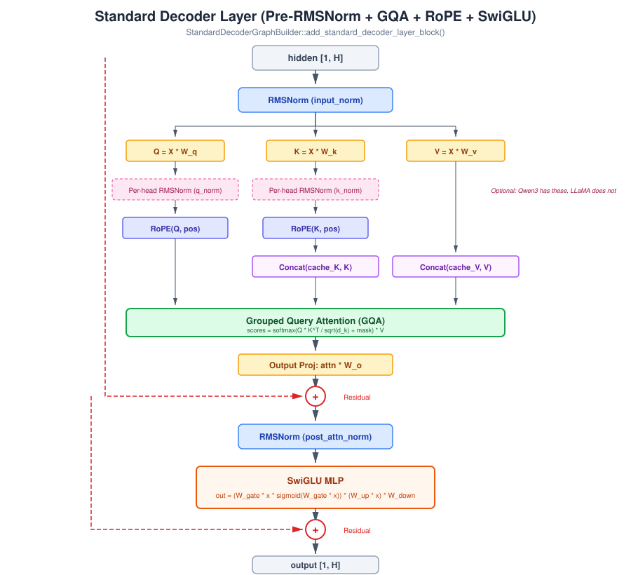

# TRT Internals

This page explains how the TensorRT backend works: from `DecoderModel` to compiled GPU engine to autoregressive token generation.

## Overview

The TRT backend takes a `DecoderModel` with checkpoint weights and:
1. Converts it to a `TrtDecoderDefinition` (inlined in `trt_model_definition.cpp`)
2. Builds a TensorRT `INetworkDefinition` using reusable graph ops (via TRT Graph Builder registry)
3. Compiles the network to an `ICudaEngine` (compiled GPU kernels)
4. Runs an autoregressive generation loop with KV-cache management

All of this happens within `CreateTrtBackend()` → `CreateTrtBackendWithRuntime()` → `TrtBackend`.

## Decoder Layer Anatomy



The `StandardDecoderGraphBuilder` implements the dominant modern LLM decoder pattern. Each layer performs:

### 1. Pre-Attention RMSNorm
```
norm1 = RMSNorm(hidden, input_norm_weights, eps)
```
RMS normalization: `x * gamma / sqrt(mean(x^2) + eps)`. Implemented via `add_rms_norm()` in `trt_graph_ops.cpp`.

### 2. QKV Projections
```
Q = norm1 * W_q    [1, hidden] * [hidden, attention_size] → [1, attention_size]
K = norm1 * W_k    [1, hidden] * [hidden, attention_size] → [1, attention_size]
V = norm1 * W_v    [1, hidden] * [hidden, attention_size] → [1, attention_size]
```

Note: `attention_size` may differ from `hidden_size` for non-square attention (e.g., GQA where K/V are expanded). The checkpoint mapper handles KV expansion during loading.

### 3. Optional Per-Head QK Norm (Qwen3)
```
Q = PerHeadRMSNorm(Q, q_norm_weights)   # Only if q_norm is non-empty
K = PerHeadRMSNorm(K, k_norm_weights)   # Only if k_norm is non-empty
```
LLaMA and Mistral skip this step (empty q_norm/k_norm vectors). Qwen3 applies per-head RMS normalization before RoPE.

### 4. Rotary Position Embeddings (RoPE)
```
Q = ApplyRoPE(Q, position_id, cos_table, sin_table, rotate_half_matrix)
K = ApplyRoPE(K, position_id, cos_table, sin_table, rotate_half_matrix)
```
Position encoding via rotation. The cos/sin tables are precomputed for all positions up to `max_cache_length + 1` and stored as constant tensors in the TRT network.

Implementation uses a rotate-half matrix multiplication approach:
```
RoPE(x, pos) = x * cos(pos) + rotate_half(x) * sin(pos)
```

### 5. KV-Cache Concatenation
```
all_K = Concat(cache_K, current_K)    # [cache_len, attn] + [1, attn] → [cache_len+1, attn]
all_V = Concat(cache_V, current_V)    # Same shape
```
The KV cache stores previous steps' K and V projections. Each new step appends the current K/V and attends over the full sequence.

### 6. Grouped Query Attention (GQA)
```
# Reshape to multi-head format
Q_heads = reshape(Q, [num_heads, 1, head_dim])
K_heads = reshape(all_K, [num_heads, seq_len, head_dim])    # Transposed: [seq, heads, dim] → [heads, seq, dim]
V_heads = reshape(all_V, [num_heads, seq_len, head_dim])

# Scaled dot-product attention
scores = Q_heads @ K_heads^T / sqrt(head_dim)
scores = scores + attention_mask          # Causal mask: -inf for future positions
weights = softmax(scores, dim=-1)
context = weights @ V_heads               # [num_heads, 1, head_dim]

# Flatten heads back
attn_output = reshape(context, [1, attention_size])
```

GQA is handled transparently: the checkpoint mapper expands K/V projections to match the number of query heads during loading. The graph builder always uses the same number of heads for Q, K, V.

### 7. Output Projection + Residual
```
attn_output = attn_output * W_o
hidden = hidden + attn_output    # Residual connection
```

### 8. Post-Attention RMSNorm + SwiGLU MLP
```
norm2 = RMSNorm(hidden, post_attn_norm_weights, eps)

gate = norm2 * W_gate       # [1, mlp_size]
up   = norm2 * W_up         # [1, mlp_size]
swish = gate * sigmoid(gate) # SiLU activation
gated = swish * up           # Element-wise gating
down  = gated * W_down       # [mlp_size, hidden] → [1, hidden]

hidden = hidden + down       # Residual connection
```

### 9. Final Layer: Norm + LM Head
After all decoder layers:
```
hidden = RMSNorm(hidden, final_norm_weights, eps)
logits = hidden * W_lm_head    # [1, hidden] * [hidden, vocab] → [1, vocab]
```

---

## Reusable TRT Graph Ops (`trt_graph_ops.h`)

These building blocks are used by the StandardDecoderGraphBuilder and can be reused by custom graph builders:

| Function | Description |
|----------|-------------|
| `add_constant_tensor()` | Creates a constant weights tensor in the TRT network |
| `add_matmul_rhs_constant()` | Matrix multiply: `input * constant_weights` |
| `add_bias_sum()` | Adds a bias vector to a tensor |
| `add_rms_norm()` | Full-hidden RMS normalization with gamma weights |
| `add_rms_norm_per_head()` | Per-head RMS normalization (for Qwen3 QK norms) |
| `make_rope_table()` | Precompute RoPE cos/sin tables for all positions |
| `make_rotate_half_matrix()` | Build the rotation matrix for RoPE |
| `add_apply_rope()` | Apply RoPE to Q or K tensor using position lookup |
| `layer_tensor_name()` | Generate per-layer tensor names (e.g., `cache_k_0`) |
| `make_dims_1d/2d/3d()` | Dimension helper constructors |

---

## TRT Engine Lifecycle

### Building the Engine

```
StandardDecoderGraphBuilder::build_decoder_step_engine(weights, logger)
  │
  └── create_decoder_step_engine_multi_layer()
        1. Create IBuilder, INetworkDefinition, IBuilderConfig
        2. Add inputs: token_id[1], position_id[1], attention_mask[1, window],
           per-layer cache_k/cache_v [max_cache, attn_size]
        3. Add embedding gather: token_id → hidden[1, H]
        4. Precompute RoPE tables, eps, attention scale as constants
        5. For each decoder layer:
           └── add_standard_decoder_layer_block() → {hidden, present_k, present_v}
        6. Final RMSNorm + LM head matmul → logits[1, vocab]
        7. Mark outputs: logits + per-layer present_k/present_v
        8. finalize_decoder_step_engine() → builds ICudaEngine
```

### DecoderStepEngine

The compiled engine is wrapped in `DecoderStepEngine`:

```cpp
struct DecoderStepEngine {
    TrtUniquePtr<nvinfer1::ICudaEngine> engine;
    TrtUniquePtr<nvinfer1::IExecutionContext> context;

    // Tensor binding names
    std::string token_id_name;
    std::string position_id_name;
    std::string attention_mask_name;
    std::vector<std::string> cache_k_names;     // Per-layer
    std::vector<std::string> cache_v_names;     // Per-layer
    std::vector<std::string> present_k_names;   // Per-layer outputs
    std::vector<std::string> present_v_names;   // Per-layer outputs
    std::string logits_name;

    // Metadata
    int32_t num_layers;
    int32_t vocab_size;
    int32_t hidden_size;
    int32_t cache_state_size;
    int32_t max_cache_length;
    bool multi_layer;
};
```

### Engine Caching

The engine cache avoids recompilation on subsequent runs. Two-level check:

1. **Early cache check** (`try_load_cached_engine()`): Called *before* building the TRT graph. Computes a cache key from the model weights hash, checks disk. On hit, skips all graph building and returns the deserialized engine directly. This avoids copying gigabytes of weight constants into the TRT builder.

2. **Late cache check** (`finalize_decoder_step_engine()`): If the early check misses (cache disabled or first run), the graph is built and compiled. The serialized plan is then saved to disk.

Cache files are read using `mmap` + `MADV_SEQUENTIAL` for fast access to multi-GB plan files.

Set `TRTF_TRT_ENGINE_CACHE_DIR` to enable. Engine compilation takes 30-90s; cached load takes 2-3s.

3. **Model-dir index** (`BuildModelDirIndexKey()` / `SaveModelDirIndex()` / `LookupModelDirIndex()`): Maps a model directory + `max_cache_length` to a cache key **without loading any weights**. The index key is an FNV-1a hash of the canonical path, `config.json` content, safetensors file sizes, and cache length. On the first slow-path run, `trtf_create_pipeline()` saves the index. On subsequent runs, the fast path in `try_create_from_cached_engine()` looks up the index, loads the cached `.plan` via mmap, deserializes the engine, and populates `DecoderStepEngine` metadata from `config.json` alone. This eliminates all weight loading (~120s) and checkpoint mapping (~40s), reducing cached startup from ~260s to ~7s.

Set `TRTF_DISABLE_ENGINE_CACHE=1` to disable both the plan cache and the model-dir index.

---

## Autoregressive Generation Loop

`TrtBackend::generate()` in `trt_backend_shared.cpp`:

```
generate(input_ids, config):
  1. Allocate CUDA buffers:
     - Per-layer cache_k, cache_v [max_cache_length, attention_size]
     - logits buffer [vocab_size]
     - Attention mask, position tracking

  2. Prefill phase:
     For each token in input_ids:
       - Build causal attention mask (0 for visible positions, -1e9 for masked)
       - run_decoder_step(engine, token_id, position, mask, caches)
       - Append K/V outputs to cache (circular buffer)
       - Advance position counter

  3. Decode phase:
     For step = 0 to max_new_tokens:
       - Run one decode step with the previously generated token
       - Read logits from GPU
       - Greedy sampling: argmax over logits → next_token_id
       - If next_token == eos_token: break
       - Append to output, update cache

  4. Return: input_ids + generated_token_ids
```

### KV-Cache Management

The cache uses a fixed-size circular buffer per layer:
- Size: `[max_cache_length, attention_size]` per layer, per K and V
- `append_cache_state()` copies new K/V into the next available slot
- Attention mask grows by one position each step
- When cache is full, oldest entries are evicted (sliding window)

### CUDA Resource Management

All GPU resources use RAII wrappers from `trt_common.h`:
- `CudaStream` — RAII `cudaStream_t`
- `CudaBuffer` — RAII `cudaMalloc`/`cudaFree`
- `TrtUniquePtr<T>` — Smart pointer for TRT objects (handles API differences between TRT 8 and 10+)
- `TrtLogger` — Custom `ILogger` implementation with error tracking

---

## Graph Building

The `StandardDecoderGraphBuilder` builds the full N-layer decoder stack with:
- Per-layer KV cache inputs/outputs
- RoPE with precomputed tables
- GQA attention with multi-head reshaping
- SwiGLU MLP
